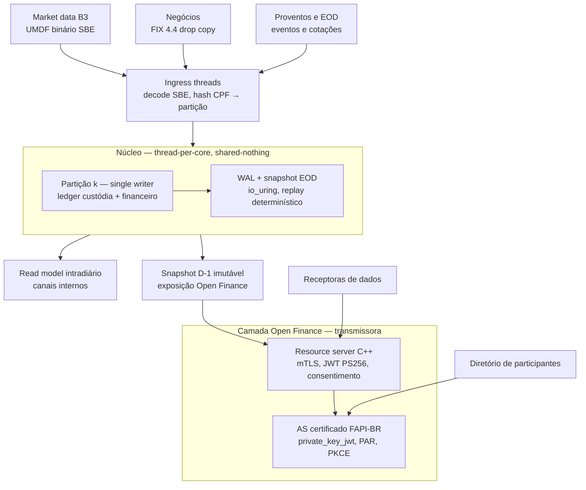

# Arquitetura — motor-rv

Diagramas: `docs/diagrams/arquitetura.{svg,png}` (planos) e `docs/diagrams/maquina-estados.{svg,png}`
(negócio → liquidação). Versão Mermaid abaixo para leitura por agentes.

## Enquadramento regulatório (fronteiras)

- BCB/CMN: Open Finance (Res. Conjunta 1/2020, Res. BCB 32/2020) — origem do perfil FAPI; SPB
  (Lei 10.214/2001: netting multilateral com finalidade) — a câmara da B3 liquida o financeiro
  líquido no STR.
- CVM/B3: negociação e pós-negociação — ciclo D+2, alocação, eventos corporativos,
  lote/fracionário. O motor implementa estas regras.
- RFB: IR sobre ganhos (IN 1.585/2015). Módulo separado (ADR-0011).

"Protocolo FAPI" aqui é o perfil FAPI-BR v2.2.1 do Open Finance Brasil: subconjunto obrigatório
do FAPI 1.0 Advanced, não o FAPI 2.0 da OIDF (ADR-0001). Detalhe em `docs/open-finance.md`.

## Escopo v1

Ações à vista (lote padrão e fracionário); ETF/FII/BDR como tipos de instrumento no mesmo
modelo. Sem opções, termo ou BTC (ADR-0010).

## Três planos

### Ingestão

Adapters convertem tudo para um schema interno em SBE (mesma codificação do Binary
UMDF/EntryPoint da B3): mensagens de tamanho fixo, alinhadas a 64 bytes, decodificadas sem
cópia. As threads de ingress só fazem decode e roteamento por `hash(CPF/CNPJ)`; a partição é
fixa por documento — toda a história de um investidor vive em um único core.
No estudo, o adapter de negócios é um simulador que emite ExecutionReports; em produção seria
drop copy FIX 4.4 mais os arquivos de posição da depositária para reconciliação.

### Núcleo

Cada partição é um loop single-threaded pinado a um core, sem locks, alimentado por um SPSC
ring. Estado em memória com layout SoA; verdade em um log de eventos append-only
(`NegocioExecutado`, `Alocado`, `LoteCompensado`, `Liquidado`, `EventoCorporativoAplicado`,
`CotacaoFechada`, `ProventoPago`, `AberturaDia`, `ReconciliacaoDepositaria`, `EodMark`).
Replay é determinístico por construção.

### Exposição

Dois read models: o intradiário serve canais internos; o snapshot D-1 é congelado no EOD e
pré-serializado, e é só dele que o Open Finance lê — a regra da API é D-1 (ADR-0003).

## Modelo de domínio

Ver `docs/dominio.md` (ledgers em dois níveis, máquina de estados, eventos corporativos) e
`docs/invariantes.md`.

## Camada FAPI — pipeline por requisição

Ordem = custo crescente de rejeitar:

1. mTLS com cadeia ICP-Brasil (o perfil exclui EC porque a ICP-Brasil emite só RSA); cipher
   suites obrigatórios; session resumption e renegotiation desabilitados.
2. `x-fapi-interaction-id` presente (recusar sem), ecoado na resposta, usado como trace id.
3. Access token: assinatura PS256 contra JWKS do AS em cache; expiração 300–900 s;
   `cnf.x5t#S256` igual ao thumbprint do certificado da conexão (RFC 8705).
4. Escopo `consent:urn:...` (parametrizável), permissão VARIABLE_INCOMES_READ, consentimento
   AUTHORISED; token inválido → 401.
5. Contadores mensais por consentimento e endpoint; depois rate limit.
6. Lookup no snapshot D-1 → fatia paginada de corpo pré-serializado → resposta.

Sem session resumption, cada conexão paga handshake completo com assinatura RSA: custo por
request ≈ zero (hash + comparação + lookup), custo por conexão fixo e alto. Keep-alive
agressivo, handshakes em pool próprio, kTLS após o handshake (experimento).

## Otimizações (com motivo)

Pré-aprovadas (ADR-0016) — implementar e medir:
- Thread-per-core, shared-nothing, particionado por documento — zero contenção; custo:
  rebalanceamento por replay do log da partição.
- SPSC rings estilo Disruptor, cursores em cache lines separadas, drenagem em lote.
- SoA + índices densos; instrumentos internados em `uint32`; `(conta, instrumento)` → slot.
- Ponto fixo: `int64` escala 1e-8 (quantidade, preço), 1e-4 (BRL); intermediários `__int128`.
- Arena por partição e pools de eventos; nada de `malloc` após warm-up.
- WAL com O_DIRECT|O_DSYNC, group commit, CRC32C por hardware, replay por mmap sequencial.
- Snapshot EOD por stall-and-copy para arquivo mapeável; corpos JSON pré-serializados.
- JSON só na borda: glaze para serializar, simdjson para entrada.
- JOSE: JWKS com EVP_PKEY pré-construído por kid; cache de tokens validados até exp.
- Build: C++23, -O3 -march=x86-64-v3, LTO.

Experimentos (só com medição): SQPOLL, reescrita de bloco de cauda, kTLS, huge pages,
PGO, snapshot fuzzy por chunks, io_uring buffer rings.

## Stack

C++23 (GCC 14+/Clang 18+), CMake presets, Asio/Beast, OpenSSL 3, liburing, glaze, simdjson,
jwt-cpp, sbe-tool (codecs), fmt, Catch2 ou GoogleTest, Google Benchmark, libFuzzer.
AS de prateleira certificado (ADR-0002) — não faz parte deste repositório.

## Decisões

Índice em `docs/adr/README.md`. Cada ADR tem contexto, decisão, alternativas e consequências.
