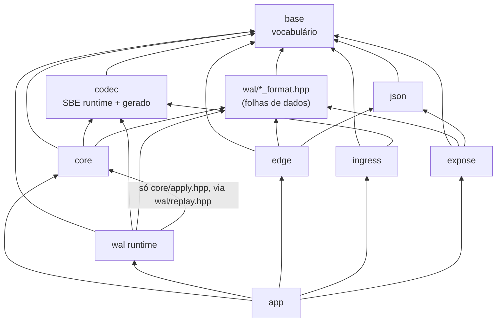

# CONTRATO INTERNO — motor-rv

**Documento de costura.** Fixa nomes, assinaturas e fronteiras para que vários agentes escrevam
módulos em paralelo sem colidir. Não descreve implementação: descreve o que atravessa as
fronteiras. Onde houve empate técnico, ganhou a alternativa que se explica em uma frase — e a
frase está escrita.

Fontes que este documento **obedece** (não substitui): `docs/adr/0001..0023`,
`docs/invariantes.md` (I1..I13, já com a correção de I1 e o I13 novo), `docs/rastreabilidade.md`,
`CODING_RULES.md`, `docs/dominio.md`, `docs/wal.md`, `docs/open-finance.md`, `docs/ambiente.md`,
e os **14 cenários golden** de `tests/domain/golden/`, que são normativos: os números foram
fechados à mão antes de existir código, e é o código que se ajusta a eles.

Onde este documento diverge de um desenho anterior do painel, a divergência está marcada com
"**Decisão:**" e o motivo. Nenhuma decisão aqui reabre ADR aceito.

---

## 0. Ordem de leitura do repositório

Treze paradas. Quem seguir esta ordem entende o motor sem precisar de mais ninguém.

| # | Arquivo | O que se aprende |
|---|---|---|
| 1 | `docs/dominio.md` | Os dois ledgers e a máquina de estados. Sem isso, o resto é sintaxe. |
| 2 | `docs/invariantes.md` | I1 e I13 são identidades **diferentes** sobre os mesmos buckets. Quem confunde as duas escreve um motor que erra só nos dias em que há liquidação pendente de um lado só. |
| 3 | `src/base/fixed.hpp` | Que dinheiro é `int64` e que soma nunca perde informação. |
| 4 | `src/base/rounding.hpp` | Que toda operação que perde informação tem nome próprio — e que o preço médio usa **duas** delas, nesta ordem. |
| 5 | `src/base/ids.hpp` | Quem é quem: documento, instrumento, conta, LSN, data. E por que `DateYmd` não tem `operator+`. |
| 6 | `src/core/state.hpp` | Os buckets: `SettleRow` de uma linha de cache, o anel de datas abertas da partição, e o que é estado (tudo que muda a decisão do `apply`). |
| 7 | `schema/events.xml` + §3.4 deste documento | O vocabulário do log: dez eventos, dez `templateId`. |
| 8 | `src/core/apply.hpp` | A fronteira do núcleo: uma função, um contrato de determinismo, duas classes de erro. |
| 9 | `src/core/partition.hpp` | O motor inteiro cabe em vinte linhas (`poll`), mais o ciclo de EOD. |
| 10 | `src/wal/wal_format.hpp` | Os bytes no disco. Trinta e dois deles são cabeçalho de registro; quatro mil e noventa e seis, de segmento. |
| 11 | `src/wal/wal.hpp` + `group_commit.hpp` | Como um evento vira durável, e por que em grupo. |
| 12 | `src/wal/recovery.hpp` + `state_format.hpp` | Como o estado volta: imagem + prefixo válido + `apply`. |
| 13 | `src/wal/snapshot_format.hpp` + `src/edge/pipeline.hpp` | A única janela do núcleo para o mundo, e as seis etapas FAPI em ordem de custo. |

Depois: `tests/domain/golden/` — os catorze cenários com os números fechados à mão. Eles são a
especificação executável do domínio; este documento existe para que o código passe neles.

**Duas frases que valem por um capítulo, e que o resto do documento só detalha:**

1. *O log é a verdade do que chegou, não do que foi aceito.* `append` acontece antes de `apply`,
   então evento rejeitado está no log, e o replay o rejeita de novo, pelo mesmo código, com o
   mesmo `Status`. Não existe caminho de validação separado do caminho de aplicação: existiriam
   duas verdades.
2. *Se uma estrutura muda a decisão do `apply`, ela é estado e vai para o snapshot.* (golden 13).
   Cache é o que dá para reconstruir sem mudar decisão nenhuma. A fila de exceção, o livro de
   negócios e o conjunto de idempotência são estado — e é por isso que §3.5 existe.

---

## 1. Árvore de `src/`

Uma frase por arquivo. `(gerado)` = produzido pelo gerador Python no build, nunca versionado
(ADR-0006 + ADR-0017). `(folha)` = header de dados puro: só `struct`, `constexpr` e
`static_assert`, sem comportamento.

```
src/
├── CMakeLists.txt                    add_subdirectory de cada camada; nenhuma flag mora aqui.
│
├── base/                             VOCABULÁRIO. Não depende de nada. Todo mundo depende dele.
│   ├── CMakeLists.txt                alvo rv_base.
│   ├── status.hpp                    Err (enum numerado por faixa), Status (8 bytes), Result<T> — erro sem exceção.
│   ├── status.cpp                    to_string(Err) e a classificação fatal/rejeitado, em um lugar só.
│   ├── assert.hpp                    RV_ASSERT, RV_INVARIANT(Ix, cond), RV_CHECK, RV_FAIL_STOP — o número da invariante é grepável.
│   ├── invariant_registry.hpp/.cpp   InvariantId I1..I13, severidade por invariante e contador por id: a §6 não pode mentir.
│   ├── fail_stop.hpp/.cpp            parada da partição: registra, conta métrica, marca halted; nunca lança.
│   ├── int128.hpp                    isola a extensão __int128 (CODING_RULES §2 vs §9) e exporta rv::i128/u128.
│   ├── fixed.hpp                     Fixed<Escala,Unidade> e Qty/Price/Money/Ratio: só operações exatas (soma, subtração, comparação).
│   ├── rounding.hpp                  mul_div<R> e as operações do domínio que perdem informação — a política está no nome.
│   ├── ids.hpp                       DocumentId, InstrumentId, AccountId, PartitionId, Lsn, DateYmd, InvestmentId, PositionSlot.
│   ├── hash.hpp        (folha)       mix64 constexpr: a ÚNICA definição do hash determinístico do projeto. É formato (§2, §3.10).
│   ├── bytes.hpp                     ByteSpan/MutBytes, leitura e escrita little-endian, checagem de alinhamento.
│   ├── crc32c.hpp/.cpp               CRC32C escolhido em COMPILAÇÃO (#if __SSE4_2__), com a tabela como alvo não-v2.
│   ├── arena.hpp/.cpp                arena bump com seal(): depois do warm-up, alocar é assert.
│   ├── dense_index.hpp               open addressing com CHAVE INTEIRA guardada; usa base/hash.hpp. Ordem de iteração = ordem de slot.
│   ├── spsc_ring.hpp                 SPSC de slots fixos: try_claim/publish, begin_drain/end_drain; cursores em cache lines separadas.
│   ├── xorshift.hpp                  PRNG determinístico com semente explícita. PROIBIDO em rv_core (check de símbolos, I12).
│   ├── metrics.hpp/.cpp              contadores e histogramas log-lineares de tamanho fixo; zero alocação.
│   ├── log.hpp/.cpp                  log estruturado com fmt — proibido dentro de apply e do loop de commit.
│   └── cpu.hpp/.cpp                  pin de thread em core físico, huge pages, leitura de cpuinfo no warm-up.
│
├── codec/                            SBE. Runtime escrito à mão + codecs gerados.
│   ├── CMakeLists.txt                alvo rv_codec; roda o gerador e adiciona os arquivos gerados.
│   ├── sbe_runtime.hpp               MessageHeader, GroupHeader, view_as<T>() com checagem de tamanho e alinhamento.
│   ├── schema_digest.hpp  (gerado)   digest do schema; viaja no SegmentHeader e força rotação de segmento quando muda.
│   ├── template_ids.hpp   (gerado)   enum class Tmpl : uint16_t com os dez ids e kTemplateCount.
│   ├── events.hpp         (gerado)   as dez structs POD com static_assert de tamanho, alinhamento e has_unique_object_representations.
│   ├── events_decode.hpp  (gerado)   decode_<msg>(ByteSpan) -> Result<const Msg*>; encode(MutBytes, const Msg&) -> Result<uint16_t>.
│   └── events_debug.cpp   (gerado)   to_string por template; só entra em build debug e nas ferramentas.
│
├── ingress/                          ADAPTADORES. Traduzem o mundo para eventos. Não conhecem core.
│   ├── CMakeLists.txt                alvo rv_ingress.
│   ├── reference_data.hpp/.cpp       pacote de dados de referência (instrumentos, contas, flags) e seu digest — a origem de InstrumentId/AccountId.
│   ├── calendar.hpp/.cpp             calendário B3 de data/calendario-b3-2026.csv: resolve D+2 e D-1. Vive AQUI, nunca no núcleo.
│   ├── partitioner.hpp               partition_of(DocumentId, n) = mix64(doc) & (n−1); e a regra de roteamento de evento com dois documentos.
│   ├── ingress_loop.hpp/.cpp         decodifica, valida limites, escreve IngressFrame no SPSC da partição certa.
│   ├── fees.hpp                      tarifas do simulador (fee_half_up); NÃO é chamado por apply — os custos chegam prontos no evento.
│   ├── trade_feed.cpp                simulador de ExecutionReport (v1) no lugar do drop copy FIX 4.4; semente explícita.
│   └── b3_files.cpp                  arquivos de EOD (fechamento, proventos, posição da depositária) → eventos, em ordem fixa.
│
├── core/                             NÚCLEO. Estado, apply, loop da partição. Hot path.
│   ├── CMakeLists.txt                alvo rv_core, -fno-exceptions -fno-rtti, lista branca de símbolos indefinidos (I12).
│   ├── state.hpp         (barreira)  PartitionState: arenas, colunas SoA, anel de datas, índices, applied_lsn, frozen_at, seq.
│   ├── state_layout.hpp  (barreira)  os static_assert de layout do estado: tamanho, alinhamento e representação única de cada coluna.
│   ├── custody_ledger.hpp/.cpp       buckets de custódia em SoA e as ÚNICAS funções que os alteram (I3).
│   ├── cash_ledger.hpp/.cpp          caixa, a_liquidar[D] e proventos_a_receber por conta (I2).
│   ├── average_price.hpp             AvgPriceAuthority (passkey): só duas TUs conseguem escrever preco_medio. I4 vira erro de compilação.
│   ├── position_index.hpp            (AccountId, InstrumentId) → PositionSlot, denso, com a chave inteira guardada.
│   ├── trade_book.hpp                negócios vivos por trade_id e o TradeState de cada um — sem isto, I5 não sobrevive a um snapshot.
│   ├── trade_state.hpp               a máquina de estados como tabela constexpr: next_state(estado, gatilho) (I5).
│   ├── corporate_action_log.hpp      conjunto de chaves (action_id, account, stage) aplicadas, com ex_date e desfecho — I6 e a poda de 60 dias.
│   ├── exception_queue.hpp           fila de exceções (divergência, rejeição registrada). É ESTADO: vai para o snapshot (goldens 04, 05, 10, 14).
│   ├── settlement.hpp/.cpp           liquidação por data, netting, falha de entrega, recompra e o bucket vencido.
│   ├── corporate_action.hpp/.cpp     as regras de evento corporativo, uma função por linha da tabela de docs/dominio.md.
│   ├── fingerprint.hpp/.cpp          state_digest(st) (CRC encadeado, ordem de slot) e canonical_dump(st, sink) — a relação de igualdade de I11.
│   ├── verify.hpp/.cpp               verify_i1/i2/i3/i13: varreduras O(n) chamadas no fim de cada TESTE, não a cada apply.
│   ├── outbox.hpp/.cpp               staging de saídas com portão em durable_lsn (I10) e seq monotônico para deduplicação.
│   ├── journal.hpp       (barreira)  concept Journal: exatamente o que o núcleo exige de um log, EOD incluído. Nada mais.
│   ├── apply.hpp         (barreira)  EventView, ApplyContext, apply() e a classificação de erro — a fronteira do núcleo.
│   ├── apply.cpp                     o despacho por template e as dez funções apply_*, cada uma em duas fases (check/commit).
│   ├── partition.hpp                 Partition<J>::poll(now_ns) e o ciclo de EOD (seal_day/drain_only). O while mora no app.
│   ├── state_image.hpp/.cpp          stall-and-copy: escreve a imagem de recuperação no layout de wal/state_format.hpp.
│   └── testing/memory_journal.hpp    Journal em memória, sem I/O: torna todo teste de núcleo determinístico por construção.
│
├── wal/                              PERSISTÊNCIA. Três folhas de formato + o runtime.
│   ├── CMakeLists.txt                alvos rv_format (INTERFACE) e rv_wal (STATIC).
│   ├── wal_format.hpp     (folha)    WalHdr, SegmentHeader de 4096 bytes, limites, padding — só bytes, zero comportamento.
│   ├── state_format.hpp   (folha)    imagem de RECUPERAÇÃO: cabeçalho + seções, uma por estrutura de PartitionState. Nunca incluída por edge.
│   ├── snapshot_format.hpp(folha)    snapshot de EXPOSIÇÃO: ExposureHeader, Section, SectionRef, SnapshotView.
│   ├── block_align.hpp/.cpp          statx(STATX_DIOALIGN) com fallback 4096 e registro da origem no cabeçalho do segmento.
│   ├── io_backend.hpp                concept IoBackend: submit/poll/wait/register (ADR-0023 — template, não virtual).
│   ├── uring_backend.hpp/.cpp        backend real: SINGLE_ISSUER|DEFER_TASKRUN, WRITE_FIXED, arquivos e buffers registrados.
│   ├── pwrite_backend.hpp/.cpp       backend síncrono sobre arquivo real: a suíte de WAL não precisa de io_uring.
│   ├── mem_backend.hpp               "segmento" como std::span<std::byte>: recuperação testada sem disco, sem root, em microssegundos.
│   ├── fault_backend.hpp             DECORATOR sobre qualquer IoBackend, com FaultPlan declarativo (reordenação, short write, EIO, cauda rasgada, morte).
│   ├── epoch.hpp                     EpochSource injetado: o epoch aleatório por segmento nunca vem de getrandom() embutido.
│   ├── segment_manager.hpp/.cpp      criação, pré-zeragem e rotação de segmentos; rotaciona também quando o schema_digest muda.
│   ├── segment_reader.hpp/.cpp       leitura sequencial validante com ReplayStopReason público — é aqui que mora a travessia de padding.
│   ├── log_cursor.hpp/.cpp           vários segmentos vistos como um log só, a partir de snapshot_lsn + 1.
│   ├── replay.hpp                    template <ApplierPort A> replay(A&, LogCursor&) — o ÚNICO ponto em que wal toca core.
│   ├── group_commit.hpp/.cpp         janela W, kMaxGroup, kMaxInflight, avanço FIFO de durable_lsn (I9).
│   ├── wal.hpp/.cpp                  template <IoBackend B> class WalT; using Wal = WalT<UringBackend>. Satisfaz core::Journal.
│   ├── recovery.hpp/.cpp             escolhe e carrega a imagem, replica o prefixo válido, devolve RecoveryReport e WalTail (I8, I11).
│   ├── snapshot_writer.hpp/.cpp      grava as duas imagens do mesmo stall: fdatasync, rename atômico, fsync do diretório.
│   ├── snapshot_reader.hpp/.cpp      reconstrói PartitionState a partir da imagem de recuperação, com CRC por seção.
│   ├── manifest.hpp/.cpp             manifesto global partição→arquivo→LSN→revisão; o conjunto de D só vale com EodMark em todas.
│   ├── archive.cpp                   zstd nos segmentos cobertos por snapshot durável; o WAL é trilha de auditoria.
│   └── testing/                      segment_image.hpp (corrupção cirúrgica) e fake_applier.hpp (ApplierPort que só registra lsn/tmpl/crc).
│
├── json/                             FOLHA. Sem dependências além de base. Usada pela borda e pelo expose.
│   ├── CMakeLists.txt                alvo rv_json.
│   ├── writer.hpp/.cpp               escritor incremental para buffer do chamador; mede antes de escrever, nunca realoca.
│   ├── parser.hpp/.cpp               parser com limites explícitos de profundidade, tamanho e número de chaves (alvo de fuzz).
│   └── number.hpp                    Fixed ↔ texto por std::to_chars. Nunca double, nem na saída.
│
├── expose/                           Constrói o snapshot D a partir da imagem de recuperação. Não conhece core.
│   ├── CMakeLists.txt                alvo rv_expose.
│   ├── investment_id.hpp/.cpp        derivação determinística do investmentId (UUID v5 sobre documento + símbolo) — R15.
│   ├── gross_amount.hpp              a conta do I7 em um só lugar, e a declaração normativa de QUAL quantidade entra nela.
│   ├── exposure_builder.hpp/.cpp     lê state_format, escreve todas as seções de snapshot_format em ordem.
│   ├── monthly_segments.hpp/.cpp     escreve e referencia os segmentos mensais imutáveis do histórico (R11, ADR-0003).
│   └── body_writer.hpp/.cpp          corpos JSON pré-serializados por endpoint, no schema da API RV 1.3.0.
│
├── edge/                             RESOURCE SERVER. Vê do núcleo apenas snapshot_format.hpp.
│   ├── CMakeLists.txt                alvos rv_jose, rv_http, rv_edge.
│   ├── transport.hpp                 concept HttpTransport + LoopbackTransport: as seis etapas são testáveis sem TLS real.
│   ├── tls_server.hpp/.cpp           mTLS ICP-Brasil, cipher suites obrigatórios, resumption e renegotiation desligados (R6).
│   ├── http_parse.hpp/.cpp           parser de requisição com limites aplicados ANTES de qualquer parse (alvo de fuzz).
│   ├── http_server.hpp/.cpp          servidor HTTP/1.1 próprio sobre io_uring; run_once(now_ns), espelhando Partition::poll.
│   ├── router.hpp/.cpp               os seis caminhos da API RV → Endpoint, e o parser de query string com limites.
│   ├── pipeline.hpp/.cpp             as seis etapas em ordem de custo, como um array de ponteiros de função.
│   ├── jose.hpp/.cpp                 JWS PS256 sobre EVP_*, thumbprint x5t#S256, rejeição de alg ≠ PS256 (R2, R3, R7).
│   ├── jwks_cache.hpp/.cpp           EVP_PKEY pré-construído por kid; recarga acontece fora do caminho da requisição.
│   ├── token_cache.hpp/.cpp          tokens já validados até exp (≤ 900 s), chaveados pelo hash do compact.
│   ├── consent.hpp/.cpp              ConsentRecord (titular, permissões, status, validade) com invalidação push (R4, R5).
│   ├── quota.hpp/.cpp                contadores mensais por consentimento × endpoint em arquivo mapeado (423) e rate limit (429) — R16.
│   ├── snapshot_set.hpp/.cpp         CONJUNTO de snapshots (um por partição) com refcount, Guard RAII e troca atômica do conjunto inteiro.
│   ├── timezone.hpp                  now_ns → data corrente em São Paulo, por tabela de offsets. Sem std::chrono no caminho quente.
│   ├── handlers.hpp/.cpp             os seis handlers: prólogo + recorte do corpo pré-serializado + links/meta, por lista de spans.
│   ├── problem.hpp/.cpp              corpo de erro padrão da API e o mapa Err → status HTTP.
│   ├── audit.hpp/.cpp                trilha de auditoria (R19) com snapshot_lsn e revisão servidos, e métricas por endpoint (R17, R18).
│   └── testing/                      fake_peer.hpp (TlsPeer sintético) e frozen_clock.hpp (exp, consentimento, rollover de mês).
│
├── tools/                            Ferramentas de linha de comando. Nenhuma entra em produção.
│   ├── walcat.cpp                    despeja registros do WAL (lsn, tmpl, crc, campos decodificados).
│   ├── snapcat.cpp                   valida e imprime um snapshot (usada pelo verificador).
│   ├── replay_check.cpp              reexecuta um log e imprime state_digest — I11 na linha de comando e no CI.
│   └── fixturegen.cpp                gera logs e snapshots de fixture determinísticos (semente e epoch na linha de comando).
│
└── app/                              COMPOSIÇÃO. O único lugar com `while (true)` e com `new`.
    ├── CMakeLists.txt                executáveis e as instanciações explícitas de template.
    ├── config.hpp/.cpp               configuração por arquivo, validada na entrada; nenhum default escondido no código.
    ├── instantiate.cpp               instancia Partition<Wal<UringBackend>> e WalT<UringBackend> uma vez, para o resto compilar rápido.
    ├── motor_main.cpp                processo do motor: ingress, N partições pinadas, WAL, ciclo de EOD.
    ├── rs_main.cpp                   processo do resource server: mapeia o conjunto de snapshots e serve.
    ├── replay_main.cpp               executável dedicado de replay, linkado com --wrap de clock_gettime/getrandom/time (I12).
    ├── simulador_main.cpp            gerador de fluxo para testes e bench; a semente entra no log via DayOpened.
    └── bench_main.cpp                harness de medição próprio que escreve bench/baseline.json (ADR-0021).
```

**Por que `base`, `json` e `expose` existem, se `CODING_RULES §10` fala de três camadas.** Porque
`base`, `codec`, `json` e as três folhas de formato **não são camadas: são vocabulário**.
Vocabulário não tem direção — tem apenas ausência de dependência. A regra de camadas continua
valendo, literal, para `core`, `wal` e `edge`. Está formalizada em §2 e mecanizada pelo CMake.

---

## 2. Direção de dependência



Regra em uma frase por aresta:

| Aresta | Por quê |
|---|---|
| `core → format` | O núcleo escreve a imagem de recuperação. Escreve **bytes**, não chama código de `wal`. |
| `wal → core` | Só através do concept `ApplierPort` em `wal/replay.hpp`, e só `core/apply.hpp`. É exatamente a frase de `CODING_RULES §10`. |
| `core ↛ wal runtime` | O núcleo declara o que precisa (`concept Journal`) em vez de importar quem fornece. Inversão de dependência sem vtable. |
| `edge → format` | A borda enxerga o núcleo **só** pelo snapshot de exposição. `edge` não linka `rv_core`; o CMake garante. `state_format.hpp` é do núcleo e da persistência: `edge` não o inclui. |
| `expose ↛ core` | O construtor do snapshot lê a imagem de recuperação, não o estado vivo. É isso que permite construí-lo em outra thread sem lock. |
| `ingress ↛ core` | O ingress traduz o mundo em eventos e não sabe o que o motor fez com eles. É o que impede um campo de evento de depender do estado da partição — a regra que C2 fixou e que este documento aplica ao catálogo inteiro (§3.4). |

**Como a regra é APLICADA, não só documentada.** Cinco mecanismos, todos rodando no `ctest`:

1. **Link.** Cada camada é um alvo CMake com `target_link_libraries` explícito. `rv_edge` **não**
   linka `rv_core`; um `#include "core/..."` na borda não compila. `rv_format` é `INTERFACE` e só
   pode incluir `base/`.
2. **`scripts/check_layers.py`** (alvo `test_layers`) lê os `#include` de `src/**` e falha se
   aparecer uma aresta fora do grafo acima. Ele também falha se `state_format.hpp` aparecer sob
   `src/edge/`, e se `snapshot_format.hpp` for incluído por `src/core/`.
3. **`scripts/check_determinism.py`** roda `nm -u rv_core.a` contra uma **lista branca** de
   símbolos indefinidos permitidos e falha em qualquer outro. Lista branca, não negra: uma lista
   negra não vê `std::chrono::steady_clock::now()` nem uma syscall futura. Complementa com
   `objdump -d` procurando `rdtsc`, `rdtscp`, `rdrand`, `rdseed` — instruções não geram símbolo.
4. **`scripts/check_rules.py`** falha se: `withhold_trunc` ou `fee_half_up` aparecerem em
   `src/core/`; `__int128` aparecer fora de `base/int128.hpp` e `base/rounding.hpp`; `std::hash`
   aparecer em qualquer coisa persistida ou replicada; `TODO` sem `ADR-NNNN` ou número de issue.
5. **`scripts/check_invariants.py`** cruza `docs/invariantes.md` (I1..I13) com os rótulos `ctest`
   existentes e com o registro de `base/invariant_registry.hpp`, e falha se alguma linha ficar sem
   ponto de verificação ou sem teste. Isto é a mecanização de "invariante sem teste não existe".

**Decisão (correção de referência cruzada):** a função de hash determinística mora em
`base/hash.hpp`, e **só** lá. Ela é formato — escritor de snapshot e leitor da borda precisam
concordar byte a byte — mas `base/dense_index.hpp` e `ingress/partitioner.hpp` também precisam
dela, e nenhum dos dois pode incluir `wal/`. Duas cópias de uma função declarada "congelada" é
o pior dos mundos: `snapshot_format.hpp` a inclui de `base/` e documenta que a usa.
`tests/domain/test_hash_golden.cpp` fixa vetores (documento → hash → slot) para que mudá-la
quebre um teste, e não a produção.

---

## 3. Fronteiras — assinaturas exatas

Tudo abaixo é C++23 real. Namespaces: `rv` para o vocabulário, `rv::codec`, `rv::core`, `rv::wal`,
`rv::json`, `rv::expose`, `rv::edge`, `rv::ingress`.

### 3.1 Erro sem exceção

```cpp
// src/base/status.hpp
namespace rv {

enum class Err : uint16_t {
  Ok = 0,
  // 1..99   base
  OutOfRange = 1, ArenaExhausted = 2, Overflow = 3, NotFound = 4, WouldBlock = 5,
  // 100..199 codec
  UnknownTemplate = 100, ShortPayload = 101, BadBlockLength = 102, GroupTooLarge = 103,
  // 200..249 core / domínio — REJEITADO: o estado não muda, o evento fica no log
  InvalidTransition = 200,        // I5
  AlreadyApplied = 201,           // I6 — idempotente: no-op registrado
  NegativeBucket = 202,           // I3
  QtyMismatch = 203,              // conferência de qty_delta / Σ alocações
  UnknownBatch = 204,             // (account, settlement_date) sem lote aberto
  NettingMismatch = 205,          // I2 — o net da câmara diverge do que o motor acumulou
  InvalidInstrumentSpec = 206,    // price_factor == 0, lot_size == 0, símbolo vazio (golden 12)
  SettlementWindowFull = 207,     // o anel de datas abertas não tem slot livre
  ShortSellNotAuthorized = 208,   // I3: bit1 do evento sem a flag correspondente no cadastro
  CrossPartitionAllocation = 209, // from_account e to_account em partições diferentes (§3.3)
  IncomeOutOfTolerance = 210,     // golden 10: |bruto − qty_base × valor_por_ação| > 1 centavo
  InvalidFactor = 211,            // factor_num/factor_den não é exato em 1e-8
  ExerciseOutOfRange = 212,       // golden 11: qty_exercida fora de [0, direitos inteiros]
  // 250..299 core / domínio — FATAL: é corrupção de log, não rejeição de negócio
  UnknownInstrument = 250,
  UnknownAccount = 251,
  LedgerOverflow = 252,           // int64 estourou em um bucket
  StateCorrupt = 253,
  ReferenceDigestMismatch = 254,  // DayOpened.reference_digest ≠ pacote carregado no warm-up
  DayDiscontinuity = 255,         // DayOpened.prev_business_date ≠ último dia fechado
  InstrumentIdentityMismatch = 256, // ClosingPriceSet liga um id a um símbolo diferente do já ligado
  StateDigestMismatch = 257,      // EodMarked.state_digest ≠ digest recomputado (I11)
  // 300..399 wal
  WalFull = 300,                  // transitório: sem buffer livre ou kMaxInflight atingido
  OutboxFull = 301,               // transitório: contrapressão, NÃO é fatal (§3.8)
  ShortWrite = 350, IoError = 351, BadCrc = 352, BadMagic = 353, LsnGap = 354,
  EpochMismatch = 355, SegmentDiscontinuity = 356, ApplyFatal = 357,
  // 400..499 edge
  MissingInteractionId = 400, BadSignature = 401, TokenExpired = 402, CertBindingMismatch = 403,
  ConsentNotAuthorised = 404, ScopeMissing = 405, OperationalLimit = 406, RateLimited = 407,
  MalformedRequest = 408, ResourceNotFound = 409, UnprocessableRange = 410,
};

const char* to_string(Err) noexcept;

class [[nodiscard]] Status {
 public:
  constexpr Status() noexcept = default;                                  // ok
  static constexpr Status fail(Err e, uint32_t detail = 0) noexcept;
  [[nodiscard]] constexpr bool     is_ok()    const noexcept;
  [[nodiscard]] constexpr bool     is_error() const noexcept;
  [[nodiscard]] constexpr Err      code()     const noexcept;
  [[nodiscard]] constexpr uint32_t detail()   const noexcept;             // LSN curto, offset, índice
  [[nodiscard]] constexpr bool     is_fatal() const noexcept;             // tabela única em status.cpp
 private:
  Err      code_{Err::Ok};
  uint16_t pad_{0};
  uint32_t detail_{0};
};
static_assert(sizeof(Status) == 8 && std::is_trivially_copyable_v<Status>);

template <class T>
class [[nodiscard]] Result {
  static_assert(std::is_trivially_copyable_v<T>, "Result<T> é para valores POD do hot path");
 public:
  constexpr Result(T v) noexcept;
  constexpr Result(Status s) noexcept;                                    // RV_ASSERT(s.is_error())
  constexpr explicit operator bool() const noexcept;
  constexpr const T& operator*()  const noexcept;                         // RV_ASSERT(ok)
  constexpr const T* operator->() const noexcept;
  [[nodiscard]] constexpr Status status() const noexcept;
  [[nodiscard]] constexpr T value_or(T fallback) const noexcept;
 private:
  Status st_{};
  union { T v_; };
};

}  // namespace rv
```

**Por quê.** `Status` cabe em um registrador e é trivialmente copiável, então "retornar erro" custa
o mesmo que retornar um `int`. A faixa numérica de `Err` é estável: o número aparece em log,
métrica e relatório de crash, e `grep 252` acha a causa. `is_fatal()` é uma tabela em um único
`.cpp` — a decisão "isso derruba a partição?" está escrita em um lugar, não espalhada em `if`s.

**Por que a faixa 200..249 é separada da 250..299.** A fronteira entre rejeitar e parar é a
fronteira entre "o mundo mandou algo impossível" e "o log está corrompido". Um negócio malformado
vindo do ingress não pode derrubar um core inteiro (golden 04 escreve isso com todas as letras);
um evento que cita um `InstrumentId` que o log nunca descreveu significa que o arquivo é outro, e
continuar é corromper. Com a faixa numérica separada, `is_fatal()` é uma comparação, não uma
tabela de exceções que alguém esquece de atualizar.

```cpp
// src/base/assert.hpp
#define RV_ASSERT(cond)                  /* debug: aborta com arquivo:linha; release: __builtin_assume */
#define RV_INVARIANT(id, cond)           /* id ∈ {I1..I13}; debug: aborta; release: conta e aplica a severidade do registro */
#define RV_CHECK(cond, status)           /* SEMPRE ativo, O(1); devolve `status` ou faz fail-stop conforme a classe */
#define RV_FAIL_STOP(err, ctx)           /* marca a partição parada; nunca retorna ao caminho normal */
```

```cpp
// src/base/invariant_registry.hpp
namespace rv {

enum class InvariantId : uint8_t {
  kI1 = 1, kI2, kI3, kI4, kI5, kI6, kI7, kI8, kI9, kI10, kI11, kI12, kI13
};
enum class InvariantClass : uint8_t {
  kLedger,        // I1, I2, I3, I4, I13 — fail-stop em release: continuar é corromper
  kDomain,        // I5, I6, I7          — rejeita o evento e segue
  kDurability,    // I8, I9, I10, I11    — fail-stop em release
  kDeterminism,   // I12                 — verificado no build e por ferramenta, não em runtime
};
struct InvariantInfo { InvariantId id; InvariantClass klass; std::string_view text; };

[[nodiscard]] const InvariantInfo& invariant_info(InvariantId) noexcept;
[[nodiscard]] uint64_t invariant_violations(InvariantId) noexcept;   // contador global por id

}  // namespace rv
```

**Por que um registro em vez de `assert` solto, e por que ele vai até I13.** A regra do projeto era
"`RV_INVARIANT` vira métrica, e fail-stop quando a classe for durabilidade ou ledger" — uma frase
sem tabela que a definisse. Com o registro, a classe de cada invariante é dado, `ctest -L I9` e o
contador se encontram, e a tabela de §6 deixa de poder mentir. **O domínio da macro é I1..I13**,
não I1..I12: `docs/invariantes.md` tem treze linhas desde a correção de I1, e
`scripts/check_invariants.py` reprovaria o build no dia em que I13 não tivesse rótulo. A numeração
nunca é reutilizada, então o domínio cresce; a macro aceita qualquer `InvariantId` declarado.

**`RV_INVARIANT` não pode ter efeito colateral.** `tests/core/test_invariant_no_side_effect.cpp`
processa o mesmo log em um build com asserts e em um sem, e compara o `state_digest` final. É a
única maneira de a macro ser segura dentro de `apply` — sem esse teste, "o assert não muda nada" é
uma esperança.

### 3.2 Ponto fixo e políticas de arredondamento

```cpp
// src/base/fixed.hpp
namespace rv {

namespace unit { struct Share {}; struct BrlPerShare {}; struct Brl {}; struct Scalar {}; }

template <int Scale, class Unit>
class Fixed {
 public:
  using Raw = int64_t;
  static constexpr int  kScale = Scale;               // casas decimais
  static constexpr Raw  kOne   = pow10_i64(Scale);    // uma unidade, em raw
  static constexpr Raw  kMax   = (Raw{1} << 62) - 1;  // domínio seguro: o produto de dois cabe em i128
  static constexpr Raw  kMin   = -kMax;

  constexpr Fixed() noexcept = default;
  static constexpr Fixed from_raw(Raw r) noexcept;
  static constexpr Fixed from_units(int64_t u) noexcept;      // RV_ASSERT sem overflow
  [[nodiscard]] constexpr Raw  raw()     const noexcept;
  [[nodiscard]] constexpr bool is_zero() const noexcept;

  // Exatas: nenhuma perde informação. Overflow chama fail_stop (LedgerOverflow) em TODO build.
  friend constexpr Fixed operator+(Fixed, Fixed) noexcept;
  friend constexpr Fixed operator-(Fixed, Fixed) noexcept;
  friend constexpr Fixed operator-(Fixed) noexcept;
  constexpr Fixed& operator+=(Fixed) noexcept;
  constexpr Fixed& operator-=(Fixed) noexcept;
  friend constexpr auto operator<=>(Fixed, Fixed) noexcept = default;
  friend constexpr bool operator==(Fixed, Fixed) noexcept = default;

  // Versão que devolve o erro em vez de parar — usada onde a rejeição é de negócio.
  [[nodiscard]] static constexpr Status checked_add(Fixed a, Fixed b, Fixed& out) noexcept;
  [[nodiscard]] static constexpr Status checked_sub(Fixed a, Fixed b, Fixed& out) noexcept;
 private:
  Raw raw_{0};
};

using Qty   = Fixed<8, unit::Share>;        // quantidade,        escala 1e-8
using Price = Fixed<8, unit::BrlPerShare>;  // preço unitário,    escala 1e-8
using Money = Fixed<4, unit::Brl>;          // BRL,               escala 1e-4
using Ratio = Fixed<8, unit::Scalar>;       // fator adimensional (10; 0,1; 0,05; 0,25)

inline constexpr Qty kOneShare = Qty::from_units(1);

static_assert(sizeof(Qty) == 8 && std::is_trivially_copyable_v<Qty>);
static_assert(std::has_unique_object_representations_v<Qty>);
}  // namespace rv
```

**Por que a unidade é parâmetro, e não só a escala.** `Qty` e `Price` têm a mesma escala (1e-8,
ADR-0007). Com `using Qty = Fixed<8>` os dois seriam o mesmo tipo e `notional(price, qty)`
compilaria silenciosamente. Um tag vazio custa zero byte e zero instrução e transforma uma troca
de argumentos em erro de compilação. Foi o único ponto em que este desenho preferiu um parâmetro
a mais de template a um comentário. *(Desvio de `CODING_RULES §2`, que escreve
`Fixed<int64_t, escala>` — pendência §8.)*

**Por que não existe `operator*`.** Multiplicar dois pontos fixos muda a escala e obriga a
arredondar. Toda multiplicação e divisão vive em `rounding.hpp`, com o arredondamento no nome. Se
você conseguiu escrever `a * b`, o desenho falhou.

**Por que `has_unique_object_representations_v` é exigido aqui, e não só nos eventos.** O
`state_digest` de I11 (§3.5) é um CRC sobre as colunas de estado. Sem representação de objeto
única, esse digest seria função do lixo de padding e falharia de forma diferente entre
compiladores — e um teste de equivalência de replay que falha aleatoriamente é pior que nenhum.

```cpp
// src/base/rounding.hpp
namespace rv {

enum class Rounding : uint8_t { TowardZero, TowardNegInf, HalfUp, HalfEven };

// Núcleo: (a·b)/d com o produto em rv::i128 e a política explícita. d > 0 (RV_ASSERT).
template <Rounding R>
[[nodiscard]] constexpr int64_t mul_div(int64_t a, int64_t b, int64_t d) noexcept;

// ---- Operações do domínio. A política faz parte do nome e do contrato. ----

// I7: grossAmount = qty × closingPrice / priceFactor
//     raw: (q.raw · p.raw) / (10^12 · price_factor)   [1e-8 × 1e-8 → 1e-4]
[[nodiscard]] constexpr Money notional_half_even(Qty q, Price p, uint32_t price_factor) noexcept;

// PASSO 1 do preço médio: o custo de uma posição existente, de 1e-16 para Money (1e-4).
// Existe como função nomeada porque É um arredondamento, e arredondamento sem nome é um bug
// esperando o cenário certo — ver a nota "os dois passos" abaixo.
[[nodiscard]] constexpr Money position_cost_half_even(Qty q, Price p) noexcept;

// PASSO 2 do preço médio (I4): custo total acumulado ÷ quantidade acumulada.
[[nodiscard]] constexpr Price average_price_half_even(Money total_cost, Qty total_qty) noexcept;

// Toda a família "fator": desdobramento, grupamento, bonificação e direitos de subscrição.
// Aplica `factor` sobre `base` e reparte em parte inteira de `unit` e fração.
struct FactorSplit { Qty whole; Qty fraction; };
[[nodiscard]] constexpr FactorSplit apply_factor_floor(Qty base, Ratio factor, Qty unit) noexcept;

// Preço médio em desdobramento (factor < 1) e grupamento (factor > 1).
[[nodiscard]] constexpr Price scale_price_half_even(Price p, Ratio factor) noexcept;

// Ratio exato a partir do par do evento; devolve erro se num·10^8 não for divisível por den.
[[nodiscard]] constexpr Result<Ratio> ratio_from(uint32_t num, uint32_t den) noexcept;

// ---- Duas operações SEM chamador em `core`. check_rules.py falha se aparecerem lá. ----
// Corretagem, emolumentos, taxa de liquidação: usado por `ingress/fees.hpp` (simulador).
// Os custos chegam PRONTOS nos campos de `TradeExecuted`; `apply` nunca os recalcula.
[[nodiscard]] constexpr Money fee_half_up(Money base, uint32_t rate_ppm) noexcept;
// IRRF: pertence ao módulo de IR (ADR-0011), que consome o log e não escreve nele.
// `apply` VERIFICA `bruto − irrf == liquido` (golden 10) e nunca calcula retenção.
[[nodiscard]] constexpr Money withhold_trunc(Money gross, uint32_t rate_bp) noexcept;
}  // namespace rv
```

| Operação | Política | Por quê |
|---|---|---|
| `notional_half_even` | half-even | É a conta exposta pela API (I7). Half-even não enviesa a soma de milhões de posições, e é a soma que o investidor confere contra o extrato. Golden 12. |
| `position_cost_half_even` | half-even | O custo antigo de uma posição sai de 1e-16 e tem de virar `Money` antes de somar com o custo novo. Half-even pelo mesmo motivo, e porque é o valor que os goldens 09 e 11 escrevem explicitamente. |
| `average_price_half_even` | half-even | O preço médio é base de custo; viés sistemático aqui vira erro de IR (golden 02 justifica contra `TRUNC` e contra `HALF_UP`). |
| `apply_factor_floor` | piso, na granularidade de `unit` | O grupamento **não pode** criar quantidade; a fração é `sobras` (goldens 08, 09, 11). |
| `scale_price_half_even` | half-even | Mesma razão do preço médio: é preço médio depois de reescalonado. |
| `fee_half_up` | half-up | Convenção de tarifa: o centavo de meio vai para cima (C4). |
| `withhold_trunc` | trunca | Retenção arredondada para cima seria retenção a maior (C4). |

#### Os dois passos do preço médio — a correção que os goldens 09 e 11 exigem

A forma "óbvia" da função é `average_price_half_even(Qty q_old, Price p_old, Qty q_add,
Money cost_add)`, com o numerador inteiro em `i128` e **uma** divisão no fim. Ela é
aritmeticamente mais limpa e é o que o golden 12 prega para `notional`. **E reprova dois cenários
normativos por uma unidade em 1e-8.** As contas, porque o motivo tem de ficar escrito:

*Golden 09 (bonificação).* `q_old = 137`, `p_old = 3217072993`, `cost_add = 720000`, `q_new = 143`.

    divisão única : 13700000000 × 3217072993 = 44_073_900_004_100_000_000 (1e-16)
                    + 720000 × 10^12         = 44_793_900_004_100_000_000
                    ÷ 14300000000            = 3_132_440_559,727  → HALF_EVEN → 3132440560
    dois passos   : position_cost_half_even(137, 32,17072993) = 44073900 (1e-4)
                    + 720000                                   = 44793900
                    average_price_half_even(44793900, 143)     = 3_132_440_559,44 → 3132440559 ✔

*Golden 11 (subscrição).* `q_old = 143`, `p_old = 3132440559`, `cost_add = 5000000`, `q_new = 163`.

    divisão única : 49_793_899_993_700_000_000 ÷ 16300000000 = 3_054_840_490,411 → 3054840490
    dois passos   : 44793900 + 5000000 = 49793900
                    49793900 × 10^12 ÷ 16300000000 = 3_054_840_490,797 → 3054840491 ✔

Os goldens exigem `3132440559` e `3054840491`. C4 fixou que os catorze cenários não mudam. Logo a
ordem correta é: **arredonda o custo antigo para 1e-4, soma o custo novo, divide uma vez.**

O golden 09 sozinho não discrimina bem (dá `3132440559` por um caminho e `3132440560` pelo outro,
e alguém poderia culpar o empate); o golden 11 confirma de forma independente, com `0,411` contra
`0,797` — nada de empate, dois resultados diferentes. É por isso que a política **não pode** ficar
escondida dentro de uma função cujo nome anuncia uma só: a assinatura `average_price_half_even(Money,
Qty)` obriga o chamador a nomear o passo intermediário, e `settlement.cpp` escreve

```cpp
const Money cost = position_cost_half_even(pos.qty, pos.avg_price) + cost_add;
set_avg_price(pos, average_price_half_even(cost, pos.qty + qty_add), AvgPriceAuthority{});
```

que é revisável linha a linha. Se alguém "otimizar" para uma divisão só, o golden 11 falha.

**Conflito resolvido, para não voltar:** o golden 02 chama a operação de
`weighted_average_price_half_up` em uma frase de texto; C4 fixou `half_even` e o próprio golden 02
argumenta contra `HALF_UP` duas linhas antes. O nome normativo é `average_price_half_even`; a
menção a `half_up` no texto do golden 02 é erro de redação a corrigir junto com este documento.

#### `apply_factor_floor` — uma função para toda a família fator

As três operações antigas (`scale_qty_exact`, `scale_qty_trunc`, `divide_price_half_even`) não
expressavam os goldens: `scale_qty_trunc` truncava na escala do `Fixed` (1e-8), e `1377/10 = 137,7`
é **exato** em 1e-8 — o grupamento do golden 08 devolveria `disponivel = 137,7` e `sobras = 0`,
passando em todo teste de "não criou quantidade" e reprovando o cenário. A granularidade que
importa (ação inteira) não era parâmetro de ninguém. E `scale_qty_exact(Qty, uint32_t)` não aceita
0,05 nem 0,25, que são os fatores dos goldens 09 e 11.

```cpp
FactorSplit apply_factor_floor(Qty base, Ratio factor, Qty unit) noexcept;
```

| Cenário | `base` | `factor` | `unit` | `whole` | `fraction` |
|---|---|---|---|---|---|
| golden 07 — desdobramento 1:10 | 137 | 10 | 1 ação | 1.370 | 0 |
| golden 08 — grupamento 10:1 | 1.377 | 0,1 | 1 ação | 137 | 0,7 |
| golden 09 — bonificação 5 % | 137 | 0,05 | 1 ação | 6 | 0,85 |
| golden 11 — direitos 1:4 | 143 | 0,25 | 1 ação | 35 (direitos) | 0,75 |

`unit` é parâmetro explícito porque "ação inteira" é regra de hoje, não lei da natureza: um
instrumento cujo lote indivisível fosse outro só muda o argumento. `factor` vem do par
`factor_num/factor_den` do evento por `ratio_from`, que **rejeita** um par não representável
exatamente em 1e-8 (`Err::InvalidFactor`) — um fator inexato faria o motor e a depositária
divergirem em uma casa que ninguém consegue explicar depois.

**Consequência de C6 que ninguém tinha puxado: desdobramento e grupamento reescalonam `sobras`.**
C6 fixa que `sobras` está **sempre na unidade corrente do instrumento**, e desdobramento e
grupamento mudam a unidade corrente. Se o fator fosse aplicado só sobre `disponivel`, uma conta que
chegasse com `sobras = 0,85` (fim do golden 09) e sofresse o grupamento 10:1 do golden 08 ficaria
com `sobras = 0,7 + 0,85 = 1,55` — misturando 0,7 ação **nova** com 0,85 ação **antiga** — contra
uma depositária que veria `(1377 + 0,85)/10 = 137,785`. Divergência de 0,765 ação, exatamente o
erro de unidade que o golden 08 diz que I1 existe para pegar.

**Regra normativa:** na família fator, `apply_factor_floor` é aplicada sobre a **posição inteira na
unidade antiga**, isto é `disponivel + sobras`, e devolve a nova `disponivel` (`whole`) e a nova
`sobras` (`fraction`), já na unidade nova. Nunca sobre `disponivel` sozinho, e nunca de forma
incremental. Expressar isso como delta seria impossível: o delta correto (`−0,765`) é função da
`sobras` da conta, que o produtor do evento não conhece — o mesmo argumento de C2.

*Falta um cenário golden:* nenhum dos catorze encadeia `sobras` não-nula com mudança de unidade,
que é exatamente por que o buraco passou. O golden 08 ganha um passo com `sobras` de entrada
não-zero, e o teste correspondente é obrigatório antes do fim da fase 3.

**Teste:** `tests/domain/test_rounding_table.cpp` — uma tabela golden por operação, incluindo os
empates (`.5` com parte inteira par **e** ímpar), negativos, e os limites de `int64`/`i128`
(`10^9 ações × 10^6 reais = 10^31` em 1e-16, contra `1,7 × 10^38` de `i128`, verificado por
`static_assert` sobre `Qty::kMax` e `Price::kMax`, como manda o golden 12).

### 3.3 Identificadores

```cpp
// src/base/ids.hpp
namespace rv {

// Uma regra só: todo id é um struct com um campo `v` e comparação padrão. Sem conversão implícita.
struct DocumentId   { uint64_t v = 0; auto operator<=>(const DocumentId&) const = default; };
struct InstrumentId { uint32_t v = 0; auto operator<=>(const InstrumentId&) const = default; };
struct AccountId    { uint32_t v = 0; auto operator<=>(const AccountId&)  const = default; };
struct PositionSlot { uint32_t v = 0xFFFF'FFFFu; };     // linha (conta × instrumento) nas colunas SoA
struct PartitionId  { uint16_t v = 0; auto operator<=>(const PartitionId&) const = default; };
struct SettleSlot   { uint8_t  v = 0xFFu; };            // índice no anel de datas abertas (§3.5)
struct Lsn          { uint64_t v = 0; auto operator<=>(const Lsn&) const = default;
                      constexpr Lsn next() const noexcept { return Lsn{v + 1}; } };
struct InvestmentId { std::array<uint8_t, 16> b{}; auto operator<=>(const InvestmentId&) const = default; };

inline constexpr InstrumentId kNoInstrument{0};
inline constexpr AccountId    kNoAccount{0};
inline constexpr Lsn          kNoLsn{0};
inline constexpr PositionSlot kNoPosition{};

// DocumentId: CPF (11 dígitos) e CNPJ (14 dígitos) cabem exatos em 63 bits.
inline constexpr uint64_t kCnpjBit = 1ull << 63;
[[nodiscard]] constexpr DocumentId cpf(uint64_t digits) noexcept;    // digits < 10^11
[[nodiscard]] constexpr DocumentId cnpj(uint64_t digits) noexcept;   // digits < 10^14, seta kCnpjBit
[[nodiscard]] constexpr bool is_cnpj(DocumentId) noexcept;

struct DateYmd {
  uint32_t v = 0;                                        // AAAAMMDD; 0 = ausente
  static constexpr DateYmd from_ymd(int y, int m, int d) noexcept;
  [[nodiscard]] constexpr int  year()  const noexcept;
  [[nodiscard]] constexpr int  month() const noexcept;
  [[nodiscard]] constexpr int  day()   const noexcept;
  [[nodiscard]] constexpr bool valid_shape() const noexcept;   // só a FORMA, não o calendário
  auto operator<=>(const DateYmd&) const = default;
  // NÃO EXISTE operator+, nem plus_business_days, nem day_index().
};
static_assert(sizeof(DateYmd) == 4);
}  // namespace rv
```

| Id | Tipo | Por que é o que é |
|---|---|---|
| `DocumentId` | `uint64` exato | CPF e CNPJ são números; cabem em 63 bits com um bit de tipo. **Não é hash**: um ledger não pode conviver com colisão, e servir a posição de outro investidor por colisão de hash é incidente de LGPD. É a chave estável entre partições, entre dias e entre o log e o snapshot. |
| `PartitionId` | `uint16` | Não aparece em payload de evento: a partição é implícita no log em que o registro está. Aparece em `SegmentHeader`, `ExposureHeader`, manifesto e `DayOpened` (redundância contra arquivo trocado). `uint16` porque a máquina de referência comporta 4 partições e o formato não deve ser reaberto quando forem 64. |
| `InstrumentId` | `uint32` denso | Índice direto em coluna SoA. **Vem do pacote de dados de referência versionado**, não da ordem de chegada — ver a decisão abaixo. |
| `AccountId` | `uint32` denso | Slot de partição. **Também vem do pacote de referência.** Nunca aparece no log nem no snapshot como chave: **o log fala `DocumentId`, a memória fala `AccountId`**. Assim rebalancear partição não invalida nada gravado. |
| `PositionSlot` | `uint32` denso | Resultado do único lookup com hash do hot path: `(AccountId, InstrumentId) → PositionSlot`. |
| `Lsn` | `uint64` por partição | Global exigiria coordenação entre cores — o oposto de shared-nothing (ADR-0005). Só é comparável dentro da partição; o manifesto casa as partições por `EodMark{D}`. `0` significa "nenhum"; o primeiro registro é 1. |
| `DateYmd` | `uint32` AAAAMMDD | Legível em hexdump, ordena como inteiro, sem fuso e sem `std::chrono` no hot path. |
| `InvestmentId` | 16 bytes | UUID v5 sobre (documento, símbolo). Determinístico ⇒ estável entre dias, replays e partições. É o `resourceId` da API Recursos (R15). |

**Por que `DateYmd` não faz aritmética — e a consequência que isso força.** D+2 conta **pregões**,
e o calendário de pregões é dado de entrada (`data/calendario-b3-2026.csv`), não fórmula: o golden
06 é explícito ("a data de liquidação vem no evento, calculada pelo ingress; se fosse calculada
dentro do `apply` consultando um calendário carregado de arquivo, o replay leria arquivo externo e
violaria I12"). Se `DateYmd` não faz aritmética, os buckets `a_liquidar[D]` **não podem** ser um
array indexado por data. A solução está em §3.5: um anel de datas abertas por partição.

**Decisão — o índice de bucket por data de calendário está errado, e não é o bucket vencido que o
quebra.** O desenho anterior indexava os buckets por `day_index() % kSettlementHorizon` com
`kSettlementHorizon = 3`. Isso colide **no ciclo normal, sem nenhuma falha de entrega**, porque as
três datas de liquidação abertas ao mesmo tempo distam 3, 4 ou 5 dias de calendário. Com o
calendário real do repositório:

| Pregão | Datas de liquidação abertas | `day_index` | `% 3` |
|---|---|---|---|
| qui 20260910 | 20260910 (de 0908), 20260911 (de 0909), 20260914 (de 0910) | X, X+1, X+4 | X, X+1, **X+1** |
| sex 20260911 | 20260911, 20260914, 20260915 | X, X+3, X+4 | X, **X**, X+1 |

Toda quinta e toda sexta — cerca de 40 % dos pregões — duas datas caem no mesmo slot e um
`Liquidado{20260911}` zeraria também o que liquida na segunda. Acrescentar um quarto slot para o
bucket vencido de C3 não resolve: com 4, colidem `X` e `X+4`. **Nenhuma potência de dois salva um
índice de calendário**, porque a distância em dias de calendário entre pregões consecutivos não é
constante. A correção está em §3.5.

**Contrato de ordenação (vale para todo o log).** Nenhum evento pode citar um `InstrumentId` que o
log ainda não descreveu, nem um `DocumentId` ausente do pacote de referência do dia. Violar isso é
`Err::UnknownInstrument` / `Err::UnknownAccount`, ambos **fatais** — é corrupção de log, não
rejeição de negócio. O ingress garante a ordem: `DayOpened` → um `ClosingPriceSet` por instrumento
do dia → o resto → `EodMarked`.

**Exceção escrita ao contrato "o ingress produz, a partição consome": `EodMarked`.** É o único dos
dez eventos **produzido pela própria partição**, por `Partition::seal_day()` (§3.9). O motivo é o
que C2 fixou ao contrário: `EodMarked` carrega o digest do estado e os dois checksums, que são
função do estado da partição. Se o ingress os produzisse, ou ele leria o ledger — quebrando
shared-nothing (ADR-0005) — ou os campos chegariam com lixo; e mesmo lendo, entre a leitura e o
`apply` a partição teria consumido mais eventos do ring, então o valor gravado no log já nasceria
errado e permaneceria errado em todo replay, porque o log é imutável. Produzido pela partição, o
digest é tomado no instante exato em que o registro é apendado, pelo único escritor que existe, e
não há corrida possível. **Esta é a única exceção; nenhum outro evento pode ser produzido pelo
núcleo, e `scripts/check_rules.py` falha se `journal_.append` aparecer fora de `partition.hpp`.**

#### Roteamento: qual documento escolhe a partição

```cpp
// src/ingress/partitioner.hpp
namespace rv::ingress {

// A função de hash é a de base/hash.hpp — a mesma que o snapshot usa para indexar contas.
[[nodiscard]] constexpr PartitionId partition_of(DocumentId d, uint32_t n) noexcept {
  return PartitionId{static_cast<uint16_t>(mix64(d.v) & (n - 1))};   // n é potência de dois
}

// Regra para evento que nomeia DOIS documentos (só `TradeAllocated`):
// roteia-se por `to_account` — o investidor final é o titular dos buckets.
// Se `partition_of(from) != partition_of(to)`, o ingress NÃO enfileira: conta a métrica,
// devolve Err::CrossPartitionAllocation e o caso vira exceção operacional.
[[nodiscard]] Status route_allocation(DocumentId from, DocumentId to, uint32_t n,
                                      PartitionId& out) noexcept;
}
```

**Decisão — na v1 a alocação não cruza partição.** As duas alternativas eram: (a) o drop copy já
traz a conta final, e `TradeAllocated` é confirmação de titularidade; (b) a alocação cruza
partição, e o catálogo precisa de um décimo-primeiro template de transferência entre partições,
produzido pelo outbox da origem e consumido pelo ingress do destino, com o mesmo tratamento de
LSN e durabilidade de I10.

Escolhemos (a), por três razões, nesta ordem: é o que os catorze goldens assumem (o golden 01,
evento 3, é "mesma conta; alocação direta"); (b) exigiria um template novo, e o catálogo dos dez é
fechado por `docs/arquitetura.md`; e (b) traz junto o problema de entrega ao-menos-uma-vez entre
partições (§3.8), que duplicaria posição depois de cada recuperação se o consumidor não
deduplicasse — muito custo para um caso que a v1 não tem. `from_account` **permanece no evento**
como campo de auditoria (é quem executou), mas não participa do roteamento nem cria posição. Se um
dia a alocação cruzar partição, o caminho está escrito acima e vira ADR. Sem essa regra, um
`TradeAllocated` cujos dois documentos caem em partições diferentes produziria ou uma partição
inteira caindo por `UnknownAccount` fatal, ou I1 e I13 permanentemente 100 ações abaixo em uma
partição e 100 acima em outra — os dois desfechos que a regra existe para impedir.

#### De onde vêm `InstrumentId` e `AccountId`

**Decisão — do pacote de dados de referência versionado, não da ordem de primeira aparição.** O
desenho anterior dizia três coisas incompatíveis (internação em `core`, atribuição pelo ingress, e
"função do prefixo do log"). A afirmação "função do prefixo" é falsa **entre dias**: se o ingress
numera por ordem do arquivo da B3, listar um papel novo na madrugada renumera todo mundo, e a
recuperação carrega um snapshot de D com `PositionInstrument = 1` significando `AAAA3` e aplica um
log de D+1 em que `1` significa `CCCC3` — corrupção cruzada de instrumento, silenciosa, que I11 não
pega porque ao vivo e no replay o log de D+1 é o mesmo.

```cpp
// src/ingress/reference_data.hpp  — construído no warm-up, FORA do apply
namespace rv::ingress {
struct ReferenceData {
  // instrumentos: instrument_id, ticker, isin, tipo, fator de cotação, lote (data/instrumentos.csv)
  // contas:       document → AccountId, partição, flags (bit0 = venda a descoberto autorizada)
  [[nodiscard]] uint64_t digest() const noexcept;   // entra em DayOpened.reference_digest
};
}
```

O digest viaja em `DayOpened.reference_digest` e `apply_day_opened` o confere contra o pacote que a
partição carregou: divergência é `Err::ReferenceDigestMismatch`, **fatal**. Assim `AccountId` e
`InstrumentId` são função pura de um artefato versionado, o snapshot casa entre dias, e o replay é
reprodutível. O pacote é lido no warm-up, nunca dentro de `apply` — I12 preservado exatamente como
o calendário do golden 06.

**Segunda linha de defesa, porque digest confere o pacote e não o uso:** `ClosingPriceSet` carrega
`instrument` **e** `symbol`, e `apply_closing_price_set` verifica que o par bate com a ligação que a
partição já tem gravada. Divergir é `Err::InstrumentIdentityMismatch`, fatal. A ligação
`InstrumentId → símbolo` está na imagem de recuperação (§3.7), então a verificação vale também
depois de um reinício.

**Consequência assumida:** um investidor novo só passa a existir **entre dias**, quando o pacote é
republicado. Cadastro intradiário exigiria um evento a mais (`AccountRegistered`), que é decisão de
domínio, não de núcleo — pendência §8.
