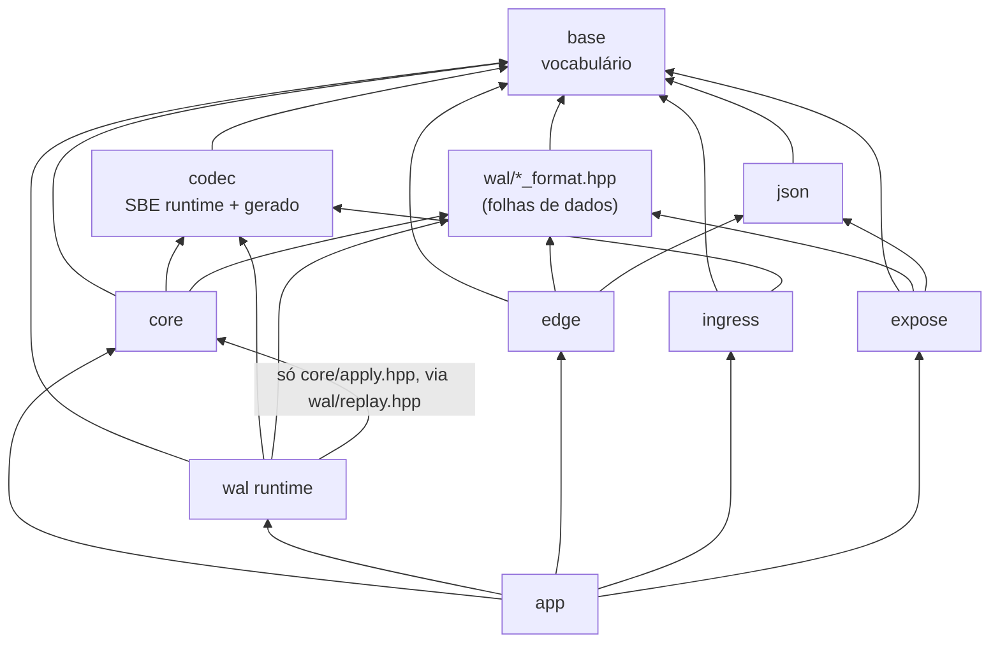

# CONTRATO INTERNO — motor-rv

**Documento de costura.** Fixa nomes, assinaturas e fronteiras para que vários agentes escrevam
módulos em paralelo sem colidir. Não descreve implementação: descreve o que atravessa as
fronteiras. Onde houve empate técnico, ganhou a alternativa que se explica em uma frase — e a
frase está escrita.

Fontes que este documento **obedece** (não substitui): `docs/adr/0001..0023`,
`docs/invariantes.md` (I1..I13, já com a correção de I1 e o I13 novo), `docs/rastreabilidade.md`,
`CODING_RULES.md`, `docs/dominio.md`, `docs/wal.md`, `docs/open-finance.md`, `docs/ambiente.md`,
e os **14 cenários golden** de `tests/domain/golden/`, que são normativos: os números foram
fechados à mão antes de existir código, e é o código que se ajusta a eles.

Onde este documento diverge de um desenho anterior do painel, a divergência está marcada com
"**Decisão:**" e o motivo. Nenhuma decisão aqui reabre ADR aceito.

---

## 0. Ordem de leitura do repositório

Treze paradas. Quem seguir esta ordem entende o motor sem precisar de mais ninguém.

| # | Arquivo | O que se aprende |
|---|---|---|
| 1 | `docs/dominio.md` | Os dois ledgers e a máquina de estados. Sem isso, o resto é sintaxe. |
| 2 | `docs/invariantes.md` | I1 e I13 são identidades **diferentes** sobre os mesmos buckets. Quem confunde as duas escreve um motor que erra só nos dias em que há liquidação pendente de um lado só. |
| 3 | `src/base/fixed.hpp` | Que dinheiro é `int64` e que soma nunca perde informação. |
| 4 | `src/base/rounding.hpp` | Que toda operação que perde informação tem nome próprio — e que o preço médio usa **duas** delas, nesta ordem. |
| 5 | `src/base/ids.hpp` | Quem é quem: documento, instrumento, conta, LSN, data. E por que `DateYmd` não tem `operator+`. |
| 6 | `src/core/state.hpp` | Os buckets: `SettleRow` de uma linha de cache, o anel de datas abertas da partição, e o que é estado (tudo que muda a decisão do `apply`). |
| 7 | `schema/events.xml` + §3.4 deste documento | O vocabulário do log: dez eventos, dez `templateId`. |
| 8 | `src/core/apply.hpp` | A fronteira do núcleo: uma função, um contrato de determinismo, duas classes de erro. |
| 9 | `src/core/partition.hpp` | O motor inteiro cabe em vinte linhas (`poll`), mais o ciclo de EOD. |
| 10 | `src/wal/wal_format.hpp` | Os bytes no disco. Trinta e dois deles são cabeçalho de registro; quatro mil e noventa e seis, de segmento. |
| 11 | `src/wal/wal.hpp` + `group_commit.hpp` | Como um evento vira durável, e por que em grupo. |
| 12 | `src/wal/recovery.hpp` + `state_format.hpp` | Como o estado volta: imagem + prefixo válido + `apply`. |
| 13 | `src/wal/snapshot_format.hpp` + `src/edge/pipeline.hpp` | A única janela do núcleo para o mundo, e as seis etapas FAPI em ordem de custo. |

Depois: `tests/domain/golden/` — os catorze cenários com os números fechados à mão. Eles são a
especificação executável do domínio; este documento existe para que o código passe neles.

**Duas frases que valem por um capítulo, e que o resto do documento só detalha:**

1. *O log é a verdade do que chegou, não do que foi aceito.* `append` acontece antes de `apply`,
   então evento rejeitado está no log, e o replay o rejeita de novo, pelo mesmo código, com o
   mesmo `Status`. Não existe caminho de validação separado do caminho de aplicação: existiriam
   duas verdades.
2. *Se uma estrutura muda a decisão do `apply`, ela é estado e vai para o snapshot.* (golden 13).
   Cache é o que dá para reconstruir sem mudar decisão nenhuma. A fila de exceção, o livro de
   negócios e o conjunto de idempotência são estado — e é por isso que §3.5 existe.

---

## 1. Árvore de `src/`

Uma frase por arquivo. `(gerado)` = produzido pelo gerador Python no build, nunca versionado
(ADR-0006 + ADR-0017). `(folha)` = header de dados puro: só `struct`, `constexpr` e
`static_assert`, sem comportamento.

```
src/
├── CMakeLists.txt                    add_subdirectory de cada camada; nenhuma flag mora aqui.
│
├── base/                             VOCABULÁRIO. Não depende de nada. Todo mundo depende dele.
│   ├── CMakeLists.txt                alvo rv_base.
│   ├── status.hpp                    Err (enum numerado por faixa), Status (8 bytes), Result<T> — erro sem exceção.
│   ├── status.cpp                    to_string(Err) e a classificação fatal/rejeitado, em um lugar só.
│   ├── assert.hpp                    RV_ASSERT, RV_INVARIANT(Ix, cond), RV_CHECK, RV_FAIL_STOP — o número da invariante é grepável.
│   ├── invariant_registry.hpp/.cpp   InvariantId I1..I13, severidade por invariante e contador por id: a §6 não pode mentir.
│   ├── fail_stop.hpp/.cpp            parada da partição: registra, conta métrica, marca halted; nunca lança.
│   ├── int128.hpp                    isola a extensão __int128 (CODING_RULES §2 vs §9) e exporta rv::i128/u128.
│   ├── fixed.hpp                     Fixed<Escala,Unidade> e Qty/Price/Money/Ratio: só operações exatas (soma, subtração, comparação).
│   ├── rounding.hpp                  mul_div<R> e as operações do domínio que perdem informação — a política está no nome.
│   ├── ids.hpp                       DocumentId, InstrumentId, AccountId, PartitionId, Lsn, DateYmd, InvestmentId, PositionSlot.
│   ├── hash.hpp        (folha)       mix64 constexpr: a ÚNICA definição do hash determinístico do projeto. É formato (§2, §3.10).
│   ├── bytes.hpp                     ByteSpan/MutBytes, leitura e escrita little-endian, checagem de alinhamento.
│   ├── crc32c.hpp/.cpp               CRC32C escolhido em COMPILAÇÃO (#if __SSE4_2__), com a tabela como alvo não-v2.
│   ├── arena.hpp/.cpp                arena bump com seal(): depois do warm-up, alocar é assert.
│   ├── dense_index.hpp               open addressing com CHAVE INTEIRA guardada; usa base/hash.hpp. Ordem de iteração = ordem de slot.
│   ├── spsc_ring.hpp                 SPSC de slots fixos: try_claim/publish, begin_drain/end_drain; cursores em cache lines separadas.
│   ├── xorshift.hpp                  PRNG determinístico com semente explícita. PROIBIDO em rv_core (check de símbolos, I12).
│   ├── metrics.hpp/.cpp              contadores e histogramas log-lineares de tamanho fixo; zero alocação.
│   ├── log.hpp/.cpp                  log estruturado com fmt — proibido dentro de apply e do loop de commit.
│   └── cpu.hpp/.cpp                  pin de thread em core físico, huge pages, leitura de cpuinfo no warm-up.
│
├── codec/                            SBE. Runtime escrito à mão + codecs gerados.
│   ├── CMakeLists.txt                alvo rv_codec; roda o gerador e adiciona os arquivos gerados.
│   ├── sbe_runtime.hpp               MessageHeader, GroupHeader, view_as<T>() com checagem de tamanho e alinhamento.
│   ├── schema_digest.hpp  (gerado)   digest do schema; viaja no SegmentHeader e força rotação de segmento quando muda.
│   ├── template_ids.hpp   (gerado)   enum class Tmpl : uint16_t com os dez ids e kTemplateCount.
│   ├── events.hpp         (gerado)   as dez structs POD com static_assert de tamanho, alinhamento e has_unique_object_representations.
│   ├── events_decode.hpp  (gerado)   decode_<msg>(ByteSpan) -> Result<const Msg*>; encode(MutBytes, const Msg&) -> Result<uint16_t>.
│   └── events_debug.cpp   (gerado)   to_string por template; só entra em build debug e nas ferramentas.
│
├── ingress/                          ADAPTADORES. Traduzem o mundo para eventos. Não conhecem core.
│   ├── CMakeLists.txt                alvo rv_ingress.
│   ├── reference_data.hpp/.cpp       pacote de dados de referência (instrumentos, contas, flags) e seu digest — a origem de InstrumentId/AccountId.
│   ├── calendar.hpp/.cpp             calendário B3 de data/calendario-b3-2026.csv: resolve D+2 e D-1. Vive AQUI, nunca no núcleo.
│   ├── partitioner.hpp               partition_of(DocumentId, n) = mix64(doc) & (n−1); e a regra de roteamento de evento com dois documentos.
│   ├── ingress_loop.hpp/.cpp         decodifica, valida limites, escreve IngressFrame no SPSC da partição certa.
│   ├── fees.hpp                      tarifas do simulador (fee_half_up); NÃO é chamado por apply — os custos chegam prontos no evento.
│   ├── trade_feed.cpp                simulador de ExecutionReport (v1) no lugar do drop copy FIX 4.4; semente explícita.
│   └── b3_files.cpp                  arquivos de EOD (fechamento, proventos, posição da depositária) → eventos, em ordem fixa.
│
├── core/                             NÚCLEO. Estado, apply, loop da partição. Hot path.
│   ├── CMakeLists.txt                alvo rv_core, -fno-exceptions -fno-rtti, lista branca de símbolos indefinidos (I12).
│   ├── state.hpp         (barreira)  PartitionState: arenas, colunas SoA, anel de datas, índices, applied_lsn, frozen_at, seq.
│   ├── state_layout.hpp  (barreira)  os static_assert de layout do estado: tamanho, alinhamento e representação única de cada coluna.
│   ├── custody_ledger.hpp/.cpp       buckets de custódia em SoA e as ÚNICAS funções que os alteram (I3).
│   ├── cash_ledger.hpp/.cpp          caixa, a_liquidar[D] e proventos_a_receber por conta (I2).
│   ├── average_price.hpp             AvgPriceAuthority (passkey): só duas TUs conseguem escrever preco_medio. I4 vira erro de compilação.
│   ├── position_index.hpp            (AccountId, InstrumentId) → PositionSlot, denso, com a chave inteira guardada.
│   ├── trade_book.hpp                negócios vivos por trade_id e o TradeState de cada um — sem isto, I5 não sobrevive a um snapshot.
│   ├── trade_state.hpp               a máquina de estados como tabela constexpr: next_state(estado, gatilho) (I5).
│   ├── corporate_action_log.hpp      conjunto de chaves (action_id, account, stage) aplicadas, com ex_date e desfecho — I6 e a poda de 60 dias.
│   ├── exception_queue.hpp           fila de exceções (divergência, rejeição registrada). É ESTADO: vai para o snapshot (goldens 04, 05, 10, 14).
│   ├── settlement.hpp/.cpp           liquidação por data, netting, falha de entrega, recompra e o bucket vencido.
│   ├── corporate_action.hpp/.cpp     as regras de evento corporativo, uma função por linha da tabela de docs/dominio.md.
│   ├── fingerprint.hpp/.cpp          state_digest(st) (CRC encadeado, ordem de slot) e canonical_dump(st, sink) — a relação de igualdade de I11.
│   ├── verify.hpp/.cpp               verify_i1/i2/i3/i13: varreduras O(n) chamadas no fim de cada TESTE, não a cada apply.
│   ├── outbox.hpp/.cpp               staging de saídas com portão em durable_lsn (I10) e seq monotônico para deduplicação.
│   ├── journal.hpp       (barreira)  concept Journal: exatamente o que o núcleo exige de um log, EOD incluído. Nada mais.
│   ├── apply.hpp         (barreira)  EventView, ApplyContext, apply() e a classificação de erro — a fronteira do núcleo.
│   ├── apply.cpp                     o despacho por template e as dez funções apply_*, cada uma em duas fases (check/commit).
│   ├── partition.hpp                 Partition<J>::poll(now_ns) e o ciclo de EOD (seal_day/drain_only). O while mora no app.
│   ├── state_image.hpp/.cpp          stall-and-copy: escreve a imagem de recuperação no layout de wal/state_format.hpp.
│   └── testing/memory_journal.hpp    Journal em memória, sem I/O: torna todo teste de núcleo determinístico por construção.
│
├── wal/                              PERSISTÊNCIA. Três folhas de formato + o runtime.
│   ├── CMakeLists.txt                alvos rv_format (INTERFACE) e rv_wal (STATIC).
│   ├── wal_format.hpp     (folha)    WalHdr, SegmentHeader de 4096 bytes, limites, padding — só bytes, zero comportamento.
│   ├── state_format.hpp   (folha)    imagem de RECUPERAÇÃO: cabeçalho + seções, uma por estrutura de PartitionState. Nunca incluída por edge.
│   ├── snapshot_format.hpp(folha)    snapshot de EXPOSIÇÃO: ExposureHeader, Section, SectionRef, SnapshotView.
│   ├── block_align.hpp/.cpp          statx(STATX_DIOALIGN) com fallback 4096 e registro da origem no cabeçalho do segmento.
│   ├── io_backend.hpp                concept IoBackend: submit/poll/wait/register (ADR-0023 — template, não virtual).
│   ├── uring_backend.hpp/.cpp        backend real: SINGLE_ISSUER|DEFER_TASKRUN, WRITE_FIXED, arquivos e buffers registrados.
│   ├── pwrite_backend.hpp/.cpp       backend síncrono sobre arquivo real: a suíte de WAL não precisa de io_uring.
│   ├── mem_backend.hpp               "segmento" como std::span<std::byte>: recuperação testada sem disco, sem root, em microssegundos.
│   ├── fault_backend.hpp             DECORATOR sobre qualquer IoBackend, com FaultPlan declarativo (reordenação, short write, EIO, cauda rasgada, morte).
│   ├── epoch.hpp                     EpochSource injetado: o epoch aleatório por segmento nunca vem de getrandom() embutido.
│   ├── segment_manager.hpp/.cpp      criação, pré-zeragem e rotação de segmentos; rotaciona também quando o schema_digest muda.
│   ├── segment_reader.hpp/.cpp       leitura sequencial validante com ReplayStopReason público — é aqui que mora a travessia de padding.
│   ├── log_cursor.hpp/.cpp           vários segmentos vistos como um log só, a partir de snapshot_lsn + 1.
│   ├── replay.hpp                    template <ApplierPort A> replay(A&, LogCursor&) — o ÚNICO ponto em que wal toca core.
│   ├── group_commit.hpp/.cpp         janela W, kMaxGroup, kMaxInflight, avanço FIFO de durable_lsn (I9).
│   ├── wal.hpp/.cpp                  template <IoBackend B> class WalT; using Wal = WalT<UringBackend>. Satisfaz core::Journal.
│   ├── recovery.hpp/.cpp             escolhe e carrega a imagem, replica o prefixo válido, devolve RecoveryReport e WalTail (I8, I11).
│   ├── snapshot_writer.hpp/.cpp      grava as duas imagens do mesmo stall: fdatasync, rename atômico, fsync do diretório.
│   ├── snapshot_reader.hpp/.cpp      reconstrói PartitionState a partir da imagem de recuperação, com CRC por seção.
│   ├── manifest.hpp/.cpp             manifesto global partição→arquivo→LSN→revisão; o conjunto de D só vale com EodMark em todas.
│   ├── archive.cpp                   zstd nos segmentos cobertos por snapshot durável; o WAL é trilha de auditoria.
│   └── testing/                      segment_image.hpp (corrupção cirúrgica) e fake_applier.hpp (ApplierPort que só registra lsn/tmpl/crc).
│
├── json/                             FOLHA. Sem dependências além de base. Usada pela borda e pelo expose.
│   ├── CMakeLists.txt                alvo rv_json.
│   ├── writer.hpp/.cpp               escritor incremental para buffer do chamador; mede antes de escrever, nunca realoca.
│   ├── parser.hpp/.cpp               parser com limites explícitos de profundidade, tamanho e número de chaves (alvo de fuzz).
│   └── number.hpp                    Fixed ↔ texto por std::to_chars. Nunca double, nem na saída.
│
├── expose/                           Constrói o snapshot D a partir da imagem de recuperação. Não conhece core.
│   ├── CMakeLists.txt                alvo rv_expose.
│   ├── investment_id.hpp/.cpp        derivação determinística do investmentId (UUID v5 sobre documento + símbolo) — R15.
│   ├── gross_amount.hpp              a conta do I7 em um só lugar, e a declaração normativa de QUAL quantidade entra nela.
│   ├── exposure_builder.hpp/.cpp     lê state_format, escreve todas as seções de snapshot_format em ordem.
│   ├── monthly_segments.hpp/.cpp     escreve e referencia os segmentos mensais imutáveis do histórico (R11, ADR-0003).
│   └── body_writer.hpp/.cpp          corpos JSON pré-serializados por endpoint, no schema da API RV 1.3.0.
│
├── edge/                             RESOURCE SERVER. Vê do núcleo apenas snapshot_format.hpp.
│   ├── CMakeLists.txt                alvos rv_jose, rv_http, rv_edge.
│   ├── transport.hpp                 concept HttpTransport + LoopbackTransport: as seis etapas são testáveis sem TLS real.
│   ├── tls_server.hpp/.cpp           mTLS ICP-Brasil, cipher suites obrigatórios, resumption e renegotiation desligados (R6).
│   ├── http_parse.hpp/.cpp           parser de requisição com limites aplicados ANTES de qualquer parse (alvo de fuzz).
│   ├── http_server.hpp/.cpp          servidor HTTP/1.1 próprio sobre io_uring; run_once(now_ns), espelhando Partition::poll.
│   ├── router.hpp/.cpp               os seis caminhos da API RV → Endpoint, e o parser de query string com limites.
│   ├── pipeline.hpp/.cpp             as seis etapas em ordem de custo, como um array de ponteiros de função.
│   ├── jose.hpp/.cpp                 JWS PS256 sobre EVP_*, thumbprint x5t#S256, rejeição de alg ≠ PS256 (R2, R3, R7).
│   ├── jwks_cache.hpp/.cpp           EVP_PKEY pré-construído por kid; recarga acontece fora do caminho da requisição.
│   ├── token_cache.hpp/.cpp          tokens já validados até exp (≤ 900 s), chaveados pelo hash do compact.
│   ├── consent.hpp/.cpp              ConsentRecord (titular, permissões, status, validade) com invalidação push (R4, R5).
│   ├── quota.hpp/.cpp                contadores mensais por consentimento × endpoint em arquivo mapeado (423) e rate limit (429) — R16.
│   ├── snapshot_set.hpp/.cpp         CONJUNTO de snapshots (um por partição) com refcount, Guard RAII e troca atômica do conjunto inteiro.
│   ├── timezone.hpp                  now_ns → data corrente em São Paulo, por tabela de offsets. Sem std::chrono no caminho quente.
│   ├── handlers.hpp/.cpp             os seis handlers: prólogo + recorte do corpo pré-serializado + links/meta, por lista de spans.
│   ├── problem.hpp/.cpp              corpo de erro padrão da API e o mapa Err → status HTTP.
│   ├── audit.hpp/.cpp                trilha de auditoria (R19) com snapshot_lsn e revisão servidos, e métricas por endpoint (R17, R18).
│   └── testing/                      fake_peer.hpp (TlsPeer sintético) e frozen_clock.hpp (exp, consentimento, rollover de mês).
│
├── tools/                            Ferramentas de linha de comando. Nenhuma entra em produção.
│   ├── walcat.cpp                    despeja registros do WAL (lsn, tmpl, crc, campos decodificados).
│   ├── snapcat.cpp                   valida e imprime um snapshot (usada pelo verificador).
│   ├── replay_check.cpp              reexecuta um log e imprime state_digest — I11 na linha de comando e no CI.
│   └── fixturegen.cpp                gera logs e snapshots de fixture determinísticos (semente e epoch na linha de comando).
│
└── app/                              COMPOSIÇÃO. O único lugar com `while (true)` e com `new`.
    ├── CMakeLists.txt                executáveis e as instanciações explícitas de template.
    ├── config.hpp/.cpp               configuração por arquivo, validada na entrada; nenhum default escondido no código.
    ├── instantiate.cpp               instancia Partition<Wal<UringBackend>> e WalT<UringBackend> uma vez, para o resto compilar rápido.
    ├── motor_main.cpp                processo do motor: ingress, N partições pinadas, WAL, ciclo de EOD.
    ├── rs_main.cpp                   processo do resource server: mapeia o conjunto de snapshots e serve.
    ├── replay_main.cpp               executável dedicado de replay, linkado com --wrap de clock_gettime/getrandom/time (I12).
    ├── simulador_main.cpp            gerador de fluxo para testes e bench; a semente entra no log via DayOpened.
    └── bench_main.cpp                harness de medição próprio que escreve bench/baseline.json (ADR-0021).
```

**Por que `base`, `json` e `expose` existem, se `CODING_RULES §10` fala de três camadas.** Porque
`base`, `codec`, `json` e as três folhas de formato **não são camadas: são vocabulário**.
Vocabulário não tem direção — tem apenas ausência de dependência. A regra de camadas continua
valendo, literal, para `core`, `wal` e `edge`. Está formalizada em §2 e mecanizada pelo CMake.

---

## 2. Direção de dependência



Regra em uma frase por aresta:

| Aresta | Por quê |
|---|---|
| `core → format` | O núcleo escreve a imagem de recuperação. Escreve **bytes**, não chama código de `wal`. |
| `wal → core` | Só através do concept `ApplierPort` em `wal/replay.hpp`, e só `core/apply.hpp`. É exatamente a frase de `CODING_RULES §10`. |
| `core ↛ wal runtime` | O núcleo declara o que precisa (`concept Journal`) em vez de importar quem fornece. Inversão de dependência sem vtable. |
| `edge → format` | A borda enxerga o núcleo **só** pelo snapshot de exposição. `edge` não linka `rv_core`; o CMake garante. `state_format.hpp` é do núcleo e da persistência: `edge` não o inclui. |
| `expose ↛ core` | O construtor do snapshot lê a imagem de recuperação, não o estado vivo. É isso que permite construí-lo em outra thread sem lock. |
| `ingress ↛ core` | O ingress traduz o mundo em eventos e não sabe o que o motor fez com eles. É o que impede um campo de evento de depender do estado da partição — a regra que C2 fixou e que este documento aplica ao catálogo inteiro (§3.4). |

**Como a regra é APLICADA, não só documentada.** Cinco mecanismos, todos rodando no `ctest`:

1. **Link.** Cada camada é um alvo CMake com `target_link_libraries` explícito. `rv_edge` **não**
   linka `rv_core`; um `#include "core/..."` na borda não compila. `rv_format` é `INTERFACE` e só
   pode incluir `base/`.
2. **`scripts/check_layers.py`** (alvo `test_layers`) lê os `#include` de `src/**` e falha se
   aparecer uma aresta fora do grafo acima. Ele também falha se `state_format.hpp` aparecer sob
   `src/edge/`, e se `snapshot_format.hpp` for incluído por `src/core/`.
3. **`scripts/check_determinism.py`** roda `nm -u rv_core.a` contra uma **lista branca** de
   símbolos indefinidos permitidos e falha em qualquer outro. Lista branca, não negra: uma lista
   negra não vê `std::chrono::steady_clock::now()` nem uma syscall futura. Complementa com
   `objdump -d` procurando `rdtsc`, `rdtscp`, `rdrand`, `rdseed` — instruções não geram símbolo.
4. **`scripts/check_rules.py`** falha se: `withhold_trunc` ou `fee_half_up` aparecerem em
   `src/core/`; `__int128` aparecer fora de `base/int128.hpp` e `base/rounding.hpp`; `std::hash`
   aparecer em qualquer coisa persistida ou replicada; `TODO` sem `ADR-NNNN` ou número de issue.
5. **`scripts/check_invariants.py`** cruza `docs/invariantes.md` (I1..I13) com os rótulos `ctest`
   existentes e com o registro de `base/invariant_registry.hpp`, e falha se alguma linha ficar sem
   ponto de verificação ou sem teste. Isto é a mecanização de "invariante sem teste não existe".

**Decisão (correção de referência cruzada):** a função de hash determinística mora em
`base/hash.hpp`, e **só** lá. Ela é formato — escritor de snapshot e leitor da borda precisam
concordar byte a byte — mas `base/dense_index.hpp` e `ingress/partitioner.hpp` também precisam
dela, e nenhum dos dois pode incluir `wal/`. Duas cópias de uma função declarada "congelada" é
o pior dos mundos: `snapshot_format.hpp` a inclui de `base/` e documenta que a usa.
`tests/domain/test_hash_golden.cpp` fixa vetores (documento → hash → slot) para que mudá-la
quebre um teste, e não a produção.

---

## 3. Fronteiras — assinaturas exatas

Tudo abaixo é C++23 real. Namespaces: `rv` para o vocabulário, `rv::codec`, `rv::core`, `rv::wal`,
`rv::json`, `rv::expose`, `rv::edge`, `rv::ingress`.

### 3.1 Erro sem exceção

```cpp
// src/base/status.hpp
namespace rv {

enum class Err : uint16_t {
  Ok = 0,
  // 1..99   base
  OutOfRange = 1, ArenaExhausted = 2, Overflow = 3, NotFound = 4, WouldBlock = 5,
  // 100..199 codec
  UnknownTemplate = 100, ShortPayload = 101, BadBlockLength = 102, GroupTooLarge = 103,
  // 200..249 core / domínio — REJEITADO: o estado não muda, o evento fica no log
  InvalidTransition = 200,        // I5
  AlreadyApplied = 201,           // I6 — idempotente: no-op registrado
  NegativeBucket = 202,           // I3
  QtyMismatch = 203,              // conferência de qty_delta / Σ alocações
  UnknownBatch = 204,             // (account, settlement_date) sem lote aberto
  NettingMismatch = 205,          // I2 — o net da câmara diverge do que o motor acumulou
  InvalidInstrumentSpec = 206,    // price_factor == 0, lot_size == 0, símbolo vazio (golden 12)
  SettlementWindowFull = 207,     // o anel de datas abertas não tem slot livre
  ShortSellNotAuthorized = 208,   // I3: bit1 do evento sem a flag correspondente no cadastro
  CrossPartitionAllocation = 209, // from_account e to_account em partições diferentes (§3.3)
  IncomeOutOfTolerance = 210,     // golden 10: |bruto − qty_base × valor_por_ação| > 1 centavo
  InvalidFactor = 211,            // factor_num/factor_den não é exato em 1e-8
  ExerciseOutOfRange = 212,       // golden 11: qty_exercida fora de [0, direitos inteiros]
  // 250..299 core / domínio — FATAL: é corrupção de log, não rejeição de negócio
  UnknownInstrument = 250,
  UnknownAccount = 251,
  LedgerOverflow = 252,           // int64 estourou em um bucket
  StateCorrupt = 253,
  ReferenceDigestMismatch = 254,  // DayOpened.reference_digest ≠ pacote carregado no warm-up
  DayDiscontinuity = 255,         // DayOpened.prev_business_date ≠ último dia fechado
  InstrumentIdentityMismatch = 256, // ClosingPriceSet liga um id a um símbolo diferente do já ligado
  StateDigestMismatch = 257,      // EodMarked.state_digest ≠ digest recomputado (I11)
  // 300..399 wal
  WalFull = 300,                  // transitório: sem buffer livre ou kMaxInflight atingido
  OutboxFull = 301,               // transitório: contrapressão, NÃO é fatal (§3.8)
  ShortWrite = 350, IoError = 351, BadCrc = 352, BadMagic = 353, LsnGap = 354,
  EpochMismatch = 355, SegmentDiscontinuity = 356, ApplyFatal = 357,
  // 400..499 edge
  MissingInteractionId = 400, BadSignature = 401, TokenExpired = 402, CertBindingMismatch = 403,
  ConsentNotAuthorised = 404, ScopeMissing = 405, OperationalLimit = 406, RateLimited = 407,
  MalformedRequest = 408, ResourceNotFound = 409, UnprocessableRange = 410,
};

const char* to_string(Err) noexcept;

class [[nodiscard]] Status {
 public:
  constexpr Status() noexcept = default;                                  // ok
  static constexpr Status fail(Err e, uint32_t detail = 0) noexcept;
  [[nodiscard]] constexpr bool     is_ok()    const noexcept;
  [[nodiscard]] constexpr bool     is_error() const noexcept;
  [[nodiscard]] constexpr Err      code()     const noexcept;
  [[nodiscard]] constexpr uint32_t detail()   const noexcept;             // LSN curto, offset, índice
  [[nodiscard]] constexpr bool     is_fatal() const noexcept;             // tabela única em status.cpp
 private:
  Err      code_{Err::Ok};
  uint16_t pad_{0};
  uint32_t detail_{0};
};
static_assert(sizeof(Status) == 8 && std::is_trivially_copyable_v<Status>);

template <class T>
class [[nodiscard]] Result {
  static_assert(std::is_trivially_copyable_v<T>, "Result<T> é para valores POD do hot path");
 public:
  constexpr Result(T v) noexcept;
  constexpr Result(Status s) noexcept;                                    // RV_ASSERT(s.is_error())
  constexpr explicit operator bool() const noexcept;
  constexpr const T& operator*()  const noexcept;                         // RV_ASSERT(ok)
  constexpr const T* operator->() const noexcept;
  [[nodiscard]] constexpr Status status() const noexcept;
  [[nodiscard]] constexpr T value_or(T fallback) const noexcept;
 private:
  Status st_{};
  union { T v_; };
};

}  // namespace rv
```

**Por quê.** `Status` cabe em um registrador e é trivialmente copiável, então "retornar erro" custa
o mesmo que retornar um `int`. A faixa numérica de `Err` é estável: o número aparece em log,
métrica e relatório de crash, e `grep 252` acha a causa. `is_fatal()` é uma tabela em um único
`.cpp` — a decisão "isso derruba a partição?" está escrita em um lugar, não espalhada em `if`s.

**Por que a faixa 200..249 é separada da 250..299.** A fronteira entre rejeitar e parar é a
fronteira entre "o mundo mandou algo impossível" e "o log está corrompido". Um negócio malformado
vindo do ingress não pode derrubar um core inteiro (golden 04 escreve isso com todas as letras);
um evento que cita um `InstrumentId` que o log nunca descreveu significa que o arquivo é outro, e
continuar é corromper. Com a faixa numérica separada, `is_fatal()` é uma comparação, não uma
tabela de exceções que alguém esquece de atualizar.

```cpp
// src/base/assert.hpp
#define RV_ASSERT(cond)                  /* debug: aborta com arquivo:linha; release: __builtin_assume */
#define RV_INVARIANT(id, cond)           /* id ∈ {I1..I13}; debug: aborta; release: conta e aplica a severidade do registro */
#define RV_CHECK(cond, status)           /* SEMPRE ativo, O(1); devolve `status` ou faz fail-stop conforme a classe */
#define RV_FAIL_STOP(err, ctx)           /* marca a partição parada; nunca retorna ao caminho normal */
```

```cpp
// src/base/invariant_registry.hpp
namespace rv {

enum class InvariantId : uint8_t {
  kI1 = 1, kI2, kI3, kI4, kI5, kI6, kI7, kI8, kI9, kI10, kI11, kI12, kI13
};
enum class InvariantClass : uint8_t {
  kLedger,        // I1, I2, I3, I4, I13 — fail-stop em release: continuar é corromper
  kDomain,        // I5, I6, I7          — rejeita o evento e segue
  kDurability,    // I8, I9, I10, I11    — fail-stop em release
  kDeterminism,   // I12                 — verificado no build e por ferramenta, não em runtime
};
struct InvariantInfo { InvariantId id; InvariantClass klass; std::string_view text; };

[[nodiscard]] const InvariantInfo& invariant_info(InvariantId) noexcept;
[[nodiscard]] uint64_t invariant_violations(InvariantId) noexcept;   // contador global por id

}  // namespace rv
```

**Por que um registro em vez de `assert` solto, e por que ele vai até I13.** A regra do projeto era
"`RV_INVARIANT` vira métrica, e fail-stop quando a classe for durabilidade ou ledger" — uma frase
sem tabela que a definisse. Com o registro, a classe de cada invariante é dado, `ctest -L I9` e o
contador se encontram, e a tabela de §6 deixa de poder mentir. **O domínio da macro é I1..I13**,
não I1..I12: `docs/invariantes.md` tem treze linhas desde a correção de I1, e
`scripts/check_invariants.py` reprovaria o build no dia em que I13 não tivesse rótulo. A numeração
nunca é reutilizada, então o domínio cresce; a macro aceita qualquer `InvariantId` declarado.

**`RV_INVARIANT` não pode ter efeito colateral.** `tests/core/test_invariant_no_side_effect.cpp`
processa o mesmo log em um build com asserts e em um sem, e compara o `state_digest` final. É a
única maneira de a macro ser segura dentro de `apply` — sem esse teste, "o assert não muda nada" é
uma esperança.

### 3.2 Ponto fixo e políticas de arredondamento

```cpp
// src/base/fixed.hpp
namespace rv {

namespace unit { struct Share {}; struct BrlPerShare {}; struct Brl {}; struct Scalar {}; }

template <int Scale, class Unit>
class Fixed {
 public:
  using Raw = int64_t;
  static constexpr int  kScale = Scale;               // casas decimais
  static constexpr Raw  kOne   = pow10_i64(Scale);    // uma unidade, em raw
  static constexpr Raw  kMax   = (Raw{1} << 62) - 1;  // domínio seguro: o produto de dois cabe em i128
  static constexpr Raw  kMin   = -kMax;

  constexpr Fixed() noexcept = default;
  static constexpr Fixed from_raw(Raw r) noexcept;
  static constexpr Fixed from_units(int64_t u) noexcept;      // RV_ASSERT sem overflow
  [[nodiscard]] constexpr Raw  raw()     const noexcept;
  [[nodiscard]] constexpr bool is_zero() const noexcept;

  // Exatas: nenhuma perde informação. Overflow chama fail_stop (LedgerOverflow) em TODO build.
  friend constexpr Fixed operator+(Fixed, Fixed) noexcept;
  friend constexpr Fixed operator-(Fixed, Fixed) noexcept;
  friend constexpr Fixed operator-(Fixed) noexcept;
  constexpr Fixed& operator+=(Fixed) noexcept;
  constexpr Fixed& operator-=(Fixed) noexcept;
  friend constexpr auto operator<=>(Fixed, Fixed) noexcept = default;
  friend constexpr bool operator==(Fixed, Fixed) noexcept = default;

  // Versão que devolve o erro em vez de parar — usada onde a rejeição é de negócio.
  [[nodiscard]] static constexpr Status checked_add(Fixed a, Fixed b, Fixed& out) noexcept;
  [[nodiscard]] static constexpr Status checked_sub(Fixed a, Fixed b, Fixed& out) noexcept;
 private:
  Raw raw_{0};
};

using Qty   = Fixed<8, unit::Share>;        // quantidade,        escala 1e-8
using Price = Fixed<8, unit::BrlPerShare>;  // preço unitário,    escala 1e-8
using Money = Fixed<4, unit::Brl>;          // BRL,               escala 1e-4
using Ratio = Fixed<8, unit::Scalar>;       // fator adimensional (10; 0,1; 0,05; 0,25)

inline constexpr Qty kOneShare = Qty::from_units(1);

static_assert(sizeof(Qty) == 8 && std::is_trivially_copyable_v<Qty>);
static_assert(std::has_unique_object_representations_v<Qty>);
}  // namespace rv
```

**Por que a unidade é parâmetro, e não só a escala.** `Qty` e `Price` têm a mesma escala (1e-8,
ADR-0007). Com `using Qty = Fixed<8>` os dois seriam o mesmo tipo e `notional(price, qty)`
compilaria silenciosamente. Um tag vazio custa zero byte e zero instrução e transforma uma troca
de argumentos em erro de compilação. Foi o único ponto em que este desenho preferiu um parâmetro
a mais de template a um comentário. *(Desvio de `CODING_RULES §2`, que escreve
`Fixed<int64_t, escala>` — pendência §8.)*

**Por que não existe `operator*`.** Multiplicar dois pontos fixos muda a escala e obriga a
arredondar. Toda multiplicação e divisão vive em `rounding.hpp`, com o arredondamento no nome. Se
você conseguiu escrever `a * b`, o desenho falhou.

**Por que `has_unique_object_representations_v` é exigido aqui, e não só nos eventos.** O
`state_digest` de I11 (§3.5) é um CRC sobre as colunas de estado. Sem representação de objeto
única, esse digest seria função do lixo de padding e falharia de forma diferente entre
compiladores — e um teste de equivalência de replay que falha aleatoriamente é pior que nenhum.

```cpp
// src/base/rounding.hpp
namespace rv {

enum class Rounding : uint8_t { TowardZero, TowardNegInf, HalfUp, HalfEven };

// Núcleo: (a·b)/d com o produto em rv::i128 e a política explícita. d > 0 (RV_ASSERT).
template <Rounding R>
[[nodiscard]] constexpr int64_t mul_div(int64_t a, int64_t b, int64_t d) noexcept;

// ---- Operações do domínio. A política faz parte do nome e do contrato. ----

// I7: grossAmount = qty × closingPrice / priceFactor
//     raw: (q.raw · p.raw) / (10^12 · price_factor)   [1e-8 × 1e-8 → 1e-4]
[[nodiscard]] constexpr Money notional_half_even(Qty q, Price p, uint32_t price_factor) noexcept;

// PASSO 1 do preço médio: o custo de uma posição existente, de 1e-16 para Money (1e-4).
// Existe como função nomeada porque É um arredondamento, e arredondamento sem nome é um bug
// esperando o cenário certo — ver a nota "os dois passos" abaixo.
[[nodiscard]] constexpr Money position_cost_half_even(Qty q, Price p) noexcept;

// PASSO 2 do preço médio (I4): custo total acumulado ÷ quantidade acumulada.
[[nodiscard]] constexpr Price average_price_half_even(Money total_cost, Qty total_qty) noexcept;

// Toda a família "fator": desdobramento, grupamento, bonificação e direitos de subscrição.
// Aplica `factor` sobre `base` e reparte em parte inteira de `unit` e fração.
struct FactorSplit { Qty whole; Qty fraction; };
[[nodiscard]] constexpr FactorSplit apply_factor_floor(Qty base, Ratio factor, Qty unit) noexcept;

// Preço médio em desdobramento (factor < 1) e grupamento (factor > 1).
[[nodiscard]] constexpr Price scale_price_half_even(Price p, Ratio factor) noexcept;

// Ratio exato a partir do par do evento; devolve erro se num·10^8 não for divisível por den.
[[nodiscard]] constexpr Result<Ratio> ratio_from(uint32_t num, uint32_t den) noexcept;

// ---- Duas operações SEM chamador em `core`. check_rules.py falha se aparecerem lá. ----
// Corretagem, emolumentos, taxa de liquidação: usado por `ingress/fees.hpp` (simulador).
// Os custos chegam PRONTOS nos campos de `TradeExecuted`; `apply` nunca os recalcula.
[[nodiscard]] constexpr Money fee_half_up(Money base, uint32_t rate_ppm) noexcept;
// IRRF: pertence ao módulo de IR (ADR-0011), que consome o log e não escreve nele.
// `apply` VERIFICA `bruto − irrf == liquido` (golden 10) e nunca calcula retenção.
[[nodiscard]] constexpr Money withhold_trunc(Money gross, uint32_t rate_bp) noexcept;
}  // namespace rv
```

| Operação | Política | Por quê |
|---|---|---|
| `notional_half_even` | half-even | É a conta exposta pela API (I7). Half-even não enviesa a soma de milhões de posições, e é a soma que o investidor confere contra o extrato. Golden 12. |
| `position_cost_half_even` | half-even | O custo antigo de uma posição sai de 1e-16 e tem de virar `Money` antes de somar com o custo novo. Half-even pelo mesmo motivo, e porque é o valor que os goldens 09 e 11 escrevem explicitamente. |
| `average_price_half_even` | half-even | O preço médio é base de custo; viés sistemático aqui vira erro de IR (golden 02 justifica contra `TRUNC` e contra `HALF_UP`). |
| `apply_factor_floor` | piso, na granularidade de `unit` | O grupamento **não pode** criar quantidade; a fração é `sobras` (goldens 08, 09, 11). |
| `scale_price_half_even` | half-even | Mesma razão do preço médio: é preço médio depois de reescalonado. |
| `fee_half_up` | half-up | Convenção de tarifa: o centavo de meio vai para cima (C4). |
| `withhold_trunc` | trunca | Retenção arredondada para cima seria retenção a maior (C4). |

#### Os dois passos do preço médio — a correção que os goldens 09 e 11 exigem

A forma "óbvia" da função é `average_price_half_even(Qty q_old, Price p_old, Qty q_add,
Money cost_add)`, com o numerador inteiro em `i128` e **uma** divisão no fim. Ela é
aritmeticamente mais limpa e é o que o golden 12 prega para `notional`. **E reprova dois cenários
normativos por uma unidade em 1e-8.** As contas, porque o motivo tem de ficar escrito:

*Golden 09 (bonificação).* `q_old = 137`, `p_old = 3217072993`, `cost_add = 720000`, `q_new = 143`.

    divisão única : 13700000000 × 3217072993 = 44_073_900_004_100_000_000 (1e-16)
                    + 720000 × 10^12         = 44_793_900_004_100_000_000
                    ÷ 14300000000            = 3_132_440_559,727  → HALF_EVEN → 3132440560
    dois passos   : position_cost_half_even(137, 32,17072993) = 44073900 (1e-4)
                    + 720000                                   = 44793900
                    average_price_half_even(44793900, 143)     = 3_132_440_559,44 → 3132440559 ✔

*Golden 11 (subscrição).* `q_old = 143`, `p_old = 3132440559`, `cost_add = 5000000`, `q_new = 163`.

    divisão única : 49_793_899_993_700_000_000 ÷ 16300000000 = 3_054_840_490,411 → 3054840490
    dois passos   : 44793900 + 5000000 = 49793900
                    49793900 × 10^12 ÷ 16300000000 = 3_054_840_490,797 → 3054840491 ✔

Os goldens exigem `3132440559` e `3054840491`. C4 fixou que os catorze cenários não mudam. Logo a
ordem correta é: **arredonda o custo antigo para 1e-4, soma o custo novo, divide uma vez.**

O golden 09 sozinho não discrimina bem (dá `3132440559` por um caminho e `3132440560` pelo outro,
e alguém poderia culpar o empate); o golden 11 confirma de forma independente, com `0,411` contra
`0,797` — nada de empate, dois resultados diferentes. É por isso que a política **não pode** ficar
escondida dentro de uma função cujo nome anuncia uma só: a assinatura `average_price_half_even(Money,
Qty)` obriga o chamador a nomear o passo intermediário, e `settlement.cpp` escreve

```cpp
const Money cost = position_cost_half_even(pos.qty, pos.avg_price) + cost_add;
set_avg_price(pos, average_price_half_even(cost, pos.qty + qty_add), AvgPriceAuthority{});
```

que é revisável linha a linha. Se alguém "otimizar" para uma divisão só, o golden 11 falha.

**Conflito resolvido, para não voltar:** o golden 02 chama a operação de
`weighted_average_price_half_up` em uma frase de texto; C4 fixou `half_even` e o próprio golden 02
argumenta contra `HALF_UP` duas linhas antes. O nome normativo é `average_price_half_even`; a
menção a `half_up` no texto do golden 02 é erro de redação a corrigir junto com este documento.

#### `apply_factor_floor` — uma função para toda a família fator

As três operações antigas (`scale_qty_exact`, `scale_qty_trunc`, `divide_price_half_even`) não
expressavam os goldens: `scale_qty_trunc` truncava na escala do `Fixed` (1e-8), e `1377/10 = 137,7`
é **exato** em 1e-8 — o grupamento do golden 08 devolveria `disponivel = 137,7` e `sobras = 0`,
passando em todo teste de "não criou quantidade" e reprovando o cenário. A granularidade que
importa (ação inteira) não era parâmetro de ninguém. E `scale_qty_exact(Qty, uint32_t)` não aceita
0,05 nem 0,25, que são os fatores dos goldens 09 e 11.

```cpp
FactorSplit apply_factor_floor(Qty base, Ratio factor, Qty unit) noexcept;
```

| Cenário | `base` | `factor` | `unit` | `whole` | `fraction` |
|---|---|---|---|---|---|
| golden 07 — desdobramento 1:10 | 137 | 10 | 1 ação | 1.370 | 0 |
| golden 08 — grupamento 10:1 | 1.377 | 0,1 | 1 ação | 137 | 0,7 |
| golden 09 — bonificação 5 % | 137 | 0,05 | 1 ação | 6 | 0,85 |
| golden 11 — direitos 1:4 | 143 | 0,25 | 1 ação | 35 (direitos) | 0,75 |

`unit` é parâmetro explícito porque "ação inteira" é regra de hoje, não lei da natureza: um
instrumento cujo lote indivisível fosse outro só muda o argumento. `factor` vem do par
`factor_num/factor_den` do evento por `ratio_from`, que **rejeita** um par não representável
exatamente em 1e-8 (`Err::InvalidFactor`) — um fator inexato faria o motor e a depositária
divergirem em uma casa que ninguém consegue explicar depois.

**Consequência de C6 que ninguém tinha puxado: desdobramento e grupamento reescalonam `sobras`.**
C6 fixa que `sobras` está **sempre na unidade corrente do instrumento**, e desdobramento e
grupamento mudam a unidade corrente. Se o fator fosse aplicado só sobre `disponivel`, uma conta que
chegasse com `sobras = 0,85` (fim do golden 09) e sofresse o grupamento 10:1 do golden 08 ficaria
com `sobras = 0,7 + 0,85 = 1,55` — misturando 0,7 ação **nova** com 0,85 ação **antiga** — contra
uma depositária que veria `(1377 + 0,85)/10 = 137,785`. Divergência de 0,765 ação, exatamente o
erro de unidade que o golden 08 diz que I1 existe para pegar.

**Regra normativa:** na família fator, `apply_factor_floor` é aplicada sobre a **posição inteira na
unidade antiga**, isto é `disponivel + sobras`, e devolve a nova `disponivel` (`whole`) e a nova
`sobras` (`fraction`), já na unidade nova. Nunca sobre `disponivel` sozinho, e nunca de forma
incremental. Expressar isso como delta seria impossível: o delta correto (`−0,765`) é função da
`sobras` da conta, que o produtor do evento não conhece — o mesmo argumento de C2.

*Falta um cenário golden:* nenhum dos catorze encadeia `sobras` não-nula com mudança de unidade,
que é exatamente por que o buraco passou. O golden 08 ganha um passo com `sobras` de entrada
não-zero, e o teste correspondente é obrigatório antes do fim da fase 3.

**Teste:** `tests/domain/test_rounding_table.cpp` — uma tabela golden por operação, incluindo os
empates (`.5` com parte inteira par **e** ímpar), negativos, e os limites de `int64`/`i128`
(`10^9 ações × 10^6 reais = 10^31` em 1e-16, contra `1,7 × 10^38` de `i128`, verificado por
`static_assert` sobre `Qty::kMax` e `Price::kMax`, como manda o golden 12).

### 3.3 Identificadores

```cpp
// src/base/ids.hpp
namespace rv {

// Uma regra só: todo id é um struct com um campo `v` e comparação padrão. Sem conversão implícita.
struct DocumentId   { uint64_t v = 0; auto operator<=>(const DocumentId&) const = default; };
struct InstrumentId { uint32_t v = 0; auto operator<=>(const InstrumentId&) const = default; };
struct AccountId    { uint32_t v = 0; auto operator<=>(const AccountId&)  const = default; };
struct PositionSlot { uint32_t v = 0xFFFF'FFFFu; };     // linha (conta × instrumento) nas colunas SoA
struct PartitionId  { uint16_t v = 0; auto operator<=>(const PartitionId&) const = default; };
struct SettleSlot   { uint8_t  v = 0xFFu; };            // índice no anel de datas abertas (§3.5)
struct Lsn          { uint64_t v = 0; auto operator<=>(const Lsn&) const = default;
                      constexpr Lsn next() const noexcept { return Lsn{v + 1}; } };
struct InvestmentId { std::array<uint8_t, 16> b{}; auto operator<=>(const InvestmentId&) const = default; };

inline constexpr InstrumentId kNoInstrument{0};
inline constexpr AccountId    kNoAccount{0};
inline constexpr Lsn          kNoLsn{0};
inline constexpr PositionSlot kNoPosition{};

// DocumentId: CPF (11 dígitos) e CNPJ (14 dígitos) cabem exatos em 63 bits.
inline constexpr uint64_t kCnpjBit = 1ull << 63;
[[nodiscard]] constexpr DocumentId cpf(uint64_t digits) noexcept;    // digits < 10^11
[[nodiscard]] constexpr DocumentId cnpj(uint64_t digits) noexcept;   // digits < 10^14, seta kCnpjBit
[[nodiscard]] constexpr bool is_cnpj(DocumentId) noexcept;

struct DateYmd {
  uint32_t v = 0;                                        // AAAAMMDD; 0 = ausente
  static constexpr DateYmd from_ymd(int y, int m, int d) noexcept;
  [[nodiscard]] constexpr int  year()  const noexcept;
  [[nodiscard]] constexpr int  month() const noexcept;
  [[nodiscard]] constexpr int  day()   const noexcept;
  [[nodiscard]] constexpr bool valid_shape() const noexcept;   // só a FORMA, não o calendário
  auto operator<=>(const DateYmd&) const = default;
  // NÃO EXISTE operator+, nem plus_business_days, nem day_index().
};
static_assert(sizeof(DateYmd) == 4);
}  // namespace rv
```

| Id | Tipo | Por que é o que é |
|---|---|---|
| `DocumentId` | `uint64` exato | CPF e CNPJ são números; cabem em 63 bits com um bit de tipo. **Não é hash**: um ledger não pode conviver com colisão, e servir a posição de outro investidor por colisão de hash é incidente de LGPD. É a chave estável entre partições, entre dias e entre o log e o snapshot. |
| `PartitionId` | `uint16` | Não aparece em payload de evento: a partição é implícita no log em que o registro está. Aparece em `SegmentHeader`, `ExposureHeader`, manifesto e `DayOpened` (redundância contra arquivo trocado). `uint16` porque a máquina de referência comporta 4 partições e o formato não deve ser reaberto quando forem 64. |
| `InstrumentId` | `uint32` denso | Índice direto em coluna SoA. **Vem do pacote de dados de referência versionado**, não da ordem de chegada — ver a decisão abaixo. |
| `AccountId` | `uint32` denso | Slot de partição. **Também vem do pacote de referência.** Nunca aparece no log nem no snapshot como chave: **o log fala `DocumentId`, a memória fala `AccountId`**. Assim rebalancear partição não invalida nada gravado. |
| `PositionSlot` | `uint32` denso | Resultado do único lookup com hash do hot path: `(AccountId, InstrumentId) → PositionSlot`. |
| `Lsn` | `uint64` por partição | Global exigiria coordenação entre cores — o oposto de shared-nothing (ADR-0005). Só é comparável dentro da partição; o manifesto casa as partições por `EodMark{D}`. `0` significa "nenhum"; o primeiro registro é 1. |
| `DateYmd` | `uint32` AAAAMMDD | Legível em hexdump, ordena como inteiro, sem fuso e sem `std::chrono` no hot path. |
| `InvestmentId` | 16 bytes | UUID v5 sobre (documento, símbolo). Determinístico ⇒ estável entre dias, replays e partições. É o `resourceId` da API Recursos (R15). |

**Por que `DateYmd` não faz aritmética — e a consequência que isso força.** D+2 conta **pregões**,
e o calendário de pregões é dado de entrada (`data/calendario-b3-2026.csv`), não fórmula: o golden
06 é explícito ("a data de liquidação vem no evento, calculada pelo ingress; se fosse calculada
dentro do `apply` consultando um calendário carregado de arquivo, o replay leria arquivo externo e
violaria I12"). Se `DateYmd` não faz aritmética, os buckets `a_liquidar[D]` **não podem** ser um
array indexado por data. A solução está em §3.5: um anel de datas abertas por partição.

**Decisão — o índice de bucket por data de calendário está errado, e não é o bucket vencido que o
quebra.** O desenho anterior indexava os buckets por `day_index() % kSettlementHorizon` com
`kSettlementHorizon = 3`. Isso colide **no ciclo normal, sem nenhuma falha de entrega**, porque as
três datas de liquidação abertas ao mesmo tempo distam 3, 4 ou 5 dias de calendário. Com o
calendário real do repositório:

| Pregão | Datas de liquidação abertas | `day_index` | `% 3` |
|---|---|---|---|
| qui 20260910 | 20260910 (de 0908), 20260911 (de 0909), 20260914 (de 0910) | X, X+1, X+4 | X, X+1, **X+1** |
| sex 20260911 | 20260911, 20260914, 20260915 | X, X+3, X+4 | X, **X**, X+1 |

Toda quinta e toda sexta — cerca de 40 % dos pregões — duas datas caem no mesmo slot e um
`Liquidado{20260911}` zeraria também o que liquida na segunda. Acrescentar um quarto slot para o
bucket vencido de C3 não resolve: com 4, colidem `X` e `X+4`. **Nenhuma potência de dois salva um
índice de calendário**, porque a distância em dias de calendário entre pregões consecutivos não é
constante. A correção está em §3.5.

**Contrato de ordenação (vale para todo o log).** Nenhum evento pode citar um `InstrumentId` que o
log ainda não descreveu, nem um `DocumentId` ausente do pacote de referência do dia. Violar isso é
`Err::UnknownInstrument` / `Err::UnknownAccount`, ambos **fatais** — é corrupção de log, não
rejeição de negócio. O ingress garante a ordem: `DayOpened` → um `ClosingPriceSet` por instrumento
do dia → o resto → `EodMarked`.

**Exceção escrita ao contrato "o ingress produz, a partição consome": `EodMarked`.** É o único dos
dez eventos **produzido pela própria partição**, por `Partition::seal_day()` (§3.9). O motivo é o
que C2 fixou ao contrário: `EodMarked` carrega o digest do estado e os dois checksums, que são
função do estado da partição. Se o ingress os produzisse, ou ele leria o ledger — quebrando
shared-nothing (ADR-0005) — ou os campos chegariam com lixo; e mesmo lendo, entre a leitura e o
`apply` a partição teria consumido mais eventos do ring, então o valor gravado no log já nasceria
errado e permaneceria errado em todo replay, porque o log é imutável. Produzido pela partição, o
digest é tomado no instante exato em que o registro é apendado, pelo único escritor que existe, e
não há corrida possível. **Esta é a única exceção; nenhum outro evento pode ser produzido pelo
núcleo, e `scripts/check_rules.py` falha se `journal_.append` aparecer fora de `partition.hpp`.**

#### Roteamento: qual documento escolhe a partição

```cpp
// src/ingress/partitioner.hpp
namespace rv::ingress {

// A função de hash é a de base/hash.hpp — a mesma que o snapshot usa para indexar contas.
[[nodiscard]] constexpr PartitionId partition_of(DocumentId d, uint32_t n) noexcept {
  return PartitionId{static_cast<uint16_t>(mix64(d.v) & (n - 1))};   // n é potência de dois
}

// Regra para evento que nomeia DOIS documentos (só `TradeAllocated`):
// roteia-se por `to_account` — o investidor final é o titular dos buckets.
// Se `partition_of(from) != partition_of(to)`, o ingress NÃO enfileira: conta a métrica,
// devolve Err::CrossPartitionAllocation e o caso vira exceção operacional.
[[nodiscard]] Status route_allocation(DocumentId from, DocumentId to, uint32_t n,
                                      PartitionId& out) noexcept;
}
```

**Decisão — na v1 a alocação não cruza partição.** As duas alternativas eram: (a) o drop copy já
traz a conta final, e `TradeAllocated` é confirmação de titularidade; (b) a alocação cruza
partição, e o catálogo precisa de um décimo-primeiro template de transferência entre partições,
produzido pelo outbox da origem e consumido pelo ingress do destino, com o mesmo tratamento de
LSN e durabilidade de I10.

Escolhemos (a), por três razões, nesta ordem: é o que os catorze goldens assumem (o golden 01,
evento 3, é "mesma conta; alocação direta"); (b) exigiria um template novo, e o catálogo dos dez é
fechado por `docs/arquitetura.md`; e (b) traz junto o problema de entrega ao-menos-uma-vez entre
partições (§3.8), que duplicaria posição depois de cada recuperação se o consumidor não
deduplicasse — muito custo para um caso que a v1 não tem. `from_account` **permanece no evento**
como campo de auditoria (é quem executou), mas não participa do roteamento nem cria posição. Se um
dia a alocação cruzar partição, o caminho está escrito acima e vira ADR. Sem essa regra, um
`TradeAllocated` cujos dois documentos caem em partições diferentes produziria ou uma partição
inteira caindo por `UnknownAccount` fatal, ou I1 e I13 permanentemente 100 ações abaixo em uma
partição e 100 acima em outra — os dois desfechos que a regra existe para impedir.

#### De onde vêm `InstrumentId` e `AccountId`

**Decisão — do pacote de dados de referência versionado, não da ordem de primeira aparição.** O
desenho anterior dizia três coisas incompatíveis (internação em `core`, atribuição pelo ingress, e
"função do prefixo do log"). A afirmação "função do prefixo" é falsa **entre dias**: se o ingress
numera por ordem do arquivo da B3, listar um papel novo na madrugada renumera todo mundo, e a
recuperação carrega um snapshot de D com `PositionInstrument = 1` significando `AAAA3` e aplica um
log de D+1 em que `1` significa `CCCC3` — corrupção cruzada de instrumento, silenciosa, que I11 não
pega porque ao vivo e no replay o log de D+1 é o mesmo.

```cpp
// src/ingress/reference_data.hpp  — construído no warm-up, FORA do apply
namespace rv::ingress {
struct ReferenceData {
  // instrumentos: instrument_id, ticker, isin, tipo, fator de cotação, lote (data/instrumentos.csv)
  // contas:       document → AccountId, partição, flags (bit0 = venda a descoberto autorizada)
  [[nodiscard]] uint64_t digest() const noexcept;   // entra em DayOpened.reference_digest
};
}
```

O digest viaja em `DayOpened.reference_digest` e `apply_day_opened` o confere contra o pacote que a
partição carregou: divergência é `Err::ReferenceDigestMismatch`, **fatal**. Assim `AccountId` e
`InstrumentId` são função pura de um artefato versionado, o snapshot casa entre dias, e o replay é
reprodutível. O pacote é lido no warm-up, nunca dentro de `apply` — I12 preservado exatamente como
o calendário do golden 06.

**Segunda linha de defesa, porque digest confere o pacote e não o uso:** `ClosingPriceSet` carrega
`instrument` **e** `symbol`, e `apply_closing_price_set` verifica que o par bate com a ligação que a
partição já tem gravada. Divergir é `Err::InstrumentIdentityMismatch`, fatal. A ligação
`InstrumentId → símbolo` está na imagem de recuperação (§3.7), então a verificação vale também
depois de um reinício.

**Consequência assumida:** um investidor novo só passa a existir **entre dias**, quando o pacote é
republicado. Cadastro intradiário exigiria um evento a mais (`AccountRegistered`), que é decisão de
domínio, não de núcleo — pendência §8.

### 3.4 Catálogo dos dez eventos, campo a campo

Os dez nomes de `docs/arquitetura.md`, com identificador em inglês e `templateId` fixo.
`templateId` é **imutável**: mudar o significado de um template exige template novo (§3.6, D7).

| Tmpl | Nome no doc | Identificador | Bloco | Produtor | Frequência |
|---|---|---|---|---|---|
| 1 | `AberturaDia` | `DayOpened` | 48 | ingress | 1/dia |
| 2 | `NegocioExecutado` | `TradeExecuted` | 88 | ingress | quente, milhões/dia |
| 3 | `Alocado` | `TradeAllocated` | 64 | ingress | quente |
| 4 | `LoteCompensado` | `BatchNetted` | 32 | ingress | D+1, morno |
| 5 | `Liquidado` | `TradeSettled` | 72 | ingress | D+2, morno |
| 6 | `EventoCorporativoAplicado` | `CorporateActionApplied` | 104 | ingress | frio, EOD |
| 7 | `ProventoPago` | `DividendPaid` | 80 | ingress | frio |
| 8 | `CotacaoFechada` | `ClosingPriceSet` | 64 | ingress | frio, EOD |
| 9 | `ReconciliacaoDepositaria` | `CustodyReconciled` | 32 + grupo | ingress | frio, EOD |
| 10 | `EodMark` | `EodMarked` | 56 | **a própria partição** (§3.3) | 1/dia |

**Regras do gerador**, válidas para todas as structs (`scripts/sbe_gen.py`, ADR-0017):

1. Campos ordenados por alinhamento decrescente (8, 4, 2, 1) e `_pad` explícito até múltiplo de 8;
   little-endian; `char[]` preenchido com `'\0'`; `int64` de dinheiro, quantidade e preço são o
   `raw()` do `Fixed` correspondente.
2. `static_assert` de `sizeof`, `alignof`, `is_trivially_copyable_v`, `is_standard_layout_v` **e
   `has_unique_object_representations_v`** para cada mensagem. Os quatro primeiros não proíbem
   padding implícito; o quinto proíbe. Sem ele, o CRC sobre a struct e qualquer golden por `memcmp`
   leriam bytes indeterminados, e o teste passaria ou falharia conforme o compilador.
3. `_pad` é **zerado no encode**. Lixo em padding quebraria CRC e `memcmp`.
4. Todo enum de domínio começa em 1; `0` é sempre inválido — memória zerada (buffer não
   inicializado, extent de pré-alocação, evento truncado) é rejeitada em vez de virar "compra de
   zero ações".
5. Sem `varData`; só `CustodyReconciled` tem grupo repetido, com contagem máxima fixa.

```cpp
// src/codec/events.hpp   (GERADO por scripts/sbe_gen.py a partir de schema/events.xml)
namespace rv::codec {

inline constexpr uint16_t kSchemaId      = 1;
inline constexpr uint16_t kSchemaVersion = 1;

enum class Tmpl : uint16_t {
  DayOpened = 1, TradeExecuted = 2, TradeAllocated = 3, BatchNetted = 4, TradeSettled = 5,
  CorporateActionApplied = 6, DividendPaid = 7, ClosingPriceSet = 8, CustodyReconciled = 9,
  EodMarked = 10,
};
inline constexpr uint16_t kTemplateCount = 10;

enum class Side           : uint8_t { Buy = 1, Sell = 2 };
enum class Market         : uint8_t { RoundLot = 1, Fractional = 2 };
enum class SettleOutcome  : uint8_t { Settled = 1, DeliveryFailure = 2, BoughtIn = 3, Penalty = 4 };
enum class ActionType     : uint8_t { Bonus = 1, Split = 2, ReverseSplit = 3, Subscription = 4,
                                      LeftoversAuction = 5 };
enum class IncomeKind     : uint8_t { Dividend = 1, Jcp = 2, FiiIncome = 3 };
enum class IncomeStage    : uint8_t { Accrued = 1, Paid = 2 };
enum class InstrumentType : uint8_t { Stock = 1, Etf = 2, Fii = 3, Bdr = 4 };
enum class ReconResult    : uint8_t { Match = 1, Divergence = 2, MissingLocal = 3, MissingRemote = 4 };

// -------- 1 --------  abre o dia, traz o calendário já resolvido e pina os dados de referência.
struct DayOpened {
  static constexpr uint16_t kTemplateId  = 1;
  static constexpr uint16_t kBlockLength = 48;
  uint64_t reference_digest;     // pacote de instrumentos + contas (§3.3); divergir é FATAL
  uint64_t sim_seed;             // semente do simulador de carga; 0 em produção
  uint32_t business_date;        // D
  uint32_t prev_business_date;   // D-1 útil; continuidade conferida no apply
  uint32_t settle_d1;            // D+1 útil, do calendário do ingress
  uint32_t settle_d2;            // D+2 útil, ciclo padrão
  uint32_t prune_days;           // janela de poda do log de eventos corporativos (I6): 60
  uint16_t schema_version;
  uint16_t partition_id;         // redundante com o segmento: detecta arquivo trocado
  uint8_t  _pad[8];
};

// -------- 2 --------  o negócio como veio do drop copy. Custos já rateados pela corretora.
struct TradeExecuted {
  static constexpr uint16_t kTemplateId  = 2;
  static constexpr uint16_t kBlockLength = 88;
  uint64_t trade_id;             // único no dia; é a chave do livro de negócios (I5)
  uint64_t broker_note_id;       // R13
  uint64_t account;              // DocumentId do titular no momento da execução
  int64_t  qty;                  // Qty raw, sempre > 0; o lado está em `side`
  int64_t  price;                // Price raw
  int64_t  brokerage_fee;        // Money raw
  int64_t  exchange_fee;         // emolumentos
  int64_t  clearing_fee;         // taxa de liquidação
  int64_t  taxes;                // retidos na nota
  uint32_t instrument;           // InstrumentId
  uint32_t trade_date;           // DateYmd — D; alimenta o movimento exposto pela API
  uint32_t settlement_date;      // DateYmd (= settle_d2 no ciclo padrão), JÁ RESOLVIDA pelo ingress
  uint16_t flags;                // bit0 day trade; bit1 venda descoberta DECLARADA pelo participante
  uint8_t  side;                 // Side
  uint8_t  market;               // Market
};

// -------- 3 --------  a alocação ao investidor final; pode fatiar o negócio.
struct TradeAllocated {
  static constexpr uint16_t kTemplateId  = 3;
  static constexpr uint16_t kBlockLength = 64;
  uint64_t allocation_id;
  uint64_t trade_id;
  uint64_t from_account;         // DocumentId de quem executou — AUDITORIA, não roteia (§3.3)
  uint64_t to_account;           // DocumentId do investidor final; é ele que roteia
  int64_t  qty;                  // parcial permitida; Σ alocações == qty do negócio (QtyMismatch)
  int64_t  cash_amount;          // parcela do financeiro, já com custos rateados
  uint32_t instrument;
  uint32_t settlement_date;
  uint16_t allocation_seq;       // ordem determinística das parcelas de um mesmo trade
  uint8_t  side;
  uint8_t  _pad[5];
};

// -------- 4 --------  o net multilateral da câmara por (conta, data de liquidação).
struct BatchNetted {
  static constexpr uint16_t kTemplateId  = 4;
  static constexpr uint16_t kBlockLength = 32;
  uint64_t batch_id;
  uint64_t account;              // DocumentId
  int64_t  net_amount;           // Money raw; > 0 crédito, < 0 débito. É CONFERÊNCIA, não fonte.
  uint32_t settlement_date;      // com `account`, é o conjunto de alocações que este lote fecha
  uint32_t trade_count;          // quantas pernas a câmara consolidou — segunda conferência
};

// -------- 5 --------  a liquidação, a falha, a recompra e a multa.
struct TradeSettled {
  static constexpr uint16_t kTemplateId  = 5;
  static constexpr uint16_t kBlockLength = 72;
  uint64_t batch_id;
  uint64_t account;              // DocumentId
  uint64_t trade_id;             // 0 = todas as pernas pendentes de (conta, instrumento, data, lado)
  int64_t  qty;                  // Qty raw
  int64_t  cash_amount;          // Money raw com sinal (net da câmara)
  int64_t  unit_cost;            // Price raw: custo unitário a incorporar no preço médio; 0 em venda
  uint32_t instrument;           // kNoInstrument (0) ⇒ LINHA PURAMENTE FINANCEIRA
  uint32_t settlement_date;      // a data do bucket que esta liquidação fecha
  uint32_t original_settle_date; // 0 normalmente; em BoughtIn, a data VENCIDA que a recompra honra
  uint32_t _pad0;
  uint8_t  side;                 // Side
  uint8_t  outcome;              // SettleOutcome
  uint8_t  _pad1[6];
};

// -------- 6 --------  evento corporativo. Só FATOS EXTERNOS; `apply` calcula o resto (C2).
struct CorporateActionApplied {
  static constexpr uint16_t kTemplateId  = 6;
  static constexpr uint16_t kBlockLength = 104;
  uint64_t action_id;            // com `account` e o estágio, é a chave de idempotência (I6)
  uint64_t account;              // DocumentId
  int64_t  position_com;         // Qty raw: posição na data-com, para CONFERÊNCIA; 0 = não informada
  int64_t  qty_delta;            // Qty raw: delta que a depositária informa, para CONFERÊNCIA; 0 = idem
  int64_t  unit_cost;            // Price raw: custo por ação ATRIBUÍDO pela companhia (bonificação)
  int64_t  subscription_price;   // Price raw: preço de emissão (subscrição)
  int64_t  unit_price;           // Price raw: preço do leilão de sobras, na unidade CORRENTE
  int64_t  qty_exercised;        // Qty raw: quantos direitos o investidor exerceu (decisão dele)
  int64_t  withheld_tax;         // Money raw
  uint32_t instrument;
  uint32_t result_instrument;    // bonificação/subscrição em outro papel; senão == instrument
  uint32_t factor_num;           // fator como par exato; ratio_from rejeita o inexato
  uint32_t factor_den;
  uint32_t com_date;
  uint32_t ex_date;              // data de efeito no ledger; chave da poda de 60 dias
  uint8_t  type;                 // ActionType
  uint8_t  _pad[7];
};

// -------- 7 --------  provento em dinheiro, em dois estágios.
struct DividendPaid {
  static constexpr uint16_t kTemplateId  = 7;
  static constexpr uint16_t kBlockLength = 80;
  uint64_t action_id;
  uint64_t account;              // DocumentId
  int64_t  qty_basis;            // Qty raw: posição na data-com, declarada pelo pagador
  int64_t  rate_per_share;       // **Price raw (1e-8)** — proventos na B3 vêm com 8 casas
  int64_t  gross_amount;         // Money raw
  int64_t  withheld_tax;         // Money raw (JCP: 15% na fonte)
  int64_t  net_amount;           // Money raw
  uint32_t instrument;
  uint32_t com_date;             // a data a que `qty_basis` se refere
  uint32_t ex_date;
  uint32_t payment_date;
  uint8_t  kind;                 // IncomeKind
  uint8_t  stage;                // IncomeStage: Accrued → proventos_a_receber; Paid → caixa
  uint8_t  _pad[6];
};

// -------- 8 --------  o fechamento do dia E o cadastro do instrumento.
struct ClosingPriceSet {
  static constexpr uint16_t kTemplateId  = 8;
  static constexpr uint16_t kBlockLength = 64;
  int64_t  closing_price;        // Price raw
  int64_t  previous_close;       // Price raw
  uint32_t instrument;           // InstrumentId do pacote de referência (§3.3)
  uint32_t date;                 // DateYmd do fechamento
  uint32_t price_factor;         // fator de cotação (I7); 0 ⇒ Err::InvalidInstrumentSpec
  uint32_t lot_size;             // lote padrão; 0 ⇒ Err::InvalidInstrumentSpec
  char     symbol[12];           // conferido contra a ligação já gravada (InstrumentIdentityMismatch)
  char     isin[12];
  uint8_t  type;                 // InstrumentType
  uint8_t  status;               // 0 normal, 1 suspenso
  uint8_t  _pad[6];
};

// -------- 9 --------  o único evento com grupo repetido. Traz ABSOLUTOS, nunca deltas.
inline constexpr uint16_t kMaxReconRowsPerEvent = 16;
struct CustodyReconciled {
  static constexpr uint16_t kTemplateId  = 9;
  static constexpr uint16_t kBlockLength = 32;
  uint64_t file_digest;          // digest do arquivo da depositária — trilha de auditoria
  uint32_t date;
  uint32_t chunk_index;
  uint32_t chunk_count;
  uint32_t divergence_count;     // só significativo no último chunk; alimenta EodMarked.flags bit0
  uint8_t  flags;                // bit0 = último chunk; bit1 = arquivo COMPLETO para esta partição
  uint8_t  _pad[7];
  // segue GroupHeader{block_length=24, num_in_group ≤ 16} e num_in_group × Reconciliation
};
struct Reconciliation {
  static constexpr uint16_t kBlockLength = 24;
  uint64_t account;              // DocumentId
  int64_t  custodian_qty;        // Qty raw ABSOLUTO informado pela depositária
  uint32_t instrument;
  uint8_t  result;               // ReconResult, como o produtor o classificou
  uint8_t  _pad[3];
};

// -------- 10 --------  a marca do fim do dia. Produzida pela PARTIÇÃO (§3.3).
struct EodMarked {
  static constexpr uint16_t kTemplateId  = 10;
  static constexpr uint16_t kBlockLength = 56;
  uint64_t state_digest;         // digest do estado IMEDIATAMENTE ANTES de aplicar este evento
  uint64_t custody_checksum;     // Σ raw de todos os buckets de quantidade da partição
  uint64_t cash_checksum;        // Σ raw de todos os buckets financeiros
  uint64_t event_count;          // eventos aplicados no dia; conferido no replay
  uint32_t date;
  uint32_t instrument_count;
  uint32_t account_count;
  uint32_t divergence_count;     // do último CustodyReconciled do dia
  uint32_t flags;                // bit0 = houve divergência de reconciliação
  uint32_t _pad;
};

// static_asserts emitidos pelo gerador para TODAS as mensagens:
static_assert(sizeof(TradeExecuted) == TradeExecuted::kBlockLength);
static_assert(alignof(TradeExecuted) == 8);
static_assert(std::is_trivially_copyable_v<TradeExecuted>);
static_assert(std::is_standard_layout_v<TradeExecuted>);
static_assert(std::has_unique_object_representations_v<TradeExecuted>);

}  // namespace rv::codec
```

**Notas de desenho, com o porquê:**

- **O evento carrega fato externo; `apply` calcula; a verificação é "verifica, não recalcula".**
  É a regra que C2 fixou para `new_avg_price` e que este documento aplica ao catálogo inteiro. Um
  campo cujo valor depende do estado da partição não pode viver em um evento produzido fora dela:
  ou o produtor lê o ledger — quebrando shared-nothing (ADR-0005) — ou o campo chega com lixo. Foi
  por isso que saíram `new_avg_price`, `cash_delta`, `leftover_delta` e `qty_delta` como fonte de
  `CorporateActionApplied`, e o `qty_delta` de `Divergence`.
- **`CorporateActionApplied` e o leilão de sobras.** O golden 08 exige `caixa += 0,7 × R$ 314,00
  = R$ 219,80`. Para preencher um `cash_delta = 2198000` o produtor precisaria saber que aquela
  conta tem 0,7 ação em `sobras` — estado da partição. Com `unit_price` (fato externo: o preço do
  leilão), `apply` computa `notional_half_even(sobras, unit_price, 1)` e zera `sobras`. Sem esse
  campo, `ActionType::LeftoversAuction` seria **inaplicável**: não havia preço em lugar nenhum.
- **`qty_exercised` é campo, não cálculo.** Exercer é ato do investidor (golden 11): o motor valida
  `0 ≤ qty_exercised ≤ direitos inteiros` — os direitos vindo de `apply_factor_floor` — e rejeita
  fora disso com `Err::ExerciseOutOfRange`.
- **`DividendPaid.rate_per_share` é `Price` (1e-8), não `Money`.** O golden 10 fixa
  `valor_por_acao = 3714286` em 1e-8. Lido como 1e-4, uma posição de 100.000 ações daria bruto
  calculado de R$ 3.710,00 contra R$ 3.714,29 declarados — R$ 4,29 contra uma tolerância de um
  centavo, e **todo dividendo do dia** iria para a fila de exceção.
- **`DividendPaid` tem `com_date`, e a chave de I6 inclui o estágio.** Sem `com_date` a verificação
  3 do golden 10 ("`qty_basis` é a posição na data-com, e não a de hoje") não tem a que se referir.
  E com a chave `(action_id, account)` o segundo estágio bateria em `AlreadyApplied`: o dinheiro
  nunca sairia de `proventos_a_receber` para `caixa`, e o ledger financeiro ficaria permanentemente
  errado **enquanto internamente consistente** — que é o pior modo de falha descrito pelo golden 09.
  A chave é `(action_id, account, stage)`, e isso está em §6.1, não só aqui.
- **`TradeSettled` alcança duas datas e dois lados.** O golden 06, passo 7, é *um* `Liquidado{0915}`
  que faz `a_liq_venda[0910] −= 50` **e** `a_liq_compra[0915] −= 50`. Com uma só `settlement_date`,
  a obrigação vencida de 0910 ficaria pendurada para sempre e I1 acusaria 137 contra uma
  depositária com 87 — uma divergência fantasma de 50 ações naquela conta, **todo EOD, para
  sempre**, que é exatamente o "alarme virando ruído" que o golden 06 quer evitar.
  `original_settle_date` com `outcome = BoughtIn` significa "credita a entrega e fecha o bucket
  vencido daquela data".
- **`instrument == kNoInstrument` ⇒ linha puramente financeira.** É o que permite o day trade do
  golden 05 ser 2 linhas de quantidade + 1 linha de caixa com o net da câmara, sem duplicar
  `caixa += a_liquidar[D]`. E `SettleOutcome::Penalty` dá casa à multa de falha do golden 06, que é
  linha financeira sem quantidade — o golden manda "registrar como movimento" e não dizia onde.
- **`BatchNetted` fecha o conjunto `(account, settlement_date)`.** É o que `Err::UnknownBatch`
  pressupõe, e nenhum evento construía esse mapa. `net_amount` é **conferência em produção**:
  `apply` compara com o que ele mesmo acumulou em `a_liquidar[conta][D]` e, na divergência,
  devolve `Err::NettingMismatch` e enfileira na fila de exceção — **não grava o número da câmara**.
  É literalmente o que o golden 05 exige ("ele não recalcula o número — ele confirma... divergência
  vai para a fila de exceção, não para o ledger"), e transforma I2 em uma checagem viva e barata
  (uma comparação por lote) em vez de um assert só de debug.
- **`ClosingPriceSet` é cadastro e cotação ao mesmo tempo.** O arquivo de fechamento da B3 traz
  ticker, ISIN, tipo, fator de cotação e preço. Um evento por instrumento por dia dá ao replay tudo
  para reconstruir a tabela sem ler arquivo externo (I12), e é o ponto onde a ligação
  `InstrumentId → símbolo` é conferida. `price_factor == 0` é **rejeitado aqui**
  (`Err::InvalidInstrumentSpec`, golden 12): sem esse código, o zero chegaria a
  `notional_half_even`, cujo `mul_div` exige `d > 0` — divisão por zero em `expose/`, fora do
  núcleo e fora do fail-stop.
- **Reconciliação traz absolutos e é fatiada.** `custodian_qty` é o número da depositária; `apply`
  calcula I1 do próprio estado, deriva a diferença e grava **os dois números** na fila de exceção
  — que é o que o golden 14 pede como teste. Um `qty_delta = depositária − motor` exigiria que
  `ingress/b3_files.cpp` reconstruísse o ledger da partição, e um delta congelado no log
  reproduziria no replay uma divergência que já não existe.
  `kMaxReconRowsPerEvent = 16` mantém o evento em 32 + 4 + 16×24 = **420 bytes**, dentro do slot de
  512 do ring de ingresso: existe **um** caminho de entrada de evento, não dois.
- **O caso mudo da reconciliação.** Uma posição que o motor tem e a depositária não reporta não
  gera linha nenhuma no arquivo, logo I1 nunca seria confrontada para ela e o motor carregaria 100
  ações fantasmas indefinidamente com a reconciliação dizendo que está tudo certo. Por isso
  `flags` bit1 declara "arquivo completo para esta partição": ao aplicar o último chunk com esse
  bit, `apply` varre as posições e marca `MissingRemote` toda posição com I1 ≠ 0 cujo
  `last_recon_date` não é o do dia. É uma varredura por dia, e é a única forma de o silêncio virar
  evidência.
- **`EodMarked` carrega um digest posicional, não só somatórios.** Os dois checksums são somas, e
  **soma cancela**: uma transferência errada entre `disponivel` e `a_liquidar_venda` da mesma conta,
  ou entre duas contas da mesma partição, passa pelos dois. O `state_digest` (§3.5) é sensível à
  posição (conta × instrumento × bucket), e o replay o recomputa **antes** de aplicar o evento e
  compara: um replay que divergiu falha **no evento exato**, não "em algum lugar do dia". Os dois
  somatórios ficam porque são baratos e servem de âncora legível em ferramenta.

Runtime do codec (escrito à mão, não gerado):

```cpp
// src/codec/sbe_runtime.hpp
namespace rv::codec {

struct MessageHeader { uint16_t block_length; uint16_t template_id; uint16_t schema_id; uint16_t version; };
static_assert(sizeof(MessageHeader) == 8);
struct GroupHeader   { uint16_t block_length; uint16_t num_in_group; };
static_assert(sizeof(GroupHeader) == 4);

template <class T>
[[nodiscard]] Result<const T*> view_as(ByteSpan b) noexcept;   // checa len ≥ kBlockLength e alinhamento 8

[[nodiscard]] Result<const TradeExecuted*> decode_trade_executed(ByteSpan) noexcept;
[[nodiscard]] Result<uint16_t>             encode(MutBytes, const TradeExecuted&) noexcept;
}
```

### 3.5 O ledger e o `PartitionState`

Esta é a parada nº 6 da ordem de leitura e o arquivo-barreira B3 da Onda 0. Sem ele, o agente de
`core/` e o de `wal/` inventam layouts incompatíveis — que é exatamente o que a Onda 0 existe para
impedir. Tudo aqui é `core/state.hpp` e `core/state_layout.hpp`.

#### O anel de datas abertas — a decisão de layout mais importante do ledger

```cpp
// src/core/state.hpp
namespace rv::core {

// Oito, não três. D+2 mantém ~3 datas abertas; 8 cobre feriado longo, falha de entrega
// arrastada (golden 06) e reentrega, com folga de 2,6×.
inline constexpr uint32_t kSettleSlots = 8;

// O anel é da PARTIÇÃO, não da posição: as datas de liquidação abertas são as MESMAS para todas
// as contas. Assim a posição guarda só oito valores — exatamente uma linha de cache.
struct SettlementRing {
  DateYmd  date[kSettleSlots]{};      // 0 = slot livre
  uint8_t  overdue[kSettleSlots]{};   // 1 = a data já venceu e o bucket não zerou (C3)
  [[nodiscard]] int find(DateYmd) const noexcept;             // −1 se ausente
  [[nodiscard]] int find_or_open(DateYmd) noexcept;           // −1 se cheio → Err::SettlementWindowFull
  [[nodiscard]] Status roll(DateYmd business_date) noexcept;  // chamado por apply_day_opened
};

struct alignas(64) SettleRow  { Qty   v[kSettleSlots]; };   // 8 × int64 = 64 B = uma linha de cache
struct alignas(64) CashRow    { Money v[kSettleSlots]; };
static_assert(sizeof(SettleRow) == 64 && sizeof(CashRow) == 64);
static_assert(std::has_unique_object_representations_v<SettleRow>);
}
```

**Por que a data mora no slot, e por que o anel é da partição.** Três alternativas estavam na mesa:

| Alternativa | Por que não |
|---|---|
| `day_index() % 3` (ou `% 4`, `% 8`) | Colide no ciclo normal: as datas abertas distam 3, 4 ou 5 dias de **calendário** (§3.3). Nenhuma potência de dois salva um índice de calendário. |
| Índice de **dia útil** com anel de 8 | Correto, e é uma boa alternativa. Mas exige uma `BusinessCalendar` carregada no núcleo, com digest conferido — isto é, um calendário dentro de `core`, que é justamente o que o golden 06 e `data/README.md` mandam manter fora. |
| **Data no slot, anel da partição** ← adotada | Não precisa de calendário nenhum: `find_or_open` é uma varredura linear de oito `uint32` que estão sempre em L1, compartilhados por toda a partição. O slot é auto-descritivo, então o snapshot sabe a que data cada valor se refere sem consultar estado externo. E o **bucket vencido de C3 é apenas uma data aberta que parou de andar** — o `roll` do `DayOpened` marca `overdue[i] = 1` para toda data anterior a `business_date` cujo bucket não zerou, e ela continua contando em I1 e I13 exatamente como as outras. |

O `roll` só libera um slot quando ele está zerado nas três colunas que o usam
(`RV_INVARIANT(I2, bucket_is_zero(slot))`); um slot vencido e não-zero permanece com sua data. Um
anel cheio devolve `Err::SettlementWindowFull` — **rejeição, não fail-stop**: rejeitar deixa o
estado intacto e a divergência aparece na reconciliação do dia, enquanto derrubar a partição
transformaria um problema de uma conta em indisponibilidade de todo mundo (golden 04).

#### Custódia e financeiro em SoA

```cpp
// src/core/custody_ledger.hpp — as ÚNICAS funções que alteram bucket de quantidade (I3)
namespace rv::core {

struct CustodyColumns {                 // uma entrada por PositionSlot
  Qty*        available;                // livre para negociar
  Qty*        blocked;                  // garantia, empréstimo — ver a nota "bloqueado na v1"
  Qty*        leftovers;                // `sobras`, SEMPRE na unidade corrente do instrumento (C6)
  Price*      avg_price;                // muda só em Liquidado(compra) e evento corporativo (I4)
  SettleRow*  pending_buy;              // a_liquidar_compra, por slot do anel
  SettleRow*  pending_sell;             // a_liquidar_venda,  por slot do anel
  uint32_t*   account;                  // AccountId dono da linha
  uint32_t*   instrument;               // InstrumentId da linha
  uint32_t*   last_recon_date;          // DateYmd da última reconciliação que cobriu esta linha
  uint8_t*    flags;                    // bit0 = venda a descoberto autorizada (do cadastro)
  uint32_t    count, capacity;
  static constexpr uint8_t kShortAllowed = 1u << 0;
};

// Únicos mutadores. Devolvem Err::NegativeBucket (rejeitado) quando o resultado ficaria < 0,
// exceto `available` quando `flags & kShortAllowed` (I3, golden 04 caso B).
[[nodiscard]] Status add_qty(CustodyColumns&, PositionSlot, Qty* column, Qty delta) noexcept;
[[nodiscard]] Status add_pending(CustodyColumns&, PositionSlot, SettleRow* col, SettleSlot, Qty) noexcept;

// I1 e I13, como funções nomeadas: são identidades DIFERENTES sobre os mesmos buckets.
[[nodiscard]] Qty custody_today(const CustodyColumns&, const SettlementRing&, PositionSlot) noexcept;
[[nodiscard]] Qty custody_projected(const CustodyColumns&, const SettlementRing&, PositionSlot) noexcept;
}

// src/core/cash_ledger.hpp — o ledger financeiro de docs/dominio.md, por conta
namespace rv::core {
struct CashColumns {                    // uma entrada por AccountId
  Money*    cash;                       // `caixa`
  Money*    income_receivable;          // `proventos_a_receber`
  CashRow*  pending;                    // `a_liquidar[D]`, no MESMO anel de datas da custódia
  uint32_t  count, capacity;
};
}
```

`custody_today` é `available + Σ pending_sell[slots] + blocked + leftovers` — **I1**, o que a
depositária guarda hoje. `custody_projected` é `available + Σ pending_buy[slots] + blocked +
leftovers` — **I13**, a posição depois que tudo pendente liquidar. As duas existem como funções
nomeadas porque a diferença entre elas é a origem do defeito que a correção C1 desfez: um motor que
verificasse só uma passaria a semana inteira certo e erraria exatamente nos dois dias em que
houvesse liquidação pendente de um lado só (golden 03).

**O anel financeiro é o MESMO da custódia.** `CashRow` usa os mesmos slots de `SettlementRing`, e a
resposta à pergunta "o `a_liquidar` financeiro compartilha o anel de datas com o de custódia?" é
sim, por construção. Um segundo anel exigiria duas rolagens, duas regras de vencimento e duas
formas de I2 discordarem.

**`bloqueado` na v1.** ADR-0010 exclui derivativos e BTC do escopo v1, e nenhum dos dez templates
escreve `blocked`. A coluna **fica**, porque `docs/invariantes.md` (I1 e I13, com a correção C1) a
soma explicitamente e um enunciado de invariante não se reescreve num documento de costura. A
consequência é assumida e **verificada**: `tests/domain/test_v1_blocked_always_zero.cpp` afirma que
a coluna é toda zero ao fim de cada cenário golden, e falha no dia em que alguém escrever nela sem
o template correspondente. Deixar a coluna declarada, não-escrevível e **não-verificada** seria a
pior das três opções: o assert de I1 passaria e a API responderia `blockedAmount: 0` para quem tem
ações em garantia. O template de bloqueio/desbloqueio, com o golden que o exercita, é pendência §8.

#### Livro de negócios, log de eventos corporativos e fila de exceção

```cpp
// src/core/trade_book.hpp — sem isto, I5 não sobrevive a um reinício
namespace rv::core {
enum class TradeState : uint8_t { None = 0, Executed = 1, Allocated = 2, Netted = 3,
                                  Settled = 4, DeliveryFailure = 5 };
struct TradeRecord {
  uint64_t trade_id;  Qty qty;  uint32_t account; uint32_t instrument;
  uint32_t settlement_date; TradeState state; uint8_t side; uint8_t _pad[2];
};
static_assert(sizeof(TradeRecord) == 32 && std::has_unique_object_representations_v<TradeRecord>);
class TradeBook { /* índice denso trade_id → TradeRecord, arena própria, poda por DayOpened */ };
}

// src/core/corporate_action_log.hpp — a idempotência de I6
namespace rv::core {
struct ActionKey { uint64_t action_id; uint32_t account; uint8_t stage; uint8_t _pad[3]; };
struct ActionValue { uint32_t ex_date; uint8_t outcome; uint8_t _pad[3]; };  // Applied | RejectedMismatch
class CorporateActionLog {
 public:
  [[nodiscard]] const ActionValue* find(const ActionKey&) const noexcept;   // chave INTEIRA comparada
  [[nodiscard]] Status mark(const ActionKey&, ActionValue) noexcept;
  void prune_before(DateYmd ex_date_floor) noexcept;                        // chamado por DayOpened
};
}

// src/core/exception_queue.hpp — é ESTADO (goldens 04, 05, 10, 14), não métrica
namespace rv::core {
struct ExceptionRecord {
  Lsn      lsn;              // o evento que gerou a exceção
  uint64_t account;          // DocumentId
  int64_t  observed_raw;     // o número do motor
  int64_t  expected_raw;     // o número do terceiro (depositária, câmara, pagador)
  uint32_t instrument;
  uint32_t date;
  Err      reason;
  uint16_t _pad[3];
};
static_assert(sizeof(ExceptionRecord) == 48 && std::has_unique_object_representations_v<ExceptionRecord>);
class ExceptionQueue { /* arena própria; drenada pelo loop; copiada no stall-and-copy */ };
}
```

**Por que a chave de I6 não pode ser um `DenseIndex` de `uint64`.** A chave é
`(action_id: uint64, account: uint32, stage: uint8)` — mais de 64 bits. Ou o par é hasheado para 64
bits e a comparação vira probabilística, ou a estrutura não serve. Colisão significaria engolir
silenciosamente um evento corporativo distinto como duplicata, e `AlreadyApplied` é uma rejeição que
só incrementa métrica: a linha do golden 13 "903 e 904 na mesma conta, mesma data-ex → as duas
aplicam" viraria cara-ou-coroa em escala. Por isso `CorporateActionLog` guarda a **chave inteira**
e a compara por inteiro. O valor guarda `ex_date` porque a poda de 60 dias do golden 13 precisa
dela — sem isso o conjunto cresceria em arena selada até `ArenaExhausted`, que é **fatal**: a
partição morreria depois de N dias de produção e nunca em teste, porque nenhum teste roda 60 dias.

**Regra de marcação na rejeição, escrita para não ficar em aberto.** `AlreadyApplied` **não** marca
(já está marcado). `QtyMismatch` (a conferência de C2 falhando) **marca** com
`outcome = RejectedMismatch` e enfileira na fila de exceção — assim a reentrega corrigida do mesmo
`action_id` é reconhecível. Toda outra rejeição **não** marca. Sem essa regra escrita, duas
implementações conformes ao documento produziriam dois estados a partir do mesmo prefixo de log.

**Por que a fila de exceção é estado da partição e não campo de `ApplyContext`.** Golden 13 dá a
regra geral: "se uma estrutura muda a decisão do `apply`, ela é estado e vai para o snapshot"; e o
golden 14 exige, como teste, que "recuperar do snapshot reproduz a fila de exceção idêntica (I11)".
Uma fila em `ApplyContext` estaria fora da imagem de recuperação e voltaria vazia depois de um
reinício — violando I11 do jeito silencioso que o golden 04 descreve ("o estado principal bateria e
o auxiliar não"). Por isso `ApplyContext` continua sendo `{Outbox&, Metrics&}` e a fila mora em
`PartitionState`.

#### `PartitionState`

```cpp
// src/core/state.hpp
namespace rv::core {

class PartitionState {
 public:
  [[nodiscard]] Status init(Arena&, const StateCapacities&) noexcept;   // warm-up; depois Arena::seal()

  // --- ledgers ---
  CustodyColumns      custody;
  CashColumns         cash;
  SettlementRing      settle;                 // as datas abertas, comuns a toda a partição

  // --- índices e tabelas de instrumento (SoA, indexadas por InstrumentId) ---
  DenseIndex          position_index;         // (AccountId, InstrumentId) → PositionSlot, chave inteira
  DenseIndex          account_index;          // DocumentId → AccountId
  InstrumentColumns   instruments;            // símbolo, isin, tipo, price_factor, lot_size, close, prev_close

  // --- estruturas que MUDAM A DECISÃO do apply: são estado, vão para o snapshot ---
  TradeBook           trades;
  CorporateActionLog  applied_actions;
  ExceptionQueue      exceptions;

  // --- posição de leitura e ciclo ---
  Lsn                 applied_lsn{};          // último LSN aplicado
  Lsn                 frozen_at{};            // != 0 ⇒ o dia está selado em `frozen_at` (§3.9)
  uint64_t            outbox_seq{};           // próximo `seq` de saída; entra na imagem (§3.8)
  DateYmd             business_date{};        // do último DayOpened aplicado
  DateYmd             prev_business_date{};
  uint64_t            reference_digest{};     // pinado pelo DayOpened do dia
  uint64_t            event_count_today{};

  // --- verificação ---
  void debug_check_position(PositionSlot) const noexcept;   // I1, I3, I4, I13 — só em debug
  void debug_check_account(AccountId)     const noexcept;   // I2
  [[nodiscard]] uint64_t state_digest()   const noexcept;   // §3.9, gravado em EodMarked
};
}
```

`state_layout.hpp` ancora, ao lado, os `static_assert` de tamanho, alinhamento e
`has_unique_object_representations_v` de **cada** coluna e de cada struct acima — é onde
`CODING_RULES §8` aterrissa para o estado, e é o que faz o `state_digest` ser reprodutível entre
compiladores.

**Regra de aceitação, para a §7 não mentir:** nenhum PR que introduza estrutura consultada por
`apply` passa sem (a) a seção correspondente em `wal/state_format.hpp`, (b) uma linha no teste de
round-trip do snapshot, e (c) a contribuição dela para `state_digest()`. É a forma executável da
regra do golden 13.

### 3.6 `apply()` — a fronteira do núcleo

```cpp
// src/core/apply.hpp
namespace rv::core {

// 32 bytes, trivialmente copiável: cabe em dois registradores por par.
struct EventView {
  Lsn              lsn;
  uint64_t         ts_ns;      // AUDITORIA. apply pode copiar; não pode comparar nem calcular.
  const std::byte* payload;    // buffer de commit do WAL; válido até o próximo maybe_submit
  uint16_t         tmpl;       // == codec::Tmpl
  uint16_t         len;
  uint32_t         _pad;
};
static_assert(sizeof(EventView) == 32 && std::is_trivially_copyable_v<EventView>);

// Tudo que apply pode tocar ALÉM do estado. Se não está aqui, apply não alcança.
// A fila de exceção NÃO está aqui: ela é estado (§3.5), porque tem de sobreviver ao snapshot.
struct ApplyContext {
  Outbox&  outbox;
  Metrics& metrics;
};

enum class ApplyClass : uint8_t { Accepted, Rejected, Fatal };
[[nodiscard]] constexpr ApplyClass classify(Status) noexcept;   // faixa 200..249 vs 250..299

[[nodiscard]] Status apply(PartitionState& state, const EventView& ev, ApplyContext& ctx) noexcept;

}  // namespace rv::core
```

**Contrato de determinismo (D1..D8).** É o texto que o `verificador` usa para reprovar um PR.

| # | Regra | Como é conferida |
|---|---|---|
| D1 | `apply` é função pura de `(state, ev)`: mesmo par ⇒ mesmo estado final, mesmo `Status`, mesmas entradas de outbox, na mesma ordem. | `tests/core/test_i11_replay_equivalence.cpp` + `state_digest` |
| D2 | Sem relógio, sem RNG, sem I/O. `ev.ts_ns` só pode ser **copiado** para saída — nunca comparado, subtraído ou usado em condição. | lista branca de `nm -u` + varredura de opcode (`rdtsc`, `rdrand`) + clang-tidy `rv-ts-no-compare` + `app/replay_main.cpp` linkado com `--wrap` |
| D3 | Sem alocação: tudo vem das arenas de `state`, já `seal()`ed. Faltar espaço é `ArenaExhausted`, fatal. | `Arena::seal()` + ASan |
| D4 | Sem dependência de endereço. A **ordem de iteração de todo índice denso é a ordem de slot**, nunca a ordem de inserção em bucket — que depende de colisões e portanto do tamanho da tabela. | `base/dense_index.hpp` só expõe iteração por slot; clang-tidy proíbe comparar ponteiros |
| D5 | Sem `double`/`float` em `rv_core` e `rv_codec`. | clang-tidy (`rv-no-floating-point`) + `-Werror=float-conversion` |
| D6 | Sem exceções (alvos com `-fno-exceptions`). | flag do alvo |
| D7 | **Mudar o significado de um `templateId` existente é proibido.** Comportamento novo = template novo. | `tests/wal/test_format_backcompat.cpp` lê um log da versão anterior, versionado no repositório |
| D8 | **`apply` que devolve `Rejected` não modifica `state`.** Todo handler é `check_*` (valida tudo, não toca em nada) seguido de `commit_*` (muta, não pode falhar). | comparação de `state_digest()` antes/depois em todo caso rejeitado do teste de propriedade de I5 |

**Por que D8 precisa estar escrito.** O golden 06 torna normativo que uma transição fora do grafo
devolve rejeição "**e estado byte a byte idêntico**", e o golden 04 diz o mesmo para a venda a
descoberto sem flag. D1 fala de determinismo, não de atomicidade: nada impediria um handler de
debitar `disponivel` e só então descobrir que devia rejeitar. O teste de propriedade de I5 percorre
6 estados × 10 tipos de evento = 60 combinações, das quais 7 estão no grafo, e compara o digest nas
53 restantes — sem D8, o autor do handler não teria violado nenhuma frase do contrato, e um
requisito normativo viraria discussão de revisão. A disciplina de duas fases também é o que mantém
`apply` all-or-nothing **sem rollback**, que é o motivo do pré-voo do outbox em §3.8.

**O que pode falhar, e o que acontece.** Duas classes, só duas:

| `Err` | Classe | O que o runner faz |
|---|---|---|
| Faixa 200..249: `InvalidTransition`, `AlreadyApplied`, `NegativeBucket`, `QtyMismatch`, `UnknownBatch`, `NettingMismatch`, `InvalidInstrumentSpec`, `SettlementWindowFull`, `ShortSellNotAuthorized`, `IncomeOutOfTolerance`, `InvalidFactor`, `ExerciseOutOfRange` | `Rejected` | Incrementa métrica, **consome o evento** e segue. O evento fica no log; a exceção vai para `state.exceptions` quando o cenário golden pede (04, 05, 10, 14). |
| Faixa 250..299 + `UnknownTemplate`, `ShortPayload`, `BadBlockLength`, `ArenaExhausted` | `Fatal` | `RV_FAIL_STOP`: a partição para de consumir, o outbox congela, a métrica sobe e o processo registra o LSN. `applied_lsn` fica em k−1. |

**A ideia que sustenta tudo isso:** o log é a verdade do que **chegou**, não do que foi aceito.
`append` acontece antes de `apply`, então eventos rejeitados estão no log — e o replay os rejeita
de novo, pelo mesmo código, com o mesmo `Status`. Não existe "caminho de validação" separado do
caminho de aplicação; existiriam duas verdades. É também o que permite `append` vir antes de
`apply` no loop (§3.9), que é o estado otimista de `docs/wal.md`.

**`Fatal` durante o replay, que o desenho anterior deixava indefinido.** Recuperação usa **o mesmo
runner** que produção: um `Fatal` durante o replay **para o replay no mesmo LSN** e deixa a partição
haltada, exatamente como ao vivo. Sem essa regra, o caso em que I11 mais importa seria o único em
que ela é indefinida: um `TradeExecuted` citando um instrumento nunca descrito devolve
`UnknownInstrument`, que é fatal; ao vivo a partição halta em k com estado S(k−1); no replay o
registro tem magic, CRC e LSN corretos, então o laço o valida, chama `apply` e recebe `Fatal`. Se o
replay continuasse, o estado final seria S(N) ≠ S(k−1) e o operador que reinicia depois de um
fail-stop voltaria com um estado que nunca existiu. `RecoveryReport` ganha `fatal_lsn` e
`fatal_err` para que o "onde" seja reportável (§3.7).

**Idempotência e verificação — o padrão "verifica, não recalcula", em uma tabela:**

| Handler | Fato externo que ele recebe | O que ele calcula | O que ele confere |
|---|---|---|---|
| `apply_batch_netted` | `net_amount`, `trade_count` | nada | `Σ a_liquidar[conta][D]` acumulado × `net_amount` → `NettingMismatch` (golden 05) |
| `apply_corporate_action` | `factor_num/den`, `unit_cost`, `subscription_price`, `unit_price`, `qty_exercised` | nova `disponivel`, nova `sobras`, novo `avg_price`, `caixa` | `position_com` e `qty_delta`, quando ≠ 0 → `QtyMismatch` (C2) |
| `apply_dividend_paid` | `gross_amount`, `withheld_tax`, `net_amount`, `rate_per_share`, `qty_basis` | `proventos_a_receber` (Accrued) ou `caixa` (Paid) | `bruto − irrf == liquido`; `\|bruto − qty_basis × rate\| ≤ 1 centavo` → `IncomeOutOfTolerance` (golden 10) |
| `apply_custody_reconciled` | `custodian_qty` absoluto | I1 do próprio estado e a diferença | grava **os dois números** na fila de exceção; liga `flags` bit0 só quando ≠ 0 (golden 14) |
| `apply_trade_executed` | `flags` bit1 (declaração do participante) | buckets e financeiro | bit1 × `custody.flags & kShortAllowed` do cadastro → `ShortSellNotAuthorized` |

**Por que `apply` nunca recalcula um número decidido por terceiro.** O golden 10 diz por quê em uma
frase que vale para o catálogo inteiro: o valor creditado é decisão do emissor e da depositária, com
regra de arredondamento própria que muda por deliberação; se o motor recalculasse, ele e o extrato
do investidor discordariam em centavos — todo mês, em milhões de contas — e a diferença apareceria
como divergência de reconciliação sem que ninguém tivesse errado. Verificar dentro de uma tolerância
declarada acha o erro de verdade e ignora o ruído que não é erro.

**Por que I3 lê a flag do ledger, e não do evento.** O golden 04 caso B é explícito: "o mesmo evento
com `short_allowed = true` **no cadastro da conta × instrumento**". `debug_check_position()` roda ao
fim de cada `apply` e **não tem o evento em mãos**; com a flag só no evento, esse assert não
distinguiria um descoberto autorizado de um ledger corrompido, e o estado final legítimo do golden
04B (`disponivel = −63`) faria o próximo evento qualquer — um desdobramento, uma reconciliação, o
`EodMarked` — derrubar a partição inteira. A flag é atributo da linha `(conta, instrumento)`, vem do
pacote de referência (§3.3) e está na imagem de recuperação; o bit1 de `TradeExecuted` fica como
declaração do participante, **conferida** contra o cadastro.

**I4 por construção, não por `grep`.** `core/average_price.hpp` define um tipo-tag
`AvgPriceAuthority` cujo construtor é privado e cujos únicos `friend` são
`settlement.cpp::settle_buy` e `corporate_action.cpp`. `set_avg_price(...)` exige o tag, então uma
terceira função que escreva `avg_price` **não compila**.
`tests/core/test_i4_static_authority.cpp` é um teste de compilação negativa. O desenho anterior
defendia I4 com um script procurando "uma terceira função" — um `grep`, que qualquer indireção
derrota; o passkey não é derrotável.

### 3.7 O log visto pelo núcleo, o backend plugável e a recuperação

```cpp
// src/core/journal.hpp   — o núcleo declara o que precisa; quem fornece é problema do app.
namespace rv::core {

struct Appended {
  Lsn                        lsn;
  std::span<const std::byte> payload;   // a cópia única, já no buffer de commit; apply lê daqui
};

template <class J>
concept Journal = requires(J j, uint16_t tmpl, ByteSpan payload, uint64_t ts_ns, uint64_t now_ns,
                           const PartitionState& st, Lsn at, uint64_t deadline_ns) {
  // --- caminho quente ---
  { j.append(tmpl, payload, ts_ns) } noexcept -> std::same_as<Result<Appended>>;
  { j.maybe_submit(now_ns) }        noexcept -> std::same_as<Status>;
  { j.reap() }                      noexcept -> std::same_as<Status>;
  { j.durable_lsn() }               noexcept -> std::same_as<Lsn>;
  { j.last_lsn() }                  noexcept -> std::same_as<Lsn>;
  { j.halted() }                    noexcept -> std::same_as<bool>;
  // --- fora do caminho quente: o ciclo de EOD faz parte do contrato, não do aplicativo ---
  { j.force_commit(now_ns) }              noexcept -> std::same_as<Status>;
  { j.await_durable(at, deadline_ns) }    noexcept -> std::same_as<Status>;
  { j.snapshot(st, at) }                  noexcept -> std::same_as<Status>;
};
}
```

| Método | Promessa |
|---|---|
| `append` | Copia o payload **uma vez** para o buffer de commit, escreve `WalHdr`, devolve o LSN e o ponteiro para a cópia. Falha com `WalFull` — transitória, **sem efeito**: tente na próxima volta. |
| `maybe_submit(now_ns)` | Se a janela `W` venceu ou o grupo chegou a `kMaxGroup`, faz padding, submete e enfileira em `inflight_`. É o **único** ponto do núcleo que recebe o relógio. |
| `reap()` | Drena completions; avança `durable_lsn` em ordem FIFO (I9); `res` diferente do esperado é fail-stop. |
| `durable_lsn()` | Maior LSN cujo grupo, **e todos os anteriores**, completaram. Monótono, nunca maior que `last_lsn()` (I9). É um `uint64` simples lido pela própria thread — **não** é `atomic`: a thread de snapshot só o lê no ponto de stall, quando a partição está parada (`CODING_RULES §5` limita atomics aos cursores dos rings). |
| `force_commit(now_ns)` | Fecha o grupo corrente agora. Usado pelo EOD. |
| `await_durable(at, deadline_ns)` | Bloqueia (via `wait` do backend) até `durable_lsn ≥ at`; ao vencer o prazo devolve `IoError` e faz fail-stop. |
| `snapshot(state, at)` | Stall-and-copy exatamente em `at` (ADR-0014). Está **no concept** para que quem escreve o duplo de teste não possa esquecer que o EOD existe. |
| `halted()` | Uma vez `true`, para sempre. |

**Por que `concept` e não classe base.** `append` é chamado uma vez por evento — milhões por
segundo. Um `concept` custa zero e ainda produz o duplo de teste mais simples possível:
`core::testing::MemoryJournal`, que satisfaz `Journal` sem tocar em disco e permite escolher
exatamente quando `durable_lsn` avança. Com `snapshot` e `await_durable` dentro do concept, o duplo
também exercita a sequência de EOD — que é justamente onde mora a classe de defeito mais cara deste
sistema (snapshot fora de `eod_lsn`).

```cpp
// src/wal/io_backend.hpp — ADR-0023: resolvido em COMPILAÇÃO, não por virtual.
namespace rv::wal {

struct WriteRequest {
  uint32_t seg_index;      // índice do fd registrado
  const void* buf;
  uint32_t len;            // múltiplo do bloco
  uint64_t offset;         // múltiplo do bloco
  uint16_t buf_index;      // índice do buffer registrado
  uint64_t token;          // == last_lsn do grupo
};
struct Completion { uint64_t token; int32_t res; };

template <class B>
concept IoBackend = requires(B b, std::span<const int> fds, std::span<const iovec> bufs,
                             const WriteRequest& r, std::span<Completion> out, uint64_t timeout_ns) {
  { b.register_files(fds) }            noexcept -> std::same_as<Status>;
  { b.register_buffers(bufs) }         noexcept -> std::same_as<Status>;
  { b.submit(r) }                      noexcept -> std::same_as<Status>;
  { b.poll(out) }                      noexcept -> std::same_as<uint32_t>;   // não bloqueia
  { b.wait(timeout_ns, out) }          noexcept -> std::same_as<uint32_t>;   // bloqueia com prazo
  { b.inflight() }                     noexcept -> std::same_as<uint32_t>;
};

class UringBackend  { /* SINGLE_ISSUER|DEFER_TASKRUN, WRITE_FIXED, fds e buffers registrados */ };
class PwriteBackend { /* pwrite() em fd O_DIRECT|O_DSYNC; completa dentro de submit()          */ };
class MemBackend    { /* o "segmento" é um std::span<std::byte>: sem disco, sem root           */ };

// Decorator sobre QUALQUER backend, com roteiro declarativo — nada de RNG.
template <IoBackend B>
class FaultBackend {
 public:
  enum class Fault : uint8_t { None, ShortWrite, IoError, Hang };
  struct Step { uint32_t at_submit; Fault fault; int32_t res; uint32_t delay_polls; };
  struct FaultPlan { std::span<const Step> steps; std::span<const uint32_t> completion_order; };
  FaultBackend(B& inner, const FaultPlan&) noexcept;
};
}
```

**Decisão — volta ao que ADR-0023 fixou.** O desenho anterior adotava `class IoBackend` com
virtuais puras e `make_*_backend` devolvendo `unique_ptr`, com um parágrafo dizendo que a assimetria
"é a regra do projeto". ADR-0023 decidiu o oposto, **com estas palavras**: backend "resolvido em
tempo de compilação (parâmetro de template, não função virtual)", e registrou a interface virtual
como **alternativa rejeitada**, porque ela "coloca uma chamada indireta no caminho de commit e
impede o compilador de embutir o `reap`". A justificativa do desenho anterior — "`submit`/`reap`
acontecem uma vez por grupo" — é falsa dentro do próprio documento: `Partition::poll` chama
`reap()` **incondicionalmente a cada volta**, e o loop é busy-poll por padrão; com o mercado parado,
`reap()` roda milhões de vezes por segundo. Além disso `unique_ptr<IoBackend>` põe `new` e destrutor
virtual dentro de `rv_wal`, num projeto onde `app/` é o único lugar com `new`. A vantagem que o
desenho queria comprar — "a escolha `io_uring | pwrite` vira uma linha de configuração" — continua
existindo: muda de arquivo de configuração para alias de tipo (`using Wal = WalT<UringBackend>`),
com instanciação explícita em `app/instantiate.cpp`, e a suíte de WAL continua rodando sem io_uring.
CLAUDE.md é claro: ADR é decisão fechada, e mudá-la exige ADR novo com números — não um parágrafo
em um documento de costura.

**Por que `wait(timeout_ns, out)` faz parte do concept.** Sem ela, dois modos ficam inexprimíveis:
o modo dormindo de `docs/wal.md` (que é o que permite rodar as 4 partições da máquina de referência
sem queimar 4 cores com o mercado fechado) e a espera do EOD. Se a última CQE do grupo do
`EodMarked` nunca chega, um laço sem prazo giraria para sempre: o motor ficaria vivo, com
`halted() == false`, sem produzir o snapshot do dia, e o resource server continuaria em D-2 sem que
nada acusasse a causa. **Um EOD que falha em voz alta é um resultado operacional; um EOD que gira em
silêncio não é.** É por isso que `await_durable` tem prazo e faz fail-stop ao vencer.

**Por que `FaultBackend` é decorator, e não um quarto backend irmão.** Como irmão, um cenário de
caos só existe se alguém o reescrever dentro dele — e, como ele não escreve em disco de verdade, a
cauda rasgada que a recuperação precisa **ler** nunca chega ao arquivo. Como decorator sobre
`MemBackend`, o teste de recuperação por prefixo válido roda em microssegundos, sem disco e sem
root; e o **mesmo** plano de falha pode ser reaplicado sobre `PwriteBackend` para conferir que o
comportamento é o do arquivo real. O roteiro é declarativo — "na 3ª submissão, short write de 8192;
completions na ordem 2,1,3" — reproduzível na primeira tentativa e legível na revisão, que é o que
ADR-0023 pediu ao rejeitar "testar só com io_uring e `dm-flakey`".

```cpp
// src/wal/wal_format.hpp   (FOLHA — só bytes)
namespace rv::wal {

inline constexpr uint32_t kRecordMagic   = 0x31575652u;   // 'RVW1'
inline constexpr uint32_t kSegmentMagic  = 0x31475652u;   // 'RVG1'
inline constexpr uint16_t kFormatVersion = 1;
inline constexpr uint32_t kMaxGroup      = 64u << 10;                       // 65536
inline constexpr uint32_t kMaxPayload    = kMaxGroup - 32u;                 // 65504
inline constexpr uint32_t kFallbackBlock = 4096;          // btrfs não reporta STATX_DIOALIGN
inline constexpr uint32_t kSegmentHeaderBytes = 4096;

struct alignas(8) WalHdr {          // 32 bytes, little-endian — igual a docs/wal.md
  uint32_t magic;
  uint32_t crc32c;                  // header com crc=0, seguido do payload
  uint64_t lsn;
  uint64_t ts_ns;                   // auditoria; ignorado no replay
  uint32_t epoch;                   // por segmento; injetado por EpochSource
  uint16_t tmpl;                    // == codec::Tmpl
  uint16_t len;                     // bytes do payload SBE
};
static_assert(sizeof(WalHdr) == 32 && alignof(WalHdr) == 8);
static_assert(std::has_unique_object_representations_v<WalHdr>);
static_assert(kMaxPayload <= 65535u);                       // cabe em WalHdr::len
static_assert(sizeof(WalHdr) + kMaxPayload <= kMaxGroup);   // um registro máximo cabe num grupo

struct alignas(kSegmentHeaderBytes) SegmentHeader {   // OCUPA O PRIMEIRO BLOCO INTEIRO
  uint32_t magic; uint32_t crc32c;                    // do cabeçalho com este campo zerado
  uint16_t format_version; uint16_t partition_id;
  uint16_t schema_id;      uint16_t schema_version;
  uint64_t schema_digest;                             // rotação de segmento quando muda (D7)
  uint64_t first_lsn;                                 // também é o nome do arquivo
  uint64_t prev_segment_last_lsn;                     // continuidade verificável na fronteira (I8)
  uint64_t segment_bytes;
  uint64_t created_ts_ns;
  uint32_t epoch;
  uint32_t block_size; uint8_t block_size_origin;     // 0 = statx, 1 = fallback 4096, 2 = config
  uint8_t  _pad[kSegmentHeaderBytes - 65];
};
static_assert(sizeof(SegmentHeader) == kSegmentHeaderBytes);

[[nodiscard]] constexpr uint32_t record_bytes(uint16_t len) noexcept;   // 32 + len arredondado a 8
[[nodiscard]] constexpr uint32_t pad_to_block(uint32_t len, uint32_t block) noexcept;
[[nodiscard]] constexpr uint64_t align_up(uint64_t off, uint32_t block) noexcept;
}
```

**Três consertos de formato que valem uma frase cada.**

*`kMaxPayload` era `64 << 10 = 65536`, que **não cabe** em `uint16_t len`.* Um `append` com payload
de exatamente esse tamanho passava numa checagem escrita como `len <= kMaxPayload` e gravava
`hdr.len = 0`; na recuperação, `record_bytes(0) = 32` mandaria o leitor procurar o próximo cabeçalho
no meio do payload anterior, não achar o magic, e tratar como cauda de torn write —
**truncamento silencioso do log**, com `stop_reason` indistinguível de um fim limpo. Hoje é
inalcançável (o maior evento tem 420 bytes), mas constantes de formato são contrato e a folha é
arquivo de barreira. `append` acima do limite devolve `Err::OutOfRange` (rejeitado), e
`fuzz_record` cobre `len` no limite.

*`SegmentHeader` tem 4096 bytes e `alignas(4096)`, não 48.* Com O_DIRECT o primeiro registro precisa
começar em offset múltiplo de bloco; um cabeçalho de 48 bytes deixava 4048 bytes de zero entre ele e
o primeiro registro — a mesma armadilha do padding entre grupos, na primeira leitura de cada
segmento. Com o cabeçalho ocupando o bloco inteiro, o primeiro registro está alinhado **por
construção**, não por convenção.

*`prev_segment_last_lsn` e `schema_digest`.* O primeiro dá à recuperação uma checagem de continuidade
na fronteira entre segmentos, que é onde uma lacuna de LSN passaria despercebida. O segundo faz a
versão de schema ser **por segmento**: o registro não paga os 4 bytes, a validação é um teste por
segmento em vez de um por registro, e o `segment_manager` rotaciona quando o digest muda — de modo
que cada segmento tem exatamente um schema e `test_format_backcompat` (D7) tem algo concreto para
ler. O desenho anterior não guardava versão de schema em lugar nenhum do WAL:
`DayOpened.schema_version` é por dia, não por registro, e não ajuda quem está decodificando.

```cpp
// src/wal/wal.hpp
namespace rv::wal {
struct WalOptions {
  PartitionId partition;
  const char* dir;
  uint64_t    window_ns     = 100'000;        // W
  uint32_t    max_group     = kMaxGroup;
  uint32_t    max_inflight  = 8;
  uint64_t    segment_bytes = 1ull << 30;
  uint32_t    block_size    = 0;              // 0 = descobrir via statx; PROIBIDO 0 em tests/wal
  uint16_t    schema_id     = codec::kSchemaId;
  uint16_t    schema_version = codec::kSchemaVersion;
};

// Onde a recuperação parou e como retomar. Sem este handoff, `open` teria de redescobrir a
// cauda sozinho — duas implementações da mesma validação, livres para discordar.
struct WalTail {
  uint64_t segment_first_lsn;
  uint64_t resume_offset;     // SEMPRE alinhado a bloco: nunca se reescreve o bloco de cauda (ADR-0013)
  uint32_t epoch;             // PRESERVADO ao reabrir um segmento existente
  Lsn      next_lsn;
};

template <IoBackend B>
class WalT {                                   // satisfaz core::Journal
 public:
  static Result<WalT*> open(Arena&, const WalOptions&, B&, EpochSource&, const WalTail&) noexcept;
  [[nodiscard]] Result<core::Appended> append(uint16_t tmpl, ByteSpan payload, uint64_t ts_ns) noexcept;
  [[nodiscard]] Status maybe_submit(uint64_t now_ns) noexcept;
  [[nodiscard]] Status reap() noexcept;
  [[nodiscard]] Lsn  durable_lsn() const noexcept;
  [[nodiscard]] Lsn  last_lsn()    const noexcept;
  [[nodiscard]] bool halted()      const noexcept;
  [[nodiscard]] Status force_commit(uint64_t now_ns) noexcept;
  [[nodiscard]] Status await_durable(Lsn target, uint64_t deadline_ns) noexcept;
  [[nodiscard]] Status snapshot(const core::PartitionState&, Lsn at) noexcept;
};
using Wal = WalT<UringBackend>;                // o alias de produção
}
```

**Regras normativas do WAL** (o implementador não desvia sem ADR):

- `append` recusa em exatamente **três** casos: (a) o WAL está em fail-stop; (b) `kMaxInflight`
  grupos em voo e o buffer corrente não comporta o registro; (c) `sizeof(WalHdr) + len` não cabe em
  `kMaxGroup`. Os dois primeiros são `Err::WalFull` — **transitórios**, tente na próxima volta. O
  terceiro é `Err::OutOfRange` e **não é transitório**: um registro que não cabe no grupo nunca vai
  caber, e tratá-lo como contrapressão transformaria o `if (!a) break;` do loop em laço infinito
  sem métrica e sem fail-stop.
- Quando o registro cabe em `kMaxGroup` mas não no **restante** do buffer corrente, `append` fecha o
  grupo corrente e abre outro — sem esperar a janela `W`. Ele não recebe `now_ns`, então o
  fechamento por espaço é decisão dele; o fechamento por tempo continua sendo de `maybe_submit`.
- `maybe_submit` é literalmente o código de `docs/wal.md`; `seg_off_ += cur_.len` acontece **depois**
  do `pad_to_block` (ADR-0013).
- `reap` drena sem bloquear; `res` diferente do esperado é fail-stop imediato; `durable_lsn` avança
  **apenas em ordem FIFO** (I9): grupo N+1 completo com N pendente marca N+1 como pronto e não move
  `durable_lsn`.
- Fail-stop é **absorvente**: uma vez em falha, `append` recusa para sempre e a partição só volta
  por recuperação.
- **`epoch` entra por injeção** (`wal/epoch.hpp::EpochSource`), nunca por `getrandom()` embutido no
  `segment_manager`. Sem isso, nenhum teste que crie dois segmentos é comparável entre execuções, e
  não existe fixture versionada para `test_format_backcompat` nem corpus estável para
  `fuzz_record` — a técnica normal nesses testes é gravar uma imagem de referência e comparar byte
  a byte. Mantém também `getrandom` fora do grafo de link que a recuperação usa, o que o
  `check_determinism.py` enxerga.
- **`block_size = 0` é proibido em `tests/wal`.** Com descoberta por `statx`, o layout do segmento
  passa a ser função do sistema de arquivos em que o teste roda: o desenvolvedor em ext4 com
  DIOALIGN 512 e a CI em btrfs caindo no fallback 4096 exercitariam fronteiras de grupo diferentes,
  e o teste de I9 — que programa uma **permutação** de completions sobre grupos — embaralharia um
  conjunto diferente do que o autor escreveu. Continua verde, deixou de testar o que foi desenhado
  para testar, e um dia falha só na máquina de alguém. A descoberta por `statx` fica para `app/`.

```cpp
// src/wal/segment_reader.hpp — varrer é uma coisa; aplicar é outra.
namespace rv::wal {
enum class ReplayStopReason : uint8_t { Clean, BadMagic, BadCrc, LsnGap, EpochMismatch,
                                        SegmentDiscontinuity, ShortSegment };
class SegmentReader {
 public:
  [[nodiscard]] Status open(ByteSpan mapped, uint32_t block, Lsn expected_first) noexcept;
  [[nodiscard]] Result<EventView> next() noexcept;      // valida magic/len/epoch/CRC/lsn
  [[nodiscard]] ReplayStopReason stop_reason() const noexcept;
  [[nodiscard]] uint64_t resume_offset() const noexcept; // alinhado a bloco
};
}
```

**A regra de varredura, escrita em termos de BLOCO — o conserto mais importante da recuperação.**
ADR-0013 e `docs/wal.md` fixam que cada grupo é preenchido com zeros até o fim do bloco, e que a
reescrita de cauda é experimento, não v1. Logo **os zeros de padding entre grupos são permanentes e
ficam no meio do log válido, não no fim**. A regra antiga — "a primeira falha encerra o log ali;
zeros de pré-alocação são fim normal" — pararia a recuperação no fim do **primeiro grupo de cada
segmento**: com bloco de 4096 e um grupo de três `TradeExecuted` (360 bytes), o cursor chegaria a
360, leria magic zero, e reportaria fim limpo com `last_valid_lsn = 3`. Um dia de 10M eventos
gravado em ~50 mil grupos recuperaria **três registros**, e a partição subiria em silêncio porque a
classificação diz que cauda rasgada não impede subir. As três regras que substituem aquela frase:

1. Um header inválido ou zerado em offset **alinhado a bloco** encerra o log. Este é o fim normal.
2. Um header inválido em offset **não alinhado** faz `cursor = align_up(cursor, block)` e a varredura
   **continua**. Este é o padding do grupo anterior.
3. `lsn == esperado` continua sendo a defesa contra retomar lixo depois do salto; `epoch` e
   `prev_segment_last_lsn` fecham a fronteira entre segmentos.

`tests/wal/test_padding_traversal.cpp` grava N grupos pequenos sobre `MemBackend` e afirma que o
leitor devolve exatamente os N×k registros e `ReplayStopReason::Clean`. Nenhum teste anterior cobria
isto: `test_i8_lsn_monotonic` verifica monotonia, não travessia de padding.

```cpp
// src/wal/replay.hpp — o ÚNICO ponto em que wal toca core
namespace rv::wal {
template <class A>
concept ApplierPort = requires(A a, const core::EventView& ev) {
  { a.apply_one(ev) } noexcept -> std::same_as<Status>;
};
template <ApplierPort A> [[nodiscard]] Status replay(A&, LogCursor&, RecoveryReport&) noexcept;
}

// src/wal/recovery.hpp
namespace rv::wal {
struct RecoveryReport {
  Lsn      image_lsn;          // LSN da imagem efetivamente carregada
  bool     used_fallback_image;// true = a mais recente estava rasgada e caímos para a anterior
  Lsn      last_valid_lsn;     // onde o log terminou
  uint64_t records_applied, records_rejected;
  ReplayStopReason stop_reason;
  Lsn      fatal_lsn;          // != 0 ⇒ apply devolveu Fatal aqui; a partição fica haltada
  Err      fatal_err;
  uint64_t elapsed_ns;         // métrica obrigatória: tempo de recuperação
};

// `recover` ESCOLHE e carrega a imagem: a mais recente cujo CRC de cabeçalho e de todas as
// seções valide; cai para a anterior se falhar. Constrói o próprio ApplyContext com
// core::Outbox::null(). NÃO recebe ApplyContext do chamador.
[[nodiscard]] Result<RecoveryReport> recover(core::PartitionState&, Metrics&, const char* dir,
                                             PartitionId, WalTail& tail_out) noexcept;
}
```

**Por que `recover` não recebe um `ApplyContext&` com um outbox real — e por que isso não é
detalhe.** Duas quebras, ambas concretas. **(1) O motor não reiniciava.** O `Outbox` é dimensionado
para regime permanente com drenagem contínua; durante o replay ninguém drena, porque `ready(durable)`
só é consultado por `publish_()` no `poll()`, que não roda. Recuperar um dia (10M eventos por
partição, `docs/wal.md`) encheria os slots, `stage()` devolveria `ArenaExhausted`, que a tabela de
§3.6 classifica como `Fatal`, e a recuperação abortaria: o RTO deixa de ser ~10 s e passa a ser
infinito. **(2) Reemissão do que já saiu.** O replay parte de `image_lsn + 1`, que é ≤ `durable_lsn`
de antes da queda: ele reproduz as saídas de eventos cujas saídas já foram publicadas. Uma
`Confirmation` duplicada depois de cada `kill -9` é exatamente o que I10 existe para impedir, e
`test_i10_outbox_gate` não pegaria, porque ele mede o que saiu **antes** da queda.

A regra, escrita: **saídas produzidas durante o replay não são externalizadas**, porque a definição
de externalizado é "passou por `ready(durable)` de um processo vivo", e um processo que caiu não
externalizou nada além de `durable_lsn`. `recover` usa `Outbox::null()`, que descarta.
`tests/chaos/test_i10_restart_no_replay_output.cpp` faz `kill -9`, recupera, e afirma que o sink não
recebeu **nenhuma** entrada com `lsn <= durable_lsn_pre_queda`.

**O handoff `WalTail`.** `recover` e `Wal::open` precisam concordar sobre onde o log termina, e o
desenho anterior não os fazia trocar nada — duas implementações da mesma validação, com uma chance
real de discordarem, e a discordância é permanente: com um CRC ruim no LSN 500 e registros íntegros
até 519 depois dele, `recover` para em 500 e `open` retomaria em 520, deixando um buraco lógico em
500..519 para sempre, sem que nenhum assert dispare. Por isso `recover` devolve `WalTail` e
`open` o **exige**. Duas regras que faltavam: (a) a retomada é sempre no próximo limite de bloco
depois do último registro válido — nunca se reescreve o bloco de cauda (ADR-0013); (b) reabrir um
segmento **preserva o `epoch`** do `SegmentHeader`; `epoch` novo só em segmento novo. Sem (b), todos
os registros já gravados naquele segmento virariam `EpochMismatch` na próxima recuperação e o
segmento inteiro seria descartado.

```cpp
// src/wal/state_format.hpp   (FOLHA — a imagem de RECUPERAÇÃO. `edge` nunca a inclui.)
namespace rv::wal {

inline constexpr uint32_t kStateMagic   = 0x31535652u;   // 'RVS1'
inline constexpr uint16_t kStateVersion = 1;
inline constexpr uint32_t kStateHeaderBytes = 4096;

// Uma seção por estrutura de PartitionState (§3.5). A lista é a resposta à pergunta
// "o que precisa sobreviver a um reinício?" — não à pergunta "o que a borda quer ler?".
enum class StateSection : uint8_t {
  SettlementRing = 0,
  InstrumentSymbol, InstrumentIsin, InstrumentType, InstrumentPriceFactor, InstrumentLotSize,
  InstrumentClosingPrice, InstrumentPrevClose,
  AccountSlot, AccountCash, AccountIncomeReceivable, AccountPending,
  PositionKey, PositionAvailable, PositionBlocked, PositionLeftovers, PositionAvgPrice,
  PositionPendingBuy, PositionPendingSell, PositionFlags, PositionLastReconDate,
  TradeBookRow,
  AppliedActionKey, AppliedActionValue,
  ExceptionRecord,
  Count
};

struct StateSectionRef { uint64_t offset, len; uint32_t elem_size, count, crc32c, reserved; };
static_assert(sizeof(StateSectionRef) == 32);

struct alignas(kStateHeaderBytes) StateHeader {
  uint32_t magic; uint32_t header_crc32c;
  uint16_t format_version; uint16_t partition_id; uint16_t section_count; uint16_t _pad0;
  uint64_t state_lsn;             // == frozen_at: o LSN EXATO em que a imagem foi tirada
  uint64_t state_digest;          // == EodMarked.state_digest do dia
  uint64_t custody_checksum, cash_checksum;
  uint64_t reference_digest;
  uint64_t outbox_seq;            // para o replay reproduzir os mesmos `seq` (§3.8)
  uint32_t base_date, prev_business_date;
  uint32_t engine_build_id; uint32_t reserved0;
  uint64_t file_bytes; uint64_t created_ts_ns;
  StateSectionRef sections[static_cast<size_t>(StateSection::Count)];
  uint8_t  reserved[/* até kStateHeaderBytes */];
};
static_assert(sizeof(StateHeader) == kStateHeaderBytes);
}
```

**Por que `state_format.hpp` existe como formato de primeira classe, separado do de exposição.** O
desenho anterior listava `state_format.hpp` como arquivo de barreira da Onda 0 e mandava escrevê-lo
"de §3.6 e §3.9" — mas §3.6 era o `concept Journal` e §3.9 era o snapshot de **exposição**, cujo
inventário de seções é moldado pelas necessidades da borda. Duas consequências: `core/state_image.cpp`
(quem escreve) e `wal/recovery.cpp` (quem lê) ficavam sem contrato comum no dia 1, e o inventário do
que precisa sobreviver a um reinício era confundido com o inventário do que a API expõe. As três
últimas seções da lista acima — livro de negócios, log de eventos corporativos e fila de exceção —
**não existem** no snapshot de exposição e são exatamente as que os goldens 06, 13 e 14 provam ser
estado.

*O que quebrava sem elas, com números:* golden 06, venda de 50 executada em 20260910, snapshot no EOD
daquele dia, falha de entrega, recompra em 0911, `Liquidado{0915}` no passo 7. Depois de qualquer
reinício entre 0910 e 0915, o livro de negócios voltaria vazio, `next_state` não acharia o negócio,
o evento viraria `InvalidTransition` e `a_liq_venda[0910] −= 50` nunca aconteceria. Ao vivo a
posição fecha em 137; depois de recuperar, fica em 187 **para sempre**, e I1 acusa divergência todo
dia. E golden 13: a duplicata do evento 903 passaria a valer, e o investidor ganharia 6 ações
inexistentes.

**Regra de escolha de imagem e de fallback.** `snapshot_writer` grava as duas imagens do mesmo stall
com `fdatasync` + `rename` + `fsync` do diretório, e só então o manifesto. Se a queda acontece entre
o `rename` da imagem e a escrita do manifesto, ninguém sabe qual usar — e a implementação natural
("varrer o diretório e pegar o maior LSN") aceitaria uma imagem cujo CRC não foi validado. Por isso
**`recover` escolhe**: a mais recente cujo CRC de cabeçalho **e de todas as seções** valide, caindo
para a anterior se falhar, e reporta em `RecoveryReport` qual usou e quantos LSNs a mais foram
replicados por causa do fallback.

### 3.8 Outbox e a regra de liberação

```cpp
// src/core/outbox.hpp
namespace rv::core {

enum class OutKind : uint8_t { ReadModelUpdate = 1, Confirmation = 2, Rejection = 3,
                               Audit = 4, EodDone = 5 };

inline constexpr uint16_t kOutboxPayloadMax  = 96;
inline constexpr uint16_t kMaxOutboxPerEvent = 4;   // PIOR CASO de um handler; contrato, não palpite

struct alignas(16) OutboxEntry {
  Lsn       gate_lsn;    // liberado somente quando durable_lsn >= gate_lsn (I10)
  uint64_t  seq;         // monotônico por partição: (partition, seq) é a chave de deduplicação
  uint16_t  len;
  OutKind   kind;
  uint8_t   _pad[5];
  std::byte payload[kOutboxPayloadMax];
};
static_assert(sizeof(OutboxEntry) == 128);

class Outbox {
 public:
  void init(Arena&, uint32_t capacity_pow2) noexcept;            // warm-up

  // --- escrita, de dentro do apply ---
  [[nodiscard]] bool       has_room(uint16_t records) const noexcept;
  [[nodiscard]] std::byte* begin_record(OutKind, uint16_t len) noexcept;   // nullptr = cheio
  void                     end_record(Lsn gate) noexcept;

  // --- liberação, do loop da partição ---
  template <class Sink> uint32_t release_upto(Lsn durable, Sink& sink) noexcept;

  void freeze() noexcept;                     // após fail-stop: nada mais sai, para sempre
  [[nodiscard]] uint32_t pending() const noexcept;
  [[nodiscard]] uint64_t next_seq() const noexcept;   // vai para a imagem de recuperação

  static Outbox& null() noexcept;             // usado pela recuperação: descarta tudo
};

template <class S> concept OutboxSink = requires(S s, const OutboxEntry& e) {
  { s(e) } noexcept -> std::same_as<bool>;    // false = contrapressão: para e retoma na próxima volta
};
}
```

**A regra de liberação (I10), como contrato:**

1. Um registro só sai quando `gate_lsn <= durable_lsn`. `release_upto` faz `RV_CHECK` dessa
   condição **em release**, não só em debug: é a única barreira entre um crash e uma confirmação
   mentirosa. Não existe outro caminho de saída do núcleo — nem log, nem métrica com conteúdo de
   negócio, nem escrita direta em ring de saída. É por isso que I10 é verificável: há **um** portão.
2. `gate_lsn` é não-decrescente ao longo do anel, porque `apply` roda em ordem de LSN e só escreve
   registros do evento corrente. A liberação é um caminhar de cursor, sem ordenação e sem busca.
3. Contrapressão do sink **para** a liberação; nunca descarta, nunca reordena.
4. `freeze()` é absorvente e vale para a partição inteira.

**Outbox cheio é contrapressão, não fail-stop.** A regra antiga — "[`stage`] falha só por falta de
espaço, e isso é fatal" — derrubava a partição por lentidão de dispositivo: uma latência transitória
do NVMe segura `durable_lsn`, `ready(durable)` para de drenar, o outbox enche em milissegundos de
tráfego, e o próximo `stage` **dentro do apply** dispara fail-stop com o ledger meio-mutado —
contrariando a atomicidade que D8 e o golden 06 exigem. A correção é mover a decisão para antes de
qualquer mutação: o laço faz `if (!out_.has_room(kMaxOutboxPerEvent)) break;` **antes** do
`append`/`apply` (§3.9). `kMaxOutboxPerEvent` é constante do contrato — o pior caso de um handler —
e é feio que o loop precise saber disso, mas é o que mantém `apply` all-or-nothing sem rollback.

**A entrega é AO MENOS UMA VEZ. A deduplicação é do consumidor, pela chave `(partition, seq)`.**
O outbox **não é persistido**: seu conteúdo é função pura do prefixo do log, então a recuperação o
reconstruiria aplicando os mesmos eventos. Tudo que já saiu tinha `gate_lsn <= durable_lsn`, logo
está no log durável, logo seria regenerado. O desenho anterior descrevia a semântica só pelo lado da
perda ("um crash perde exatamente o que nunca foi externalizado") e nunca pelo lado do excesso — e
sem chave de deduplicação, toda recuperação duplicaria registros de auditoria de R19, que é artefato
regulatório onde duplicata é achado. Na v1 o replay usa `Outbox::null()` (§3.7), então nada é
reemitido; `seq` existe assim mesmo, e o `next_seq` corrente vai para a imagem de recuperação, para
que o replay reproduza os mesmos números e um consumidor futuro possa deduplicar sem ambiguidade.

**Por que o sink é template e não `std::function`.** `std::function` é uma alocação e uma chamada
indireta, e a liberação roda a cada volta do loop, inclusive quando há um único registro. Com
template, um sink que enfileira em um ring é inlinado até virar dois stores.

### 3.9 O loop da partição e o ciclo de EOD

```cpp
// src/base/spsc_ring.hpp — a única estrutura com atomics do projeto (CODING_RULES §5)
namespace rv {
template <class T, uint32_t kSlots>            // kSlots é potência de dois
class SpscRing {
 public:
  // produtor (thread de ingress)
  [[nodiscard]] T*   try_claim() noexcept;     // nullptr = cheio
  void               publish() noexcept;       // um store release no cursor do produtor
  // consumidor (thread da partição) — drenagem em LOTE, como manda ADR-0016
  struct DrainView { const T* a; uint32_t na; const T* b; uint32_t nb; };  // cobre o wrap
  [[nodiscard]] DrainView begin_drain(uint32_t max) noexcept;   // uma leitura do cursor oposto
  void                    end_drain(const DrainView&) noexcept; // UM store no cursor do consumidor
 private:
  alignas(64) std::atomic<uint64_t> head_;     // cursores em cache lines separadas
  alignas(64) std::atomic<uint64_t> tail_;
  alignas(64) uint64_t cached_head_, cached_tail_;   // cursor oposto cacheado
  alignas(64) T slots_[kSlots];
};
}
```

**Por que `begin_drain`/`end_drain` e não `peek`/`pop`.** ADR-0016 pré-aprova "drenagem em lote", e
`peek`/`pop` um a um **não** a entrega: cada `pop` faz um store de release no cursor do consumidor,
e com o produtor consultando esse mesmo cursor para saber o espaço livre, são 256 invalidações de
linha de cache por lote de 256 eventos, onde o desenho promete uma. É um custo que nenhum teste
funcional vê — só o bench, depois de o código estar escrito por dois agentes diferentes. Por isso
`base/spsc_ring.hpp` é **arquivo de barreira da Onda 0**, com a assinatura completa: era a única
estrutura do hot path sem contrato neste documento.

```cpp
// src/core/partition.hpp
namespace rv::core {

inline constexpr uint32_t kMaxIngressPayload = 496;
struct alignas(64) IngressFrame {
  uint64_t  arrival_ts_ns;
  uint16_t  tmpl;
  uint16_t  len;
  uint32_t  _pad;
  std::byte payload[kMaxIngressPayload];       // maior evento: CustodyReconciled cheio = 420 B
  [[nodiscard]] ByteSpan bytes() const noexcept;
};
static_assert(sizeof(IngressFrame) == 512);
using Inbox = SpscRing<IngressFrame, 4096>;

template <Journal J>
class Partition {
 public:
  Partition(PartitionState&, J&, Inbox&, Outbox&, Metrics&) noexcept;

  // Uma volta do loop. O `while (true)` mora em app/motor_main.cpp — por isso isto é testável.
  uint32_t poll(uint64_t now_ns) noexcept;
  // Uma volta que NÃO consome o inbox: só submete, colhe e publica. É o que o EOD usa.
  uint32_t drain_only(uint64_t now_ns) noexcept;

  // --- ciclo de EOD (§3.3: EodMarked é o único evento produzido pela partição) ---
  [[nodiscard]] Status seal_day(DateYmd, uint32_t flags) noexcept;  // append+apply EodMarked; frozen_at = lsn
  [[nodiscard]] Lsn    frozen_at() const noexcept;
  void                 resume_day() noexcept;                       // frozen_at = 0

  [[nodiscard]] bool halted() const noexcept;
  [[nodiscard]] Lsn  applied_lsn() const noexcept;

 private:
  static constexpr uint32_t kMaxBatch = 256;
};

template <Journal J>
uint32_t Partition<J>::poll(uint64_t now_ns) noexcept {
  uint32_t applied = 0;
  if (!halted_ && state_.frozen_at.v == 0) {          // dia selado ⇒ não consome mais nada
    auto view = inbox_.begin_drain(kMaxBatch);        // UMA leitura do cursor do produtor
    for (const IngressFrame* f : view) {
      if (!out_.has_room(kMaxOutboxPerEvent)) break;  // pré-voo: contrapressão ANTES de mutar
      auto a = journal_.append(f->tmpl, f->bytes(), f->arrival_ts_ns);
      if (!a) break;                                  // WalFull: tenta na próxima volta
      const EventView ev{a->lsn, f->arrival_ts_ns, a->payload.data(), f->tmpl, f->len, 0};
      const Status st = apply(state_, ev, ctx_);
      if (classify(st) == ApplyClass::Fatal) { fail_stop_(st, a->lsn); break; }
      metrics_.count_apply(st);
      ++applied;
    }
    inbox_.end_drain(view, applied);                  // UM store no cursor do consumidor
  }
  (void)journal_.maybe_submit(now_ns);
  (void)journal_.reap();
  publish_(journal_.durable_lsn());
  return applied;
}
}
```

**Por que `poll(now_ns)` em vez de `run()`.** O relógio entra como parâmetro, uma vez, no lugar mais
raso possível — e nunca cruza a fronteira de `apply`. O teste chama `poll` com o tempo que quiser,
na ordem que quiser, e o replay não o chama de forma alguma. É a mesma função nos três regimes.

**A sequência de EOD, no contrato e não no aplicativo.** `docs/wal.md` e ADR-0014 exigem "snapshot
exatamente em `eod_lsn`", e o desenho anterior não tinha **nenhuma** assinatura que congelasse a
partição num LSN: `poll()` era indivisível, e a mesma chamada que avançava `durable_lsn` também
consumia o inbox. Não havia como esperar `durable_lsn ≥ eod_lsn` sem continuar aplicando eventos
além dele. Concretamente: `EodMarked` sai com LSN 1000, o laço `while (durable < 1000) poll()`
consome um `ClosingPriceSet` atrasado como LSN 1001 e o aplica, e o stall-and-copy copia arenas que
já contêm o efeito de 1001 gravando `state_lsn = 1000`. Na recuperação seguinte o replay parte de
1001 e **reaplica** o evento — se for um `TradeExecuted`, `disponivel -= 50` acontece duas vezes e
I1/I13 quebram permanentemente. A sequência correta é:

```cpp
// app/motor_main.cpp — o EOD inteiro
RV_TRY(part.seal_day(D, recon_flags));                     // append + apply EodMarked; frozen_at = lsn
const Lsn at = part.frozen_at();
RV_TRY(wal.force_commit(now()));
RV_TRY(wal.await_durable(at, now() + kEodDeadlineNs));     // com PRAZO: vencer é fail-stop
RV_TRY(wal.snapshot(state, at));                           // stall-and-copy exato em `at`
part.resume_day();
```

`poll()` recusa consumir enquanto `frozen_at != 0`; `drain_only()` continua submetendo e colhendo.
O laço fecha com o teste que amarra as duas pontas:
`ExposureHeader.custody_checksum == EodMarked{D}.custody_checksum` e
`ExposureHeader.base_date == EodMarked{D}.date` (§6.2, R14) — o detector já existia no desenho
anterior e nenhum teste o usava.

**`state_digest` — a relação de igualdade que I11 não tinha.**

```cpp
// src/core/fingerprint.hpp
namespace rv::core {
[[nodiscard]] uint64_t state_digest(const PartitionState&) noexcept;  // CRC encadeado, ordem de slot
void canonical_dump(const PartitionState&, DumpSink&) noexcept;       // lento, ordenado, para explicar
}
```

I11 era a única linha da tabela de invariantes sem ponto de verificação ("é propriedade do
conjunto"), e a única âncora oferecida eram dois somatórios — que são **cegos** a qualquer erro que
preserve o total: creditar as 50 ações do golden 06 na conta B em vez da conta A dá o mesmo
`custody_checksum`; a divergência de 2 ações do golden 14 some se outra conta da partição tiver 2 a
mais; uma troca de `avg_price` entre dois instrumentos não entra em checksum nenhum. `ctest -L I11`
ficaria verde enquanto o defeito que I11 existe para pegar está em produção.

`state_digest` é um CRC encadeado sobre as seções canônicas em **ordem de slot fixa**, sensível a
posição (conta × instrumento × bucket) — o que só é bem definido porque D4 fixa a ordem de iteração
e porque `state_layout.hpp` exige `has_unique_object_representations_v` em cada coluna. Ele é
gravado em `EodMarked.state_digest` **antes** de o próprio evento ser aplicado; o replay recomputa e
compara, e um replay que divergiu falha `Err::StateDigestMismatch` **no evento exato**, não em algum
lugar do dia. `canonical_dump` e `tools/replay_check` existem para o passo seguinte: explicar
*onde*, quando o digest já disse *quando*.

### 3.10 Snapshot de exposição — a única janela

```cpp
// src/wal/snapshot_format.hpp   (FOLHA — a borda inclui isto e mais nada do núcleo)
#include "base/hash.hpp"        // mix64 mora em base/, e é a MESMA que o ingress usa (§2)

namespace rv::wal {

inline constexpr uint32_t kExposureMagic       = 0x53565231u;   // "1RVS"
inline constexpr uint16_t kExposureVersion     = 1;
inline constexpr uint32_t kExposureHeaderBytes = 4096;
inline constexpr uint32_t kDefaultPageSize     = 25;            // page-size default da API RV

// Uma ideia só: TODA seção é um array tipado (ou um blob). Um acessor serve para tudo.
enum class Section : uint8_t {
  InstrumentSymbol = 0, InstrumentIsin, InstrumentType, InstrumentPriceFactor,
  InstrumentLotSize, InstrumentClosingPrice,
  AccountSlot,
  PositionRow, PositionInstrument, PositionAccountSlot,
  PositionAvailable, PositionBlocked, PositionLeftovers,
  PositionPendingBuyTotal, PositionPendingSellTotal, PositionOverdueBuy, PositionOverdueSell,
  PositionAvgPrice, PositionQuantity, PositionGrossAmount,
  PositionInvestmentId, InvestmentSlot,
  MovementRow, MovementRecord,
  BrokerNoteId, BrokerNoteBlob,
  MonthlySegment,
  ExceptionRecord,
  BodyInvestmentRef, BodyBalancesRef, BodyListPage, BodyMovementsPage, BodyItem, BodyBytes,
  Count
};

struct SectionRef { uint64_t offset, len; uint32_t elem_size, count, crc32c, reserved; };
static_assert(sizeof(SectionRef) == 32);

struct ExposureHeader {
  uint32_t   magic;  uint16_t format_version;  uint16_t partition_id;
  uint16_t   partition_count;        // rs_main confere contra a sua configuração
  uint16_t   revision;               // MONOTÔNICO por base_date (ADR-0003: "data E número de versão")
  uint32_t   base_date;              // == EodMarked.date — a data cujo FECHAMENTO está aqui
  uint32_t   current_window_from;    // janela de R12 (D-6..D) como FATO do arquivo
  uint32_t   current_window_to;
  uint64_t   snapshot_lsn;           // == frozen_at
  uint64_t   state_digest;           // == EodMarked.state_digest — fecha a cadeia log→estado→exposição
  uint64_t   custody_checksum;       // idênticos aos de EodMarked{base_date}
  uint64_t   cash_checksum;
  uint32_t   engine_build_id;  uint32_t reserved0;
  uint64_t   created_ts_ns;
  uint64_t   file_bytes;
  uint32_t   block_size;  uint8_t block_size_origin;  uint8_t flags;  uint16_t section_count;
  uint32_t   account_slot_mask;      // capacidade − 1 (potência de 2)
  uint32_t   investment_slot_mask;
  SectionRef sections[static_cast<size_t>(Section::Count)];
  uint8_t    reserved[/* até 4092 */];
  uint32_t   header_crc32c;          // últimos quatro bytes
};
static_assert(sizeof(ExposureHeader) == kExposureHeaderBytes);
// flags: bit0 = houve divergência de reconciliação (marca o snapshot, não bloqueia o EOD)

struct AccountSlot    { uint64_t document; uint32_t index; uint32_t reserved; };  // document==0 ⇒ vazio
struct InvestmentSlot { InvestmentId id;   uint32_t position; uint32_t reserved; };
struct MonthlySegmentRef { uint32_t yyyymm; uint32_t crc32c; char path[120]; };
static_assert(sizeof(MonthlySegmentRef) == 128);

struct MovementRecord {
  uint64_t movement_id; uint64_t broker_note_id;
  int64_t  qty_raw; int64_t price_raw; int64_t amount_raw;
  int64_t  costs_raw;          // corretagem + emolumentos + taxa de liquidação
  int64_t  withheld_tax_raw;   // golden 10: o IRRF do JCP "fica registrado no movimento"
  uint32_t instrument; uint32_t date;
  uint8_t  type; uint8_t side; uint16_t flags;
  uint32_t reserved[3];
};
static_assert(sizeof(MovementRecord) == 80);   // passou de 64 de propósito: ver a nota abaixo
struct BlobRef { uint64_t offset; uint32_t len; uint32_t crc32c; };

class SnapshotView {
 public:
  static Result<SnapshotView> open(const char* path) noexcept;   // mmap MAP_POPULATE|MADV_HUGEPAGE + CRC
  void close() noexcept;

  [[nodiscard]] const ExposureHeader& header() const noexcept;
  template <class T> [[nodiscard]] std::span<const T> array(Section) const noexcept;  // checa elem_size
  [[nodiscard]] std::span<const std::byte> blob(Section, BlobRef) const noexcept;

  [[nodiscard]] std::optional<uint32_t> find_account(DocumentId) const noexcept;
  // TITULARIDADE NO TIPO: não existe lookup por investmentId sem a conta (§3.11).
  [[nodiscard]] std::optional<uint32_t> find_position(uint32_t account_slot, InvestmentId) const noexcept;
  [[nodiscard]] std::span<const uint32_t> positions_of(uint32_t account_slot) const noexcept;   // CSR
  [[nodiscard]] std::span<const MovementRecord> movements_of(uint32_t position_slot) const noexcept; // CSR
  [[nodiscard]] std::optional<uint32_t> find_broker_note(uint64_t) const noexcept;
  [[nodiscard]] std::span<const MonthlySegmentRef> monthly_segments() const noexcept;

  [[nodiscard]] std::span<const std::byte> body_investment(uint32_t position_slot) const noexcept;
  [[nodiscard]] std::span<const std::byte> body_balances(uint32_t position_slot) const noexcept;
  [[nodiscard]] std::span<const std::byte> body_list_page(uint32_t account_slot, uint32_t page) const noexcept;
  [[nodiscard]] std::span<const std::byte> body_item(uint32_t row) const noexcept;
};
}  // namespace rv::wal
```

**Por que "toda seção é um array tipado".** Instrumentos em SoA, posições em CSR, movimentos em CSR,
blobs JSON — quatro estruturas viram **um** conceito: `array<T>(Section)`. O leitor tem um acessor,
uma checagem (`sizeof(T) == elem_size`) e um CRC por seção. Foi a troca que mais reduziu conceitos
no documento inteiro. **Só offsets, nunca ponteiros:** o arquivo é mapeado em endereços diferentes
em cada processo e a cada troca de versão.

**Os buckets por data viram escalares na exposição — e isso desacopla dois formatos.** A borda nunca
precisou da dimensão data: para responder `quantity` e a posição pendente ela precisa de **somas**.
Publicar `PendingByDate[kSettlementHorizon]` acoplava o formato do snapshot — folha congelada,
versionada, compartilhada com `edge` — ao horizonte de liquidação do núcleo, de modo que qualquer
mexida no anel de datas viraria bump de `kExposureVersion` com revisão cruzada de `persistencia` +
`verificador` e três frentes reabertas. Com `PositionPendingBuyTotal`, `PositionPendingSellTotal`,
`PositionOverdueBuy` e `PositionOverdueSell` como colunas escalares, mudar D+2 para D+1 deixa de ser
mudança de formato, **e a falha de entrega vira campo visível** em vez de bucket colidido.

**`PositionQuantity` existe, e é I1 — declarado, não deduzido.** Com a correção C1 existem duas
somas legítimas e diferentes sobre os mesmos buckets, e um snapshot com seis colunas de quantidade
não dizia qual delas é o `quantity` da API nem qual entra em `grossAmount`. Com os números da própria
`docs/invariantes.md` (137 iniciais, compra de 100 e venda de 50, ambas pendentes): `disponivel` =
87, I1 = 137, I13 = 187 — **três** respostas para o mesmo campo, e a R$ 35,00 a diferença entre a
leitura ingênua e a correta é de R$ 1.750,00 em uma única posição.

**Decisão normativa, escrita como comentário em `expose/gross_amount.hpp`:** o `quantity` exposto e a
base de `grossAmount` são a identidade **I1** — `disponivel + Σ a_liquidar_venda + bloqueado +
sobras` — porque é o que a depositária guarda e é contra o extrato da depositária que o investidor
confere. A projeção de I13 é outro campo, se um dia for exposta. O golden 12 fixa `qty = 137
unidades` sem dizer de quais buckets vieram os 137, então o teste de I7 passaria mesmo com o bucket
errado: o golden 12 ganha uma linha mostrando a origem, e `test_i7_gross_amount_golden.cpp` a afirma.

**`PositionGrossAmount` já vem calculado.** `grossAmount = quantity × closingPrice / priceFactor`
(I7) é calculado **uma vez**, no construtor do snapshot, por `expose/gross_amount.hpp`. A borda não
faz aritmética de dinheiro — copia bytes. I7 vira um golden test do construtor e R10 um contract test
de schema. Se a borda pudesse calcular, haveria dois lugares para errar.

**`base_date` é `EodMarked.date`, não `DayOpened.prev_business_date`.** O snapshot é construído no
EOD do dia D, depois dos `ClosingPriceSet{date=D}` e do `EodMarked{date=D}`, a partir do estado em
`frozen_at`: ele contém as posições e o fechamento de **D**. Rotulá-lo com `prev_business_date` erra
um pregão — e o próprio cabeçalho se contradizia, porque `custody_checksum` era declarado "idêntico
ao de `EodMarked`", que é de D. Pior que o rótulo é a **colisão de publicação**: o caminho é
`snapshot/p{k}/{data}/v{n}` e a regra de `docs/wal.md` é "correção da B3 na manhã seguinte →
`v{n+1}` para a mesma data". No EOD de quinta 2026-09-10 o motor publicaria
`snapshot/p0/20260909/v2`, mas `v1` daquela data já fora publicado no EOD de 09/09 com o conteúdo
daquele dia: o resource server, que escolhe a maior versão de uma data, passaria a servir o
conteúdo de 10/09 acreditando ser uma **correção** de 09/09, e o conteúdo de 09/09 ficaria
inalcançável. A regra "se o EOD de D atrasa, o RS continua em D-2" (ADR-0003) deixaria de funcionar,
porque não haveria como distinguir atraso de correção. Com o calendário real, `DayOpened{20260908}`
tem `prev_business_date = 20260904` (07/09 é Independência): o snapshot de 08/09 sairia rotulado
quatro dias de calendário atrás.

**"D-1" é uma relação entre `base_date` e o dia em que o RS serve, não um campo do arquivo.** O
campo tem de dizer a que dia o conteúdo pertence, senão nada no arquivo identifica o conteúdo. O
teste `test_r14_d1_only` deixa de afirmar `base_date == prev_business_date` — que afirmava o erro —
e passa a afirmar três coisas: `base_date == EodMarked{D}.date`,
`header.custody_checksum == EodMarked{D}.custody_checksum`, e `base_date <` data corrente em São
Paulo no momento da publicação.

**`revision`, que ADR-0003 exige e o cabeçalho não tinha.** ADR-0003 decide "versionado por data
**e número de versão**"; `format_version` é a versão do *formato*, não do dado. Sem `revision`, dois
arquivos com `base_date = 20260904` (o segundo depois de uma correção da B3) não têm campo que os
ordene — comparar `created_ts_ns` de arquivos escritos por partições diferentes não é ordem de
revisão — e a auditoria de R19 não consegue dizer qual revisão respondeu à requisição contestada,
que é justamente a pergunta que uma contestação faz. `revision` é monotônico por `base_date`,
replicado no manifesto, e gravado no registro de auditoria de cada resposta ao lado de
`snapshot_lsn`.

**`MonthlySegment` — a fonte de dados de R11, que não existia.** A tabela de requisitos dizia que
`/transactions` é servido "sobre segmentos mensais referenciados no cabeçalho", e não havia campo
nenhum assim: o snapshot só tem a janela de 7 dias de R12, e `expose/` lê a imagem de recuperação,
que é **estado**, não histórico. `MonthlySegmentRef{yyyymm, crc32c, path[120]}` é o que ADR-0003 já
decidiu ("histórico de movimentos fica em segmentos mensais, não no snapshot diário"), escrito.
Quem os produz é `expose/monthly_segments.cpp`, a partir dos movimentos do dia, acumulando por mês;
o CRC por segmento é o que permite à borda recusar um arquivo trocado. Um snapshot que crescesse com
o passado deixaria de caber no `MAP_POPULATE` e o custo de EOD viraria linear na história.

**Movimentos indexados por LINHA DE POSIÇÃO, não por conta.** Os dois endpoints de movimentação são
por investimento (`/investments/{id}/transactions` e `.../transactions-current`), e um CSR por conta
obrigaria o handler a varrer todos os movimentos da conta filtrando por instrumento a cada
requisição: uma conta com 5.000 movimentos em 40 instrumentos pagaria O(total) para devolver a
página 17 de um papel. A promessa de "zero aritmética" e o P95 de R17 morreriam juntos. Com
`MovementRow` em CSR por `position_slot` e os registros já ordenados por data dentro do intervalo, o
filtro de janela é **duas buscas binárias** e a paginação volta a ser recorte.

**`MovementRecord` passou de 64 para 80 bytes, de propósito.** O golden 10 diz textualmente que o
IRRF de R$ 1,74 do JCP "fica registrado no movimento para a apuração anual"; sem campo, `/transactions`
não conseguiria mostrar bruto 116200, IRRF 17400 e líquido 98800 — só um `amount_raw`. E uma nota de
corretagem sem a quebra de custos não é uma nota de corretagem: R13 ficaria sem conteúdo. Espremer
os dois campos em 64 bytes exigiria descartar informação que a API pede; a alternativa honesta é
declarar o tamanho novo, e está declarado.

**`ExceptionRecord` é seção do snapshot de exposição.** A flag `bit0` do cabeçalho vem de lá, e o
golden 14 exige que "recuperar do snapshot reproduz a fila de exceção idêntica". A seção é escrita
por `expose/` a partir da seção correspondente da imagem de recuperação; a borda não a expõe na API
(a flag não muda o corpo das respostas — os números publicados são os do motor), ela alimenta a
trilha de auditoria e a métrica operacional.

**Páginas pré-montadas só no tamanho default (25).** `BodyListPage` e `BodyMovementsPage` guardam a
página inteira já concatenada, com o `"data":[…]` fechado, para o page-size default: `GET /investments`
com paginação default vira **um** lookup e **um** span no `writev`. Page-size não-default cai no
caminho lento (`BodyItem` + montagem por lista de spans), que existe, é correto e é mais devagar. A
assimetria é deliberada e está escrita aqui **para o revisor não "consertar"**.

### 3.11 Servidor HTTP e o pipeline FAPI

```cpp
// src/edge/http_server.hpp
namespace rv::edge {

inline constexpr uint32_t kMaxRequestBytes = 16u << 10;
inline constexpr uint16_t kMaxHeaders      = 32;
inline constexpr uint16_t kMaxUriBytes     = 2048;
inline constexpr uint32_t kMaxBodyBytes    = 0;   // os SEIS endpoints da API RV são GET

struct ServerOptions {
  uint16_t port;  uint32_t max_connections;  uint32_t io_depth;
  uint32_t max_header_bytes;   // limite ANTES de qualquer parse (CODING_RULES §14)
  uint32_t max_uri_bytes;
  uint32_t keep_alive_s;       // agressivo: o handshake RSA é o custo, não a requisição
};

struct TlsPeer {
  uint8_t          x5t_s256[32];   // thumbprint SHA-256 do cert do cliente (RFC 8705)
  bool             chain_ok;       // cadeia ICP-Brasil validada
  bool             resumed;        // POR R6 DEVE SER SEMPRE false; true é violação detectável
  uint16_t         cipher_id;
  uint16_t         tls_version;
  std::string_view subject_dn;     // aponta para o buffer da conexão
};

// A resposta é uma LISTA de spans, não um span único.
struct ResponseChunks { std::span<const std::byte> parts[8]; uint8_t count; };
struct Response {
  uint16_t       status;
  char           head[512];        // linha de status + cabeçalhos, em buffer fixo
  uint16_t       head_len;
  ResponseChunks body;
};

// concept, com implementação de loopback em bytes crus: as seis etapas testáveis sem TLS real.
template <class T> concept HttpTransport = requires(T t) { /* accept/read/write/close */ };

template <HttpTransport T>
class HttpServer {
 public:
  static Result<HttpServer*> create(Arena&, const ServerOptions&, T&) noexcept;
  [[nodiscard]] Status run_once(uint64_t now_ns) noexcept;   // mesma forma de Partition::poll
  void request_stop() noexcept;
};
}
```

**`kMaxBodyBytes = 0`** é a redução de superfície mais barata que existe para um processo que recebe
tráfego externo com parser HTTP próprio (ADR-0019 exige fuzz justamente por isso): qualquer corpo é
rejeitado antes de ser lido.

**Por que a resposta é uma lista de spans e não um `span` único.** Três coisas exigidas pela API RV
**não podem** estar pré-serializadas no arquivo: `links` (`self`/`first`/`prev`/`next`/`last`), que
contêm a query da própria requisição; `meta.requestDateTime`, que é o instante da requisição; e a
refeitura de `meta.totalPages` para page-size não-default. Com um span único apontando para o mmap,
`GET /investments?page=2&page-size=50` seria **irrespondível**: nenhum sub-span de um blob
pré-serializado produz `"links":{"self":".../investments?page=2&page-size=50",…}`. E "recorte
paginado de corpo já serializado" é impossível como recorte de bytes — paginar um JSON exige recortar
entre elementos do array e refechar `]}`. Com `ResponseChunks`, o handler monta prólogo, `links` e
`meta` na arena da requisição e intercala o blob do snapshot, sem cópia e sem alocação.

```cpp
// src/edge/pipeline.hpp — as seis etapas de docs/arquitetura.md, na ordem de custo de rejeitar.
namespace rv::edge {

enum class Endpoint : uint8_t {
  InvestmentsList = 0, InvestmentDetail, Balances, Transactions, TransactionsCurrent, BrokerNote, Count
};
inline constexpr uint16_t kMonthlyLimit[static_cast<size_t>(Endpoint::Count)] = {30, 4, 30, 4, 30, 30};
enum class Stage : uint8_t { Tls = 1, InteractionId, Token, Consent, Quota, Lookup };

struct InteractionId { char v[36]; };
struct TokenClaims {
  uint64_t exp_s, iat_s;
  std::string_view consent_urn;                  // consent:urn:<org>:<id>
  std::string_view scope, client_id;
  uint8_t  cnf_x5t_s256[32];
  bool     has_variable_incomes_read;
};

// O consentimento carrega o TITULAR. Sem isso, nada liga o consentimento a uma conta.
struct ConsentRecord {
  std::string_view consent_urn;
  DocumentId       subject;                      // CPF/CNPJ do titular
  uint32_t         permissions;                  // bitmask; bit0 = VARIABLE_INCOMES_READ
  enum class St : uint8_t { Authorised, Rejected, Expired, Revoked } status;
  DateYmd          expires_on;
};
class ConsentStore {                             // ADR-0009 e ADR-0002: invalidação por push
 public:
  [[nodiscard]] Status apply_event(ByteSpan) noexcept;                 // fora do caminho da requisição
  [[nodiscard]] const ConsentRecord* find(std::string_view urn) const noexcept;
};
using ConsentView = ConsentRecord;

struct QuotaDecision { uint32_t used, limit; bool allowed, rate_limited; };

// Parâmetros de consulta: R11 exige filtros de data e paginação, e não havia campo nenhum.
struct Query { uint32_t page = 1, page_size = kDefaultPageSize; DateYmd from{}, to{}; };

struct RequestContext {
  // entrada
  const TlsPeer*      peer;
  std::string_view    method, target;
  HeaderView          headers;
  uint64_t            now_ns;                 // relógio SEMPRE por parâmetro, em qualquer camada
  DateYmd             request_date;           // derivada UMA vez, em America/Sao_Paulo (edge/timezone.hpp)
  Arena&              scratch;                // arena da requisição: prólogo, links, meta
  // preenchido etapa a etapa
  InteractionId       interaction_id;
  Endpoint            endpoint;
  Query               query;
  std::string_view    resource_id;            // investmentId ou brokerNoteId
  TokenClaims         claims;
  ConsentView         consent;
  QuotaDecision       quota;
  wal::SnapshotSet::Guard snapshot;           // RAII: o mmap vive até a completion do ENVIO
  uint32_t            account_slot;           // resolvido de consent.subject na etapa 6
  // saída
  Response            response;
  Stage               stopped_at;
  Status              error;
};

using StageFn = Status (*)(RequestContext&) noexcept;

[[nodiscard]] Status check_mtls(RequestContext&) noexcept;             // 1 — R6
[[nodiscard]] Status check_interaction_id(RequestContext&) noexcept;   // 2 — R1
[[nodiscard]] Status check_access_token(RequestContext&) noexcept;     // 3 — R2, R3, R7
[[nodiscard]] Status check_consent(RequestContext&) noexcept;          // 4 — R4, R5
[[nodiscard]] Status check_quota(RequestContext&) noexcept;            // 5 — R16
[[nodiscard]] Status serve_from_snapshot(RequestContext&) noexcept;    // 6 — R8..R15

inline constexpr StageFn kPipeline[] = {
  check_mtls, check_interaction_id, check_access_token, check_consent, check_quota, serve_from_snapshot
};
inline constexpr size_t kStageCount = std::size(kPipeline);

[[nodiscard]] Status handle(RequestContext& rc) noexcept;   // roda kPipeline; para na primeira falha
}
```

**Por que um array de ponteiros de função.** O pipeline do documento de arquitetura tem seis itens
numerados; o código tem seis entradas numeradas, na mesma ordem, no mesmo arquivo. Sem virtual, sem
registro dinâmico, sem "middleware". Ler `kPipeline` é ler a especificação, e
`tests/edge/test_pipeline_order.cpp` afirma a ordem, porque a ordem **é** requisito (rejeitar antes
de gastar).

**O consentimento carrega o titular — sem isso há um vazamento de dados, não um campo faltando.**
Nenhuma das seis etapas produzia um `DocumentId`, e a única porta por recurso era
`find_position(InvestmentId)`, que não recebia conta nenhuma e portanto não conferia titularidade.
Duas quebras: `GET /investments` era irrespondível (a etapa 6 não tinha chave para
`find_account`); e `GET /investments/{investmentId}/balances` devolveria a posição de quem quer que
fosse dono daquele `investmentId`. Agrava porque `InvestmentId` é UUID v5 sobre (documento, símbolo)
— algoritmo público, sem segredo: quem tem um consentimento válido do próprio CPF calcularia o UUID
de (CPF alheio, PETR4) e leria a posição do vizinho, com 200 tickers de dicionário. Nenhum teste de
R4 ou R15 pegaria, porque todos testam **status** de consentimento, não **titularidade do recurso**.

As duas correções são estruturais, não de disciplina: `ConsentRecord` tem `subject`, e
`find_position` **exige** `account_slot` na assinatura — não existe lookup por `investmentId` sem a
conta. Divergência é **404**, nunca 200, e `tests/edge/test_r15_cross_account_denied.cpp` entra na
tabela de §6.2.

**R14 é metade estrutural e metade disciplina; a metade que faltava era a que importa.** Estrutural:
`rs` não linka `rv_core` e a borda só enxerga `snapshot_format.hpp` — não existe caminho de código
para o estado vivo, e isso é garantido pelo link. Disciplina: nada impedia publicar um snapshot
cujo `base_date` fosse o dia corrente; um unit de systemd publicando logo após o stall do EOD, às
18h40 do próprio dia D, exporia posições intradiárias de D durante D — violação regulatória que
`test_r14_d1_only` não pegaria, porque ele só comparava dois campos do cabeçalho. E a borda não
tinha como olhar: `now_ns` é nanossegundos desde a época, `DateYmd` é "sem fuso" por definição, e
não havia função `now_ns → data em São Paulo`. As três correções:

1. `SnapshotSet::publish` **recusa** arquivo com `base_date >= request_date` e devolve erro.
2. `RequestContext::request_date` é derivada **uma vez por requisição** por `edge/timezone.hpp` —
   tabela de offsets de America/Sao_Paulo, sem `std::chrono` no caminho quente (o Brasil não tem
   mais horário de verão, o que torna a tabela trivial e estável).
3. `current_window_from`/`current_window_to` no cabeçalho tornam a janela D-6..D de R12 um **fato do
   arquivo**, verificável, e não uma conta refeita na borda: sem âncora, uma requisição às 02:00Z
   (23:00 do dia anterior em Brasília) pegaria um dia a mais ou a menos, e ninguém saberia se são
   sete dias corridos ou sete pregões.

```cpp
// src/edge/snapshot_set.hpp — o motor escreve N arquivos; a borda precisa ver os N.
namespace rv::edge {
class SnapshotSet {
 public:
  class Guard {                       // RAII; o munmap só acontece quando o último Guard morre
   public:
    [[nodiscard]] const wal::SnapshotView* view() const noexcept;
    ~Guard() noexcept;                // liberado na COMPLETION DO ENVIO, não no retorno do handler
  };
  [[nodiscard]] Guard acquire(PartitionId) noexcept;
  [[nodiscard]] Guard acquire_for(DocumentId) noexcept;   // roteia por mix64 e partition_count
  // Troca ATÔMICA do conjunto inteiro, a partir do manifesto: ou o dia todo está publicado,
  // ou nenhuma partição está.
  [[nodiscard]] Status publish(const char* manifest_path, DateYmd request_date) noexcept;
};
}
```

**Por que um conjunto, e por que a troca é do conjunto inteiro.** O motor escreve um snapshot por
partição (`partition_id` no cabeçalho, manifesto partição→arquivo→LSN), e a borda enxergava
exatamente **um** `SnapshotView`: com as 4 partições da máquina de referência, o RS que mapeou o
arquivo da partição 0 devolveria 404 para ~75 % dos consentimentos. Replicar a constante `n` na
borda para contornar seria pior: um rebalanceamento para 8 partições passaria a apontar
consistentemente para o arquivo errado, e como `find_account` usa o documento como chave exata o
sintoma voltaria a ser 404 silencioso. Por isso `partition_count` é campo do cabeçalho e do
manifesto, `rs_main` o confere contra a sua configuração na partida, e a regra
`partition = mix64(documento) & (n−1)` mora em `base/hash.hpp` — a mesma definição que o ingress
usa. A troca do conjunto inteiro casa com a regra do manifesto ("o conjunto de D só vale com
`EodMark` em todas"): evita servir metade das contas em D-1 e metade em D-2.

**O `Guard` é RAII e vive até a completion do envio.** O corpo aponta para dentro do mmap e o
servidor é assíncrono. Se o `release` acontecesse no fim do handler, uma publicação às 19h enquanto
uma receptora lenta ainda drena 1 MB faria o `munmap` do arquivo antigo acontecer com um
`IORING_OP_SEND` em voo sobre aquelas páginas — SIGSEGV no processo que recebe tráfego externo,
exatamente uma vez por dia, no EOD. O `Guard` mora em `RequestContext` e é destruído na completion.

**Erro, auditoria e métrica.**

```cpp
// src/edge/problem.hpp e audit.hpp
namespace rv::edge {
struct FapiOutcome { uint16_t http_status; Stage stage; uint8_t _pad; Err code; };
[[nodiscard]] uint16_t http_status_of(Err) noexcept;   // ... UnprocessableRange → 422

struct AuditRecord {                 // R19: o que foi mostrado, não só que houve acesso
  InteractionId interaction_id;  std::string_view consent_urn, client_id;
  Endpoint endpoint;  Stage stage;  uint16_t http_status;
  uint64_t snapshot_lsn;  uint32_t base_date;  uint16_t revision;  uint64_t now_s;
};
}
```

`snapshot_lsn` + `base_date` + `revision` na trilha são o que ligam uma resposta contestada a uma
versão específica do arquivo — sem eles, R19 registra que houve acesso mas não o que foi mostrado. A
`stage` dá a R18 uma classificação **com causa** (rejeitado no token vs. no consentimento vs. no
limite), que é o que a apuração de disponibilidade precisa para não contar rejeição legítima como
indisponibilidade. E a métrica de R17 separa **tempo de handshake** de **tempo de requisição**: sem
resumption (R6), cada conexão paga assinatura RSA completa, e um P95 por endpoint que incluísse o
handshake mediria a coisa errada exatamente no requisito que o regulador monitora. `TlsPeer::resumed`
é a verificação em tempo de execução do que `test_r6_tls_profile` audita no `SSL_CTX`: é a que pega
uma mudança de configuração em produção.

**Quota (R16).** `edge/quota.cpp` mantém os contadores em **arquivo mapeado** com `msync` periódico
e no rollover, chaveados por `(consent_urn, endpoint, yyyymm)` com o mês em horário de Brasília.
Contadores só em memória do processo devolveriam as 4 chamadas de `/transactions` a um consentimento
esgotado no primeiro deploy do RS: `test_r16_monthly_limits` passaria (é in-process) e a suíte de
conformidade funcional do OFB não. Os códigos 423 (limite operacional) e 429 (rate limit) estão
marcados como "a confirmar no manual vigente" em `docs/open-finance.md` — pendência §8.

---

## 4. Convenções

**Namespaces.** `rv` guarda o vocabulário (`rv::Money`, `rv::Status`, `rv::Lsn`) — sem prefixo
extra, porque aparece em toda linha. As camadas ganham `rv::core`, `rv::wal`, `rv::edge`,
`rv::codec`, `rv::json`, `rv::expose`, `rv::ingress`. Declaração aninhada (`namespace rv::core {…}`).
Nunca `using namespace` em header; nunca namespace anônimo em header. Símbolo local de TU vai em
namespace anônimo no `.cpp`.

**Nomes.**

| Coisa | Forma | Exemplo |
|---|---|---|
| Arquivo | `snake_case`, nomeado pelo tipo principal | `group_commit.hpp` |
| Tipo, concept | `PascalCase` | `SnapshotView`, `Journal`, `IoBackend` |
| Função, variável, membro público | `snake_case` | `durable_lsn()` |
| Membro privado | `snake_case_` | `cur_`, `seg_off_` |
| Constante de compilação | `kPascalCase` | `kMaxGroup`, `kSettleSlots` |
| Enumerador (`enum class`) | `PascalCase` | `Side::Buy` |
| Macro | `RV_` | `RV_INVARIANT` |

Nome que precisa de comentário está errado: prefira `notional_half_even` a `calc(…) // half-even`.
**A política de arredondamento faz parte do nome da função**, e é por isso que `position_cost_half_even`
existe em vez de morar escondida dentro de `average_price_half_even` (§3.2).

**Erros.** `Status`/`Result<T>` em toda a `src/`, com `[[nodiscard]]`. `-fno-exceptions` em
`rv_base`, `rv_codec`, `rv_core`, `rv_wal`, `rv_format`, `rv_json`, `rv_expose`; `rv_edge` e
`rv_http` compilam com a mesma flag — nada no caminho da requisição lança, e OpenSSL retorna código.
Os binários de teste compilam **com** exceções e linkam bibliotecas sem elas: é seguro porque
nenhuma delas lança (`CODING_RULES §4`), e permite `EXPECT_DEATH`/`EXPECT_THROW` nos testes de
pré-condição. `std::optional` é permitido (não lança); `std::expected` não é usado — `Result<T>` é o
mesmo conceito com garantia de POD e tamanho conhecido.

**Asserts.** `RV_ASSERT` para pré-condição de programador. `RV_INVARIANT(Ix, …)` para as **treze**
invariantes numeradas, e só para elas; a severidade em release vem do registro
(`base/invariant_registry.hpp`), não de uma frase. `RV_CHECK` é sempre ativo e O(1) — é o que
guarda o portão do outbox em release. `RV_FAIL_STOP` para violação de durabilidade ou de ledger.
Nenhum deles pode ter efeito colateral, e há um teste que prova isso (§3.1).

**Verificação de invariante O(n) não vai dentro de `apply`.** `verify_i1`, `verify_i2`, `verify_i3`
e `verify_i13` são varreduras da partição inteira e vivem em `core/verify.hpp`, chamadas **ao fim de
cada teste**, não a cada evento. O motivo é aritmético: I1 e I13 percorrem buckets diferentes, então
seriam duas varreduras por posição por `apply` em debug, mais a de I2; e o teste de I11 ("para todo
k: snapshot em k + replay k+1..N") já é O(N²) applies — com três varreduras O(posições) por apply,
viraria O(N³) e não caberia na CI, e alguém desligaria os asserts justamente no build em que I11 é
verificada. `debug_check_position()` faz a versão O(1) por linha tocada; `verify_*` faz a total.

**Header-only vs `.cpp`.** Fica no header o que é: (a) template, (b) `constexpr`, (c) acessor de até
três linhas, (d) definição de formato (`struct` POD + `static_assert`). Todo o resto vai para `.cpp`
— por tempo de compilação e por um lugar único para pôr breakpoint. `src/base` e as três folhas de
formato são quase inteiramente header; `src/core/apply.cpp` e `src/wal/group_commit.cpp` são
deliberadamente `.cpp`.

**Formato persistente.** Todo `struct` que toca disco tem `static_assert` de `sizeof`, `alignof` e
`has_unique_object_representations_v`, campo `_pad` explícito e zerado no encode, e uma constante de
versão no cabeçalho. Mudança de layout = bump + teste de leitura da versão anterior
(`CODING_RULES §11`) + veto cruzado de `persistencia` e `verificador` com suíte de crash verde
(CLAUDE.md). São **três** formatos independentes, com versões independentes: `wal_format`
(registro e segmento), `state_format` (imagem de recuperação) e `snapshot_format` (exposição).

**Include.** `#pragma once`. Ordem: o próprio header, `<...>` do C++, `<...>` do sistema,
`"rv/..."`. Caminhos a partir de `src/` (`#include "wal/snapshot_format.hpp"`).

**`TODO`.** Só com `ADR-NNNN` ou número de issue no mesmo comentário. `scripts/check_rules.py` falha
o build sem isso.

**Determinismo em teste.** Toda semente de PRNG é explícita e entra no artefato:
`base/xorshift.hpp` exige semente no construtor, `tools/fixturegen` a recebe na linha de comando, e
a semente do simulador de carga viaja no próprio log, em `DayOpened.sim_seed`. Uma falha de caos
que não se reproduz não é um teste, é uma anedota — e num projeto cuja tese é "o estado é função
pura do prefixo do log", a semente que gerou o prefixo pertence ao prefixo.

---

## 5. Alvos de build

```
rv_base      STATIC   base/                          -fno-exceptions -fno-rtti
rv_codec     STATIC   codec/ + gerados               → rv_base
rv_format    INTERFACE wal/*_format.hpp              → rv_base           (só cabeçalhos de dados)
rv_json      STATIC   json/                          → rv_base
rv_core      STATIC   core/                          → rv_base rv_codec rv_format
rv_wal       STATIC   wal/ (menos os formatos)       → rv_base rv_codec rv_format rv_core liburing
rv_wal_testing INTERFACE wal/testing/ + mem/fault    → rv_base rv_format
rv_ingress   STATIC   ingress/                       → rv_base rv_codec
rv_expose    STATIC   expose/                        → rv_base rv_format rv_json OpenSSL(sha)
rv_jose      STATIC   edge/jose*, jwks*, token*      → rv_base rv_json OpenSSL
rv_http      STATIC   edge/http*, tls_server         → rv_base liburing OpenSSL
rv_edge      STATIC   edge/ (resto)                  → rv_base rv_format rv_json rv_jose rv_http

motor        EXE  app/motor_main.cpp      → rv_core rv_wal rv_ingress rv_expose
rs           EXE  app/rs_main.cpp         → rv_edge                       (NÃO linka rv_core)
replay       EXE  app/replay_main.cpp     → rv_core rv_wal   -Wl,--wrap=clock_gettime,--wrap=getrandom,--wrap=time
snapdump     EXE  tools/snapcat.cpp       → rv_format rv_json
walcat       EXE  tools/walcat.cpp        → rv_format rv_codec
replay_check EXE  tools/replay_check.cpp  → rv_core rv_wal
fixturegen   EXE  tools/fixturegen.cpp    → rv_core rv_wal rv_ingress
simulador    EXE  app/simulador_main.cpp  → rv_ingress rv_codec
bench        EXE  app/bench_main.cpp      → rv_core rv_wal rv_edge        (ADR-0021)

test_domain   EXE tests/domain/  → rv_core GTest
test_core     EXE tests/core/    → rv_core GTest            (usa core::testing::MemoryJournal)
test_wal      EXE tests/wal/     → rv_wal rv_wal_testing GTest   (NÃO linka rv_core: usa FakeApplier)
test_edge     EXE tests/edge/    → rv_edge GTest
test_contract EXE tests/edge/contract/ → rv_edge GTest      (gerado do OpenAPI da API RV)
test_chaos    EXE tests/chaos/   → rv_core rv_wal GTest
fuzz_jws      EXE tests/edge/fuzz_jws.cpp     → rv_jose  libFuzzer
fuzz_json     EXE tests/edge/fuzz_json.cpp    → rv_json  libFuzzer
fuzz_http     EXE tests/edge/fuzz_http.cpp    → rv_http  libFuzzer
fuzz_record   EXE tests/wal/fuzz_record.cpp   → rv_wal   libFuzzer
```

**`rs` não linka `rv_core`.** É a forma executável de `CODING_RULES §10`: se alguém incluir um
header de núcleo na borda, o link quebra antes de qualquer revisão humana.

**`test_wal` não linka `rv_core`.** É o que o `ApplierPort` de `wal/replay.hpp` compra: com
`wal::testing::FakeApplier` — que só registra `(lsn, tmpl, crc(payload))` — a suíte inteira de WAL
roda sem domínio nenhum. Toda falha de ordenação FIFO ou de travessia de padding chega **isolada**,
em vez de misturada com falhas de domínio, e o teste de I9 deixa de depender de as dez funções
`apply_*` já existirem — o que desacopla a frente de `persistencia` da frente de `domínio` na Onda 2.

**`replay` é executável dedicado, sem GoogleTest.** O envenenamento de símbolo de I12 é global no
binário: um `clock_gettime` local que aborta seria chamado pelo próprio GTest
(`testing::internal::GetTimeInMillis`) antes de qualquer caso do usuário, e o binário morreria no
primeiro teste. Com `--wrap` no link de um executável sem GTest, a verificação roda de verdade.

**Flags** (de `docs/ambiente.md`, não de `docs/arquitetura.md` — ver §8):
`-std=c++23 -Wall -Wextra -Wpedantic -Werror -march=x86-64-v2 -mtune=native` (ADR-0022; `x86-64-v3`
gera SIGILL na máquina de referência). Release: `-O3 -flto=auto`. Presets: `debug-gcc`,
`debug-clang`, `asan`, `ubsan`, `tsan`, `release`, `release-lto`, `native` (opcional, **nunca**
usado para baseline).

**CRC32C é escolhido em COMPILAÇÃO.** `#if defined(__SSE4_2__)` usa `_mm_crc32_u64`; a tabela
continua existindo como implementação de alvo não-v2, mas deixa de ser um ponteiro de função. O
despacho em runtime custava uma chamada indireta **por registro de WAL** — isto é, por evento, na
função mais quente do caminho de durabilidade — para um ramo que nunca é tomado, já que
`x86-64-v2` já inclui SSE4.2 e a máquina de referência o tem. Pior, a indireção impedia o inlining
do CRC dentro do `commit`, que era justamente o ponto de calcular sobre o buffer que acabou de ser
escrito e está em L1.

**Cada diretório tem seu próprio `CMakeLists.txt`;** a raiz só faz `add_subdirectory`. É a regra que
impede dois agentes de conflitarem no mesmo arquivo de build.

**Geração de codecs:** `scripts/sbe_gen.py schema/events.xml -o ${CMAKE_BINARY_DIR}/generated/rv/codec/`
via `add_custom_command`, com `DEPENDS` no XML e no gerador. Saída nunca é versionada (ADR-0006 +
ADR-0017). O gerador também emite `schema_digest.hpp`, que o `segment_manager` usa para decidir
rotação de segmento.

---

## 6. Invariantes e requisitos: onde é verificado, qual teste cobre

### 6.1 I1..I13

| Id | Classe | Verificado em | Teste | Rótulo `ctest` |
|---|---|---|---|---|
| I1 | ledger | `custody_ledger.hpp::custody_today()`, chamada por `debug_check_position()` ao fim de cada `apply` em debug e por `verify_i1()` ao fim de cada teste; em produção, `apply.cpp::apply_custody_reconciled` a compara com `custodian_qty` | `tests/domain/test_i1_custody_sum.cpp` (propriedade) + `tests/domain/test_g14_reconciliation.cpp` | `I1` |
| I2 | ledger | `cash_ledger.hpp::pending_of(account, slot)` e `apply.cpp::apply_batch_netted` (net acumulado × `BatchNetted.net_amount` → `Err::NettingMismatch`, **rejeição em produção**); `RV_INVARIANT(I2,…)` antes de reciclar slot do anel | `tests/domain/test_i2_cash_by_date.cpp` + `test_g05_day_trade_netting.cpp` | `I2` |
| I3 | ledger | `custody_ledger.hpp::add_qty()` / `add_pending()` — os únicos mutadores de quantidade; a flag de descoberto é lida da **linha** (`custody.flags & kShortAllowed`), não do evento | `tests/domain/test_i3_non_negative_buckets.cpp` (propriedade) + `test_g04_short_sell.cpp` | `I3` |
| I4 | ledger | `core/average_price.hpp::set_avg_price(..., AvgPriceAuthority)` — o tipo-tag só é construível por `settlement.cpp::settle_buy` e por `corporate_action.cpp`: uma terceira função **não compila** | `tests/domain/test_i4_average_price.cpp` + `tests/core/test_i4_static_authority.cpp` (compilação negativa) | `I4` |
| I5 | domínio | `trade_state.hpp::next_state()` (tabela `constexpr` única) sobre o `TradeState` guardado em `core/trade_book.hpp`; fora do grafo ⇒ `Err::InvalidTransition` e **estado byte a byte idêntico** (D8) | `tests/domain/test_i5_trade_state_machine.cpp` (60 combinações; 7 no grafo, 53 rejeitadas com digest inalterado) | `I5` |
| I6 | domínio | `core/corporate_action_log.hpp` — chave **`(action_id, account, stage)`** com a chave inteira guardada e comparada; valor `{ex_date, outcome}`; poda por `DayOpened` (D − `prune_days`) | `tests/domain/test_i6_corporate_action_idempotent.cpp` (inclui os cinco casos do golden 13, com `AberturaDia` avançando 61 dias) | `I6` |
| I7 | domínio | `expose/gross_amount.hpp` → `notional_half_even`, sobre a quantidade **I1**; gravado em `Section::PositionGrossAmount` | `tests/domain/test_i7_gross_amount_golden.cpp` + `tests/edge/contract/test_r10_balances.cpp` | `I7` |
| I8 | durabilidade | `wal/wal.cpp` (`last_lsn_ + 1`), `wal/segment_reader.cpp` (`lsn == esperado`) e `SegmentHeader::prev_segment_last_lsn` na fronteira entre segmentos | `tests/wal/test_i8_lsn_monotonic.cpp` + `tests/wal/test_padding_traversal.cpp` | `I8` |
| I9 | durabilidade | `wal/group_commit.cpp` — FIFO `inflight_`; `durable_lsn` só avança pela cabeça | `tests/wal/test_i9_durable_fifo.cpp` (permutação explícita de completions via `FaultBackend`) | `I9` |
| I10 | durabilidade | `core/outbox.hpp::release_upto()` — portão único, com `RV_CHECK` **em release** | `tests/chaos/test_i10_outbox_gate.cpp` (`kill -9`) + `tests/chaos/test_i10_restart_no_replay_output.cpp` (nada com `lsn <= durable_pré-queda` sai depois de recuperar) | `I10` |
| I11 | durabilidade | `core/fingerprint.hpp::state_digest()`, gravado em `EodMarked.state_digest` e em `StateHeader.state_digest`; o replay recomputa **antes** de aplicar e compara (`Err::StateDigestMismatch`) | `tests/core/test_i11_replay_equivalence.cpp` (para todo *k* do roteiro) + `tools/replay_check` no CI | `I11` |
| I12 | determinismo | `scripts/check_determinism.py` (lista **branca** de `nm -u` sobre `rv_core.a` + varredura de opcode por `rdtsc`/`rdtscp`/`rdrand`/`rdseed`); clang-tidy `rv-ts-no-compare`; `app/replay_main.cpp` linkado com `--wrap=clock_gettime,--wrap=getrandom,--wrap=time` | `tests/core/test_i12_no_clock_no_rng.cpp` (roda **no** binário `replay`, sem GTest) | `I12` |
| I13 | ledger | `custody_ledger.hpp::custody_projected()`, chamada por `debug_check_position()` e por `verify_i13()` | `tests/domain/test_i13_projected_position.cpp` (o golden 03 percorre os cinco estados afirmando I1 e I13 em cada um) | `I13` |

O `CMakeLists.txt` de cada suíte registra o rótulo
(`set_tests_properties(... PROPERTIES LABELS "I3")`), então `ctest -L I3` responde "qual teste cobre
I3" sem consultar documento. `scripts/check_invariants.py` cruza os rótulos com
`docs/invariantes.md` **e** com `base/invariant_registry.hpp`, e falha se alguma das três listas
divergir — é a mecanização de "invariante sem teste não existe".

**A coluna "Classe" não é decorativa:** ela é o dado que `RV_INVARIANT` consulta em release.
`kLedger` e `kDurability` fazem fail-stop; `kDomain` rejeita o evento e segue; `kDeterminism` não
tem checagem de runtime, é verificado no build. Sem essa tabela, "fail-stop quando a classe for
durabilidade ou ledger" era uma regra sem definição — e para I9 a resposta importa muito: uma
violação de ordem FIFO detectada em produção tem de **parar** a partição, não incrementar um
contador.

### 6.2 R1..R19

| Id | Camada | Onde vive | Teste |
|---|---|---|---|
| R1 | RS | `edge/pipeline.cpp::check_interaction_id` (etapa 2) | `tests/edge/test_r1_interaction_id.cpp` |
| R2 | RS | `edge/jose.cpp::verify_access_token` + `jwks_cache` | `tests/edge/test_r2_token_ps256.cpp` |
| R3 | RS | `verify_access_token` compara `cnf.x5t#S256` com `TlsPeer::x5t_s256` | `tests/edge/test_r3_cert_binding.cpp` |
| R4 | RS | `edge/consent.cpp` + `ConsentStore::apply_event` (invalidação push) — etapa 4 | `tests/edge/test_r4_consent_authorised.cpp` |
| R5 | RS | `edge/consent.cpp::check_scope` (`consent:urn:…`, bit `VARIABLE_INCOMES_READ`) | `tests/edge/test_r5_scope_permission.cpp` |
| R6 | RS/TLS | `edge/tls_server.cpp` (cipher suites, resumption e renegotiation off) **e** `TlsPeer::resumed == false` em runtime | `tests/edge/test_r6_tls_profile.cpp` (auditoria do `SSL_CTX` + handshake real) |
| R7 | RS | `edge/jose.cpp` (`alg ≠ PS256`, `kid` desconhecido → `BadSignature` → 400) | `tests/edge/test_r7_bad_signature.cpp` + `fuzz_jws` |
| R8 | RS | `edge/handlers.cpp::investments_list` + `Section::BodyListPage` (default 25) e caminho lento por `BodyItem` | `tests/edge/contract/test_r8_list.cpp` |
| R9 | RS | `handlers.cpp::investment_detail` + `Section::BodyInvestmentRef` | `tests/edge/contract/test_r9_detail.cpp` |
| R10 | RS/snapshot | `handlers.cpp::balances` + `Section::PositionGrossAmount` (I7, sobre a quantidade I1) | `tests/edge/contract/test_r10_balances.cpp` |
| R11 | RS/histórico | `handlers.cpp::transactions` sobre `Section::MonthlySegment` + `RequestContext::Query{from,to,page}` | `tests/edge/contract/test_r11_transactions.cpp` |
| R12 | RS/snapshot | `handlers.cpp::transactions_current` sobre `Section::MovementRecord` em CSR por linha de posição; janela lida de `current_window_from/to` | `tests/edge/contract/test_r12_current.cpp` |
| R13 | RS/snapshot | `handlers.cpp::broker_note` + `SnapshotView::find_broker_note` + `Section::BrokerNoteBlob` | `tests/edge/contract/test_r13_broker_note.cpp` |
| R14 | snapshot | `ExposureHeader::base_date` = **`EodMarked.date`**; `SnapshotSet::publish` recusa `base_date >= request_date`; `rs` não linka `rv_core` | `tests/edge/contract/test_r14_d1_only.cpp` (afirma `base_date == EodMarked{D}.date`, `custody_checksum` igual, e `base_date <` hoje em São Paulo) |
| R15 | RS | `expose/investment_id.cpp` + `SnapshotView::find_position(account_slot, id)` | `tests/edge/contract/test_r15_resource_id.cpp` + **`tests/edge/test_r15_cross_account_denied.cpp`** |
| R16 | RS | `edge/quota.cpp` com `kMonthlyLimit` (etapa 5) e `limits_store` em arquivo mapeado; 423 e 429 em `problem.cpp` | `tests/edge/test_r16_monthly_limits.cpp` (inclui restart e rollover de mês com `frozen_clock`) |
| R17 | RS/observabilidade | `edge/audit.cpp` — histograma por `Endpoint`, **handshake separado da requisição**; harness em `app/bench_main.cpp` | `tests/edge/test_r17_latency_slo.cpp` |
| R18 | RS/observabilidade | `edge/audit.cpp` — 2XX/422 sucesso, 5XX/408 erro, classificados por `FapiOutcome::stage` | `tests/edge/test_r18_availability_classes.cpp` |
| R19 | RS/log | `edge/audit.cpp` com `snapshot_lsn`, `base_date` e `revision` servidos | `tests/edge/test_r19_audit_trail.cpp` |

Mesmo mecanismo de rótulo: `ctest -L R10`. `scripts/check_traceability.py` cruza com
`docs/rastreabilidade.md`.

**Duas lacunas que este contrato NÃO fecha, nomeadas de propósito** (para `regulatorio-open-finance`
fechar antes da fase 4, e não para o implementador inventar na semana da certificação):

- **R16 — os códigos 423 e 429.** `docs/open-finance.md` já os marca como "a confirmar no manual
  vigente". A estrutura (arquivo mapeado, chave `(consent_urn, endpoint, yyyymm)`, mês em Brasília)
  está fixada aqui; o código HTTP de cada caso, não.
- **R13 — o caminho exato de `/broker-notes/{id}` na 1.3.0.** Versões antigas o aninhavam sob
  `/investments/{investmentId}`. `BrokerNoteBlob` funciona para qualquer um dos dois; só a tabela de
  rotas muda.

---

## 7. Ordem de construção

**Regra de conflito zero:** cada arquivo tem exatamente um agente dono; cada diretório tem seu
`CMakeLists.txt`. Dois agentes nunca abrem o mesmo arquivo.

### Onda 0 — as barreiras (sequencial, bloqueia todo mundo)

Barreira = arquivo cujo conteúdo vários agentes precisam para compilar. Cada uma é escrita **como
header com assinaturas, `static_assert` e comentário normativo, sem implementação**, revisada pelo
`verificador` e merged **antes** de qualquer trabalho paralelo depender dela.

| # | Barreira | Conteúdo | Dono | Destrava |
|---|---|---|---|---|
| B1 | `base/status.hpp`, `assert.hpp`, `invariant_registry.hpp`, `fixed.hpp`, `rounding.hpp`, `ids.hpp`, `hash.hpp` | §3.1, §3.2, §3.3 | núcleo, com a semântica de arredondamento revisada por `dominio-pos-negociacao` | **todos** |
| B2 | `base/spsc_ring.hpp` | §3.9 — `try_claim/publish`, `begin_drain/end_drain`, `alignas(64)` em cada cursor | núcleo + desempenho | núcleo, ingress |
| B3 | `schema/events.xml` | os dez templates de §3.4, campo a campo, com os `kBlockLength` da tabela | `dominio-pos-negociacao` (campos) + núcleo (layout) | gerador, núcleo, WAL, ingress |
| B4 | `core/state.hpp` + `core/state_layout.hpp` | §3.5 inteiro | núcleo | domínio, `wal/state_image`, `wal/snapshot_writer`, `expose` |
| B5 | `core/apply.hpp` + `core/journal.hpp` + `core/outbox.hpp` + `wal/io_backend.hpp` | §3.6, §3.7, §3.8 — só declarações e os dois `concept` | núcleo (três primeiros) + persistência (backend) | `core` e `wal` em paralelo |
| B6 | `wal/wal_format.hpp` + `wal/state_format.hpp` + `wal/snapshot_format.hpp` | §3.7 e §3.10, só `struct` e `static_assert` | persistência, **co-assinado por `borda-fapi`** no `snapshot_format` | WAL, expose, borda |

**São seis, não quatro.** As duas novas — B2 e B4 — são exatamente os buracos que o desenho anterior
deixava: `PartitionState` era um nome sem conteúdo (nenhum layout SoA, nenhum endereçamento de
bucket por data, nenhuma tabela de idempotência, nenhuma fila de exceção) e `SpscRing` era a única
estrutura do hot path sem contrato, apesar de ser a única com atomics do projeto. Sem B4, três
frentes ficam bloqueadas no dia 1 num arquivo que ninguém foi encarregado de desenhar; sem B2, a
"drenagem em lote" de ADR-0016 vira um comentário que o código não cumpre, e o custo só aparece no
bench, depois de dois agentes terem escrito os dois lados.

**C3 é absorvida na Onda 0, não depois.** O anel de datas de §3.5 muda `state_format` e
`snapshot_format`, que são B6. Aplicar a correção depois seria mudança de formato persistente com
todos os custos que `CODING_RULES §11` e CLAUDE.md impõem — bump de `kExposureVersion`, `elem_size`
de duas seções, veto duplo de `persistencia` e `verificador` com suíte de crash verde, e três
frentes reabertas se cair depois que `expose/` e `edge/handlers` estiverem escritos.

### Ondas paralelas

| Onda | Frentes simultâneas | Dono |
|---|---|---|
| 1 | `base/` (corpo) · gerador `scripts/sbe_gen.py` + `codec/sbe_runtime.hpp` · `json/` · presets CMake, sanitizers e os quatro scripts de verificação de §2 | núcleo · núcleo · borda · toolchain |
| 2 | `core/` (ledgers, máquina de estados, `apply`) · `wal/` runtime (segment, group_commit, backends, `segment_reader`) · `edge/` (http_parse, tls, jose) · `ingress/` (reference_data, calendar, partitioner) | domínio+núcleo · persistência · borda-fapi · núcleo |
| 3 | `core/state_image` + `wal/snapshot_writer` + `wal/manifest` + `wal/recovery` · `expose/` + `monthly_segments` · `edge/handlers` + `quota` + `snapshot_set` | persistência · persistência+borda · borda-fapi |
| 4 | `tests/chaos` · `tests/edge/contract` · `bench_main` e baseline · fuzzers | persistência+verificador · regulatório · desempenho · borda-fapi |

Sequência das fases de `docs/plano-fases.md`: Onda 0 + 1 = fase 1; Onda 2 = fase 2; Onda 2–3
(domínio) = fase 3; Onda 3–4 = fase 4; conformance = fase 5.

### As barreiras reais que sobram, e as anti-barreiras

1. **`schema/events.xml` → gerador → `core/apply.cpp`.** Truque para não esperar: como §3.4 fixa
   nomes, ordem e tamanho de campo, o gerador e o `apply` podem ser escritos ao mesmo tempo; o
   encontro é o `static_assert` de `kBlockLength`. Se bater, ninguém esperou.
2. **`core/state.hpp` → `wal/state_format.hpp`.** É derivação, não negociação: cada estrutura de
   `PartitionState` vira uma `StateSection`. O mesmo agente escreve as duas na Onda 0.
3. **`wal/snapshot_format.hpp` → `expose/` e `edge/handlers`.** Duas frentes travadas por um header
   de dados, com **dois donos** (`persistencia` escreve, `borda-fapi` co-assina). É a barreira mais
   cara do projeto, e é por isso que ela é da Onda 0 e é `INTERFACE`.
4. **`expose/exposure_builder.cpp` e `edge/handlers.cpp` são um par acoplado.** Quem gera o blob e
   quem o serve precisam concordar no byte. Ou é o mesmo agente em sequência, ou o golden é a
   barreira: `tests/edge/contract/` guarda o blob esperado, o construtor produz e o handler consome.
5. **`bench/baseline.json` → qualquer PR de otimização.** Barreira de processo, não de código
   (ADR-0016): antes da fase 2 não existe número, logo não existe otimização aprovável.
6. **As anti-barreiras.** `core::testing::MemoryJournal`, `wal::testing::FakeApplier`,
   `wal/mem_backend.hpp`, `wal/fault_backend.hpp`, `edge/transport.hpp::LoopbackTransport`,
   `edge/testing/fake_peer.hpp` e `edge/testing/frozen_clock.hpp` **não** são barreiras: escritos na
   Onda 1, permitem que `tests/core` rode sem WAL, `tests/wal` rode sem io_uring **e sem `rv_core`**,
   e `tests/edge` rode sem TLS real, desde o primeiro dia. A borda tinha 19 requisitos rastreados e
   nenhuma costura de teste; agora tem as mesmas três que o núcleo.

### O que NÃO pode ser paralelizado

- **B1 antes de tudo.** Dois agentes escrevendo `Fixed` em paralelo produzem duas políticas de
  arredondamento, e I4 e I7 morrem juntos.
- **B3 e B4 antes de `core`, `ingress` e `wal`.** Os três dependem dos tamanhos exatos.
- **Nada mede antes do baseline.** ADR-0016: `desempenho` fixa `bench/baseline.json` na fase 2, e só
  ele escreve nele.

---

## 8. Pendências que este documento levanta (para o orquestrador virar ADR)

As pendências de ADR-0017..0023 do desenho anterior estão **resolvidas**: os sete ADRs existem em
`docs/adr/` (gerador SBE próprio, JSON próprio, HTTP próprio, JOSE sobre OpenSSL, harness de bench,
baseline `x86-64-v2`, backend de I/O plugável). O que sobra, e o que este documento acrescentou:

1. **`Fixed<Escala, Unidade>` em vez de `Fixed<int64_t, escala>`.** Desvio deliberado de
   `CODING_RULES §2`, justificado em §3.2: sem a tag de unidade, `Qty` e `Price` seriam o mesmo tipo
   e `notional(price, qty)` compilaria. O `Raw` continua sendo `int64_t`, como ADR-0007 exige, então
   o parâmetro removido não carregava informação. Se o orquestrador preferir a forma de um
   parâmetro, a alternativa é aceitar que `Qty` e `Price` sejam intercambiáveis.

2. **Dados de referência versionados como pré-condição de determinismo.** `InstrumentId` e
   `AccountId` vêm de um pacote cujo digest entra em `DayOpened.reference_digest` (§3.3).
   Consequência assumida: **um investidor novo só passa a existir entre dias**. Cadastro intradiário
   exigiria um evento a mais (`AccountRegistered`), que é decisão de domínio.

3. **Bloqueio de custódia (`bloqueado`) não tem template na v1.** ADR-0010 exclui derivativos e BTC,
   e a coluna existe apenas porque I1 e I13 a somam. A consequência está verificada por
   `test_v1_blocked_always_zero.cpp` (§3.5). Quando garantia entrar em escopo: template novo (D7),
   coluna escrevível, e um cenário golden que a exercite — hoje **nenhum** dos catorze o faz com
   valor diferente de zero.

4. **`FalhaEntrega` como `outcome` de `TradeSettled`**, com `original_settle_date` e o novo
   `SettleOutcome::Penalty`, em vez de evento próprio, para manter o catálogo em dez templates.
   Decisão de desenho tomada aqui; precisa de ratificação de `dominio-pos-negociacao`.

5. **Alocação não cruza partição na v1** (§3.3). Se um dia cruzar, o caminho é um décimo-primeiro
   template de transferência entre partições, produzido pelo outbox da origem e consumido pelo
   ingress do destino, com o mesmo tratamento de LSN e durabilidade de I10 — e com deduplicação por
   `(partition, seq)`, porque a entrega do outbox é ao-menos-uma-vez (§3.8).

6. **`EodMarked` é produzido pela própria partição** (§3.3) — a única exceção ao contrato "o ingress
   produz, a partição consome". É o que permite o log ser auto-verificável offline, com
   `state_digest` tomado sem corrida. Precisa estar registrado, porque é uma exceção a uma regra
   estrutural.

7. **`DocumentId` como CPF/CNPJ exato em 64 bits, não hash.** Consequência: o WAL guarda CPF em
   claro, coberto por ADR-0015 (cifra no dispositivo). Confirmar com o regulatório que basta.

8. **`ClosingPriceSet` acumula cadastro de instrumento e cotação de fechamento**, para que o replay
   não leia arquivo externo (I12). Confirmar com o domínio que o arquivo de fechamento da B3 traz
   todos os campos usados, e que `price_factor` e `lot_size` vêm sempre preenchidos.

9. **Persistência dos contadores de limite operacional (R16)** fora do WAL, no processo do resource
   server: arquivo mapeado com `msync`, chaveado por `(consent_urn, endpoint, yyyymm)` em horário de
   Brasília. Junto: confirmar 423 vs 429 no manual vigente.

10. **Formato do `investmentId`** (UUID v5 sobre documento + símbolo) precisa ser conferido contra a
    API Recursos antes da fase 4 — R15 exige igualdade com o `resourceId`.

11. **`docs/arquitetura.md` §Stack e §Otimizações contradizem `docs/ambiente.md`** (citam Asio/Beast,
    glaze, simdjson, jwt-cpp, `sbe-tool`, Google Benchmark e `-march=x86-64-v3`, que gera SIGILL na
    máquina). Este documento segue `ambiente.md` e os ADRs 0017–0023 — fato medido vence desenho.
    `docs/arquitetura.md` precisa de uma nota apontando para eles, senão um agente novo tentará
    linkar biblioteca que não existe. `CODING_RULES §6` ("codecs gerados por `sbe-tool`") já foi
    reconciliado por ADR-0017 na própria seção de conflitos do arquivo.

12. **`.claude/ownership.json` cobre `src/core`, `src/edge`, `src/wal`.** Este desenho acrescenta
    `src/base`, `src/codec`, `src/json`, `src/expose`, `src/ingress`, `src/tools`, `src/app`.
    Sugestão: `base`, `codec`, `ingress`, `tools`, `app` → `nucleo` (com veto de
    `dominio-pos-negociacao` sobre `rounding.hpp` e `schema/events.xml`); `json`, `expose` →
    `borda-fapi`, com veto de `persistencia` (formato) e de `regulatorio-open-finance` (semântica de
    campo).

### Correções que este documento faz nos artefatos existentes

Não são pendências de ADR: são erratas a aplicar, e cada uma já está justificada acima.

| Artefato | Correção | Onde está o porquê |
|---|---|---|
| `tests/domain/golden/02` | o nome da operação é `average_price_half_even`, não `weighted_average_price_half_up` (C4 fixou half-even, e o próprio texto argumenta contra half-up) | §3.2 |
| `tests/domain/golden/01` | a linha "Invariante I1 no fechamento" usa o enunciado **antigo** (`+ a_liquidar_compra − a_liquidar_venda`); com a correção C1 o valor é o mesmo (100) porque nada está pendente, mas a fórmula escrita está errada | §3.5 |
| `tests/domain/golden/08` | acrescentar um passo com `sobras` **não-zero na entrada**, para exercitar o reescalonamento que C6 exige — nenhum dos catorze cenários encadeia sobras com mudança de unidade | §3.2 |
| `tests/domain/golden/12` | acrescentar a linha que mostra de **quais buckets** vieram os 137 (é a soma de I1), e registrar a exceção do preço médio: `notional` divide uma vez, `average_price` arredonda o custo antigo antes | §3.2, §3.10 |
| `tests/domain/golden/10` | a verificação 3 (`qty_basis` é a posição na data-com) passa a ser conferência de tolerância contra `com_date`, que agora é campo do evento | §3.4 |
| `docs/rastreabilidade.md` | R14 deixa de ser "`base_date` = `prev_business_date`"; passa a ser "`base_date` = `EodMarked.date`, e o RS nunca serve `base_date >= hoje`" | §3.10 |
| `docs/invariantes.md` | preencher a coluna "Teste" das treze linhas com os rótulos de §6.1 — `check_invariants.py` reprova o build enquanto houver `—` | §6.1 |
| `src/base/ids.hpp` | remover `day_index()`/`from_day_index()`: com o anel de datas, ninguém os chama, e sua existência convida de volta o índice de calendário que colide (§3.3) | §3.3, §3.5 |
| `src/core/ledger.hpp` | `kSettlementSlots = 3` + `overdue_buy/overdue_sell` separados viram o anel de oito slots datados de §3.5, com `overdue` como marca de slot; as datas saem da posição e vão para `PartitionState` | §3.5 |

---

## Apêndice — as dez decisões que este documento tomou entre alternativas

Uma linha por decisão, com o porquê, para quem for revisar sem ler tudo.

1. **Anel de oito slots com a data guardada, por partição** — em vez de módulo sobre índice de
   calendário (colide em 40 % dos pregões) ou índice de dia útil (correto, mas exige calendário
   dentro do núcleo, que o golden 06 manda manter fora).
2. **Preço médio em dois passos nomeados** — porque a divisão única, que é a forma mais limpa,
   reprova os goldens 09 e 11 por uma unidade em 1e-8, e os goldens são normativos.
3. **`apply_factor_floor` sobre `disponivel + sobras`** — porque C6 põe `sobras` na unidade corrente,
   e desdobramento e grupamento mudam a unidade corrente.
4. **Evento carrega fato externo; `apply` calcula; a conferência é "verifica, não recalcula"** —
   C2 aplicado ao catálogo inteiro, não só a `new_avg_price`.
5. **`EodMarked` produzido pela partição** — a alternativa (ingress produzindo checksums do estado)
   quebra shared-nothing e tem corrida inerente; a exceção é uma linha escrita, o defeito seria
   permanente.
6. **`concept IoBackend` + template** — porque ADR-0023 já decidiu isso e registrou a virtual como
   alternativa rejeitada; reabrir exigiria ADR novo com números.
7. **Fila de exceção em `PartitionState`, não em `ApplyContext`** — porque o golden 14 exige que ela
   sobreviva ao snapshot, e o que sobrevive ao snapshot é estado.
8. **Alocação não cruza partição na v1** — é o que os goldens assumem, e a alternativa custa um
   template novo mais deduplicação entre partições.
9. **`quantity` exposto = identidade I1** — porque é o que a depositária guarda e é contra o extrato
   da depositária que o investidor confere; I13 é outro campo, se for exposto.
10. **`base_date` = `EodMarked.date`** — porque o campo tem de dizer a que dia o conteúdo pertence;
    "D-1" é a relação entre o arquivo e o dia em que o RS serve, não um campo do arquivo.
