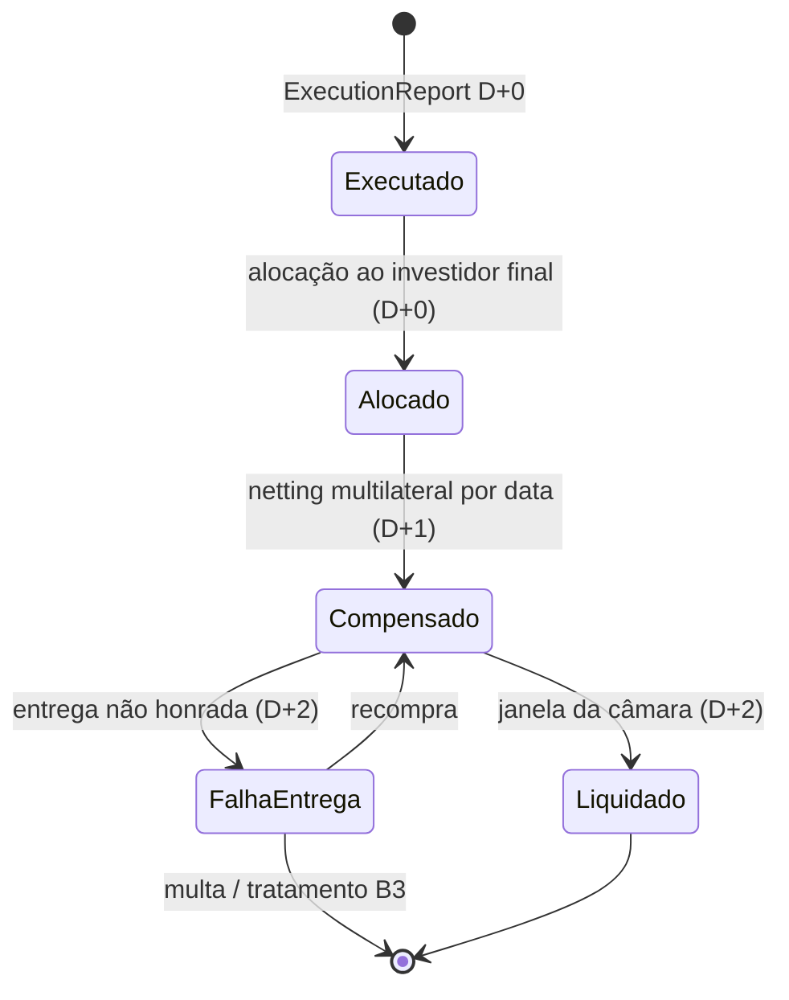

# Domínio — pós-negociação de renda variável

Dono: `dominio-pos-negociacao`. Invariantes numerados em `docs/invariantes.md`.

## Entidades

Instrumento (ticker, ISIN, tipo: ação/ETF/FII/BDR, fator de cotação, lote padrão),
Conta de custódia (documento CPF/CNPJ + participante), Negócio, Alocação, Lote de liquidação
(por data D), Evento corporativo, Posição (conta × instrumento), Movimento, Nota de corretagem
(`brokerNoteId`), Consentimento (só no plano de exposição).

## Ledger em dois níveis

Custódia — por conta × instrumento, em quantidade (escala 1e-8):
- `disponivel`
- `a_liquidar_compra[D]`, `a_liquidar_venda[D]` — indexados pela data de liquidação
- `bloqueado` (garantia, empréstimo)
- `sobras` (frações de eventos corporativos até o leilão)
- `preco_medio` (escala 1e-8) — muda só em compra e evento corporativo; nunca em venda

Financeiro — por conta, em BRL (escala 1e-4):
- `caixa`
- `a_liquidar[D]` (crédito ou débito líquido por data de liquidação)
- `proventos_a_receber`

## Máquina de estados do negócio

Efeito nos buckets:

| Transição | Custódia | Financeiro |
|---|---|---|
| Executado (compra) | `a_liquidar_compra[D+2] += q` | `a_liquidar[D+2] -= q·p + custos` |
| Executado (venda) | `disponivel -= q`; `a_liquidar_venda[D+2] += q` | `a_liquidar[D+2] += q·p − custos` |
| Alocado | conta final passa a ser a titular dos buckets | idem |
| Compensado | sem efeito em quantidade | net por D consolidado |
| Liquidado (compra) | `a_liquidar_compra[D] -= q`; `disponivel += q`; recalcula `preco_medio` | `caixa += a_liquidar[D]`; zera |
| Liquidado (venda) | `a_liquidar_venda[D] -= q` | `caixa += a_liquidar[D]`; zera |
| Falha de entrega | `a_liquidar_venda[D]` permanece; marca de falha | pendência mantida |

## Eventos corporativos

Aplicados sobre a posição na data-com; efeito na data-ex. Entram no log como
`EventoCorporativoAplicado` e nunca são recalculados fora do replay.

| Tipo | Quantidade | Preço médio | Financeiro |
|---|---|---|---|
| Dividendo | — | — | `proventos_a_receber += q·valor` (isento) |
| JCP | — | — | idem, com IRRF 15% na fonte registrado |
| Bonificação | `+q·fator` | custo atribuído pela companhia | — |
| Desdobramento | `×fator` | `÷fator` | — |
| Grupamento | `÷fator` (frações → `sobras`) | `×fator` | — |
| Subscrição | `+q` exercida | média ponderada com preço de emissão | `caixa −=` |
| Sobras | leilão B3 → `caixa +=` | — | — |

## Reconciliação

`ReconciliacaoDepositaria{data, divergências}` compara `Σ buckets de custódia` com a posição da
depositária. Divergência vai para fila de exceção e marca o snapshot; não bloqueia o EOD.

## IR (RFB) — módulo à parte (ADR-0011)

Swing trade 15%, day trade 20%, isenção de R$ 20 mil/mês em vendas de ações (não para ETF, FII,
BDR nem day trade), IRRF 0,005% em vendas comuns e 1% sobre ganho em day trade, compensação
de prejuízos. Consome o log; não escreve nele. Valores a confirmar na IN vigente antes da
implementação.

## Exposição D-1

O snapshot de exposição usa `CotacaoFechada` para `grossAmount = qty × closingPrice /
priceFactor` e apresenta os buckets no vocabulário da API RV (ver `docs/open-finance.md`).
